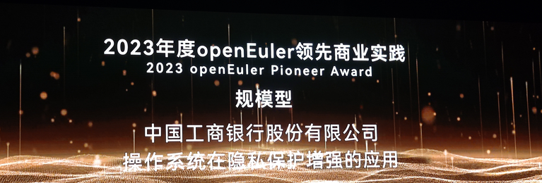
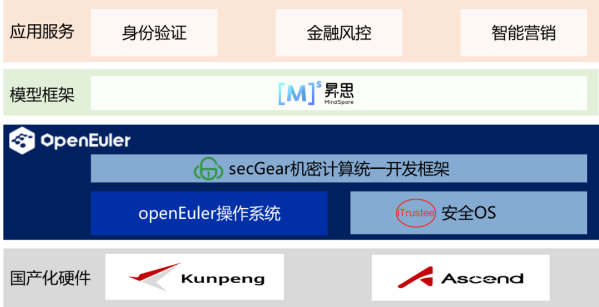

【中国，北京，2023年12月15日】以"崛起数字时代，引领数智未来"为主题的操作系统大会在北京国家会议中心举办，中国工商银行股份有限公司（以下简称"工商银行"）联合复旦大学、华为基于openEuler
打造的 AI
机密计算解决方案增强数据安全和隐私保护，在大会上成功斩获由国家工业信息安全发展研究中心和
OpenAtom openEuler 社区联合颁发的"领先商业实践"大奖，展现了工商银行在 OS
安全增强和 AI 隐私保护领域自主创新的先进性。

图1 
工商银行荣获2023年度"领先商业实践"大奖

随着《中华人民共和国网络安全法》、《中华人民共和国数据安全法》和《中华人民共和国个人信息保护法》的颁布实施和
AI 应用的迅猛发展，如何在 AI
服务的过程中保护数据和模型的机密性和完整性成为业务落地面临的关键挑战之一。作为长期推动数字化转型、持续关注
AI
技术在实际业务中的落地应用的国有大行，工商银行敏锐识别到了这一难题，在国家科技创新2023
\--"新一代人工智能"重大项目"数据安全与隐私保护下的机器学习技术"组织下，积极探索
AI 机密计算技术，产学研通力合作，共建数据安全和隐私保护增强的全栈自主 AI
机密计算解决方案，并荣登"openEuler + Friends 4.0：OS + AI 创新无止境"
十大联创项目。

图2  AI 机密计算解决方案

工商银行在 AI
机密计算的创新探索，实现软、硬全栈自主创新：**全栈创新：**实现包括算力平台、系统底座、机密计算框架、AI
计算框架在内的软硬协同、全栈创新 AI 机密计算解决方案。**高安全：**基于
openEuler 机密计算技术，增强现有 AI
业务系统的数据安全和隐私保护，在工商银行 e
办公上线。**高性能：**基于鲲鹏 TEE - 昇腾 TEE
的异构安全通道技术，算力安全卸载到昇腾
NPU，结合复旦大学自研的动态推理等大规模异构算力加速技术，实现极致的安全和性能。工商银行为金融行业
AI
安全技术自主创新积累了丰富经验，构筑了关键技术根基。未来，工商银行将持续推进金融安全科技创新，加速金融向数字化与智能化迈进。
