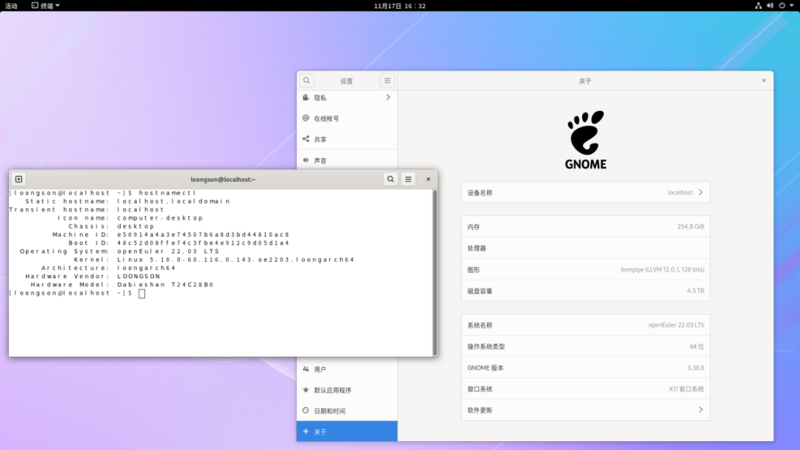

近日，openEuler 社区 LoongArch64 SIG 联合 Release SIG、QA
SIG，共同完成了社区主线代码归一，CI/CD 工程整合工作，同时， openEuler
22.03 LTS 实现了对 LoongArch 的完整支持，并发布系统镜像，支持
Everything、EPOL 软件仓库中的所有软件（约 3.5 万个）。龙架构正式成为
openEuler 官方支持的芯片架构，是 openEuler 社区发展进程中的重要里程碑。

**下载链接**

[https://www.openeuler.org/zh/download/archive/](https://www.openeuler.org/zh/download/archive)

**龙架构进入社区主线，构建流程规范化**
--------------------------------------

本次龙架构代码与社区其他架构同源，核心软件 Linux
Kernel、GCC、OpenJDK、LLVM 等均在 openEuler 22.03 LTS
分支完成移植和构建。

在 LoongArch64 SIG 与 CICD SIG 共同努力下，社区的构建系统 OBS
正式建立支持建立 LoonArch 的版本构建流程，为后续 OBS
支持其他芯片架构的版本构建流程提供了非常宝贵的经验。此外，龙架构也适配了
EulerMaker 统一构建服务。

**发布系统镜像，支持 Everything 和 EPOL 软件仓库中的所有软件**
--------------------------------------------------------------

openEuler 22.03 LTS LoongArch 完成了 Everything 和 EPOL
软件仓库所有软件的构建和测试工作，支持这两个软件库中的所有软件。经过
DailyBuild 的反复迭代和 QA SIG
的多次审核，相应的软件源和镜像最终在官方仓库正式发布。openEuler 22.03
LTS LoongArch 支持 3C5000、3D5000 的服务器整机；Linux 内核新增对
3C5000、3D5000、2K0500 BMC 的支持；虚拟化支持 CPU、内存和 PCI
设备热插拔；支持 Xfce、GNOME、Kiran 桌面环境。

**展望未来：openEuler LoongArch 的下一步**
------------------------------------------

为了更好地满足用户和开发者的需求，LoongArch64 SIG
已明确规划了接下来的发展方向：

-   持续维护 openEuler 22.03 LTS
    LoongArch，并在此基础上完善软件生态，服务更多用户和开发者。

-   跟随社区主线版本，完成 openEuler 24.03 LTS
    版本的开发和发布工作，积极参与社区版本核心软件选型与验证，并完成
    Everything、EPOL 等所有软件包的更新工作。

-   完善社区门禁 CI、EulerMaker
    统一构建服务的支持，为用户和开发者提供稳定且高效的系统构建体验。

-   推动国内主流软硬件与龙架构适配。

**感谢**
--------

本次 openEuler 22.03 LTS LoongArch
的完整支持及正式发布，离不开龙芯中科、华为、统信软件、麒麟软件等社区开发者的贡献，也离不开
TC、Release SIG、QA SIG 的支持。未来，LoongArch64 SIG 将持续做好
openEuler LoongArch 维护工作，持续贡献 openEuler 社区，把 openEuler
LoongArch 打造成最佳支持龙架构的 Linux 操作系统。
