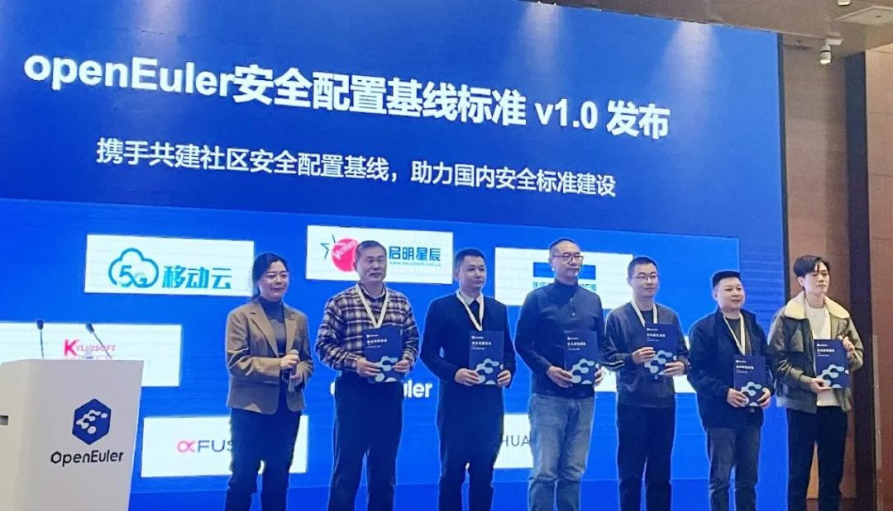
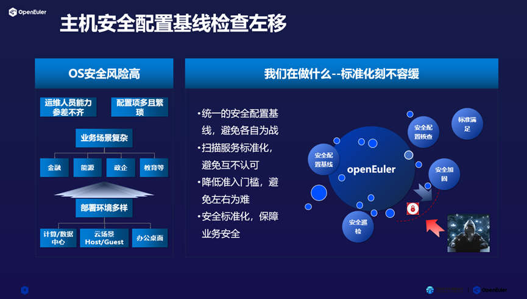

【中国，北京，2023年12月15-16日】以"崛起数字时代，引领数智未来"为主题的"操作系统大会
& openEuler Summit 2023"在北京盛大召开。启明星辰联合 openEuler
社区以及移动云、统信、麒麟软件、麒麟信安、超聚变、华为等公司共同发布《openEuler
安全配置基线标准 v1.0》。

在当今日益复杂的数字化环境中，操作系统安全已成为企业和个人必须面对的挑战，运行环境的多样性和不一致性使得安全加固、核查、巡检等工作变得异常艰巨。为了应对日益增长的网络安全风险，保护企业信息系统和核心资产的安全，实现操作系统安全配置的规范化、标准化、例行化，提升语言交流的一致性和管理的便捷性，openEuler
推出了首个匹配业界优秀安全实践的基线标准，满足国内外桌面及服务器市场基础安全诉求
，帮助用户在投入最少工作量的情况下，快速并显著的提升系统整体安全防护能力，助力各种安全配置核查诉求。

**安全配置基线具备以下特征**：

**全覆盖**：围绕初始部署、安全访问、运行和服务、日志审计四大方面，建设完成近
200 条基线标准，覆盖 openEuler 全系统基础安全。

**多兼容**：适用于政企、金融、能源、教育、交通等各领域场景下桌面、服务器、虚拟机的基础安全保障，确保系统始终保持最佳状态。

**易应用**：通过规则说明、检查方法、修复方法等标准字段，给出清晰易懂的配置检查项、加固指导，方便用户快速理解和使用。

**强生态**：社区持续自主创新，合作共赢，助力国内各种标准建设，促进安全配置领域繁荣发展。

心有多大，舞台就有多大，以 openEuler
社区为中心，通过广泛合作，互利互强，打破壁垒，给用户更多信心，给世界更多选择。

**openEuler 安全配置基线 v1.0发布地址：**

<https://gitee.com/openeuler/security-committee/blob/master/secure-configuration-benchmark/release/openEuler安全配置基线.md>

