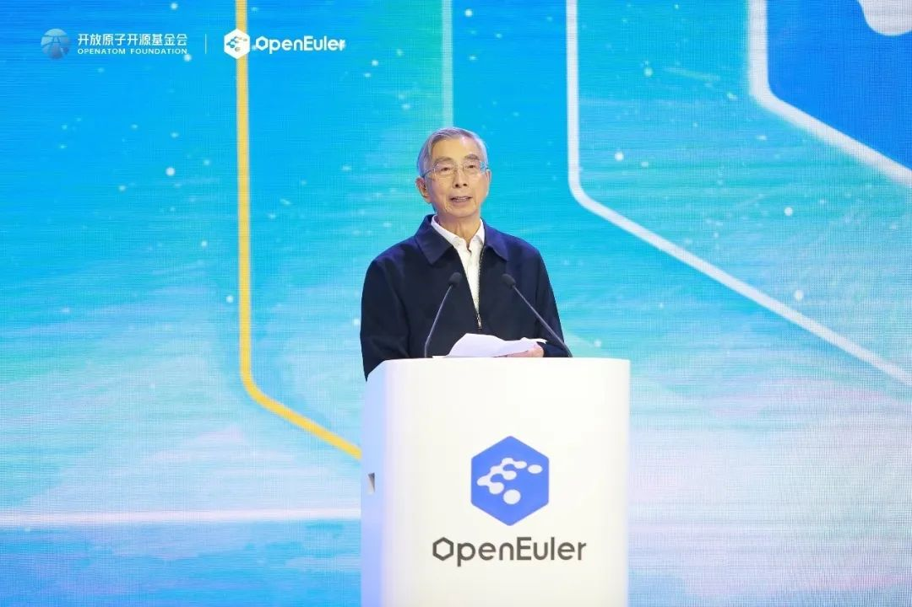

2 月 15 日，操作系统大会 2023
在北京国家会议中心举办。会上，中国工程院院士倪光南在致辞中表示，"欧拉"的经验充分证明，只要中国开发者协同起来，就有能力创建世界一流的开源社区。让我们共同携手，推动开源欧拉成为中国业界带头创建的、首个具有世界影响力的开源社区。

**中国工程院院士倪光南致辞**以下为倪光南院士致辞全文：操作系统大会
2023
是中国开源界的一个盛会，希望不久的将来也能成长为世界开源界的盛会。当前，我国正开启全面建设社会主义现代化国家的新征程，面临新形势、新任务，迫切需要重视开源，学习开源、用好开源。特别是在信息领域，开源可以成为发挥中国人才优势的创新平台，成为中国融入国际科技创新网络，参与国际科技治理的有效方式。正是在这个大背景下，开源"欧拉"的成功实践具有强烈的现实意义。

"欧拉"操作系统发展至今，经过了十几年的成长，"欧拉"的开发团队在创建
openEuler
开源社区的过程中，经历了从开源使用者------参与者------贡献者的各个阶段，这也是中国开源界成长壮大缩影。操作系统是软硬件资源的分配者，它下接终端，上承应用，是科技时代不可或缺的根技术。我国信息技术领域一度出现"重硬轻软"的发展倾向，对软件生态建设的重要性认识不足，这使得中国操作系统产业的发展长期处于低水平建设阶段。而今中国操作系统整体的研发、推广环境已经有了很大改善，在新的历史机遇下，不仅需要足够的"远见"，更需要
"长期主义"的实干。

操作系统是软件领域基础研究中的重要环节，在基础软件中处于核心地位。"欧拉"的最初目标是针对企业用户服务器市场的开源操作系统，它还可以支持云计算、人工智能、算力基础设施、嵌入式系统等多领域的需求。"欧拉"经过这些年的发展，在上万名开发者的参与和贡献下，已经由一粒种子成长为参天大树，承担起构建我国信息领域根技术和数字经济技术底座的重任。展望未来，我们对"欧拉"的前景充满信心。

第一，openEuler
社区影响力将不断增加。今天，openEuler 社区规模已汇聚了超过千家企业，包括
Intel
等国际知名企业的加入，已经拥有上万名开源贡献者，特别兴趣小组上百个，全球下载量突破
210 万。这个数据还在持续更新中，相信在世界开源工作者的努力下，openEuler
社区很快将发展成为具有全球影响力的开发者社区。

第二，openEuler
社区生态将不断壮大。开源四年来，创新项目代码仓已达到近 500
个，平均每个月产生 10
个创新项目。这些创新项目覆盖内核、安全、编译器、云原生、嵌入式等多个技术方向，大大扩展壮大了
openEuler 的生态，促进了相关领域的科技和产业发展。

第三，openEuler
将持续引领技术创新。openEuler 紧跟技术潮流，大力推进在 AI
技术应用上赋能，以更高效地发挥 AI 的作用。openEuler
通过异构资源统一管理与调度，实现 CPU 和 NPU 的深度融合，打通通用算力和
AI 算力，有效提升大模型训练和推理效率；同时 openEuler
颠覆了传统的命令行交互方式，基于大模型，训练出了
EulerCopilot，初步实现代码辅助生成、辅助运维等功能。第四，openEuler
将持续为世界开源作出贡献。openEuler 社区已经对 Apache
Spark、Ceph、OpenCV、OpenHPC
等覆盖多个领域的数十款主流开源软件实现了原生支持；在软件安全与治理方面，openEuler
社区联合 OpenChain、SPDX、CHAOSS
等国际组织，共同制定开源软件供应链安全标准，为解决开源社区治理和软件安全问题贡献中国方案。

目前"欧拉"已经创造了显著的经济和社会效益，欧拉生态正在不断发展和壮大中，欧拉系统已经在通信、金融、电力、交通、政务信息化等领域规模化商用。可以预见"欧拉"的未来一片光明，中国开源的前景一片光明！古人云"路虽远，行则将至；事虽难，做则有成。不积跬步无以至千里，不积小流无以成江海。"

"欧拉"的经验充分证明，只要中国开发者协同起来，就有能力创建世界一流的开源社区。开源是世界的，也是中国的，让我们共同携手，推动开源欧拉成为中国业界带头创建的、首个具有世界影响力的开源社区。
