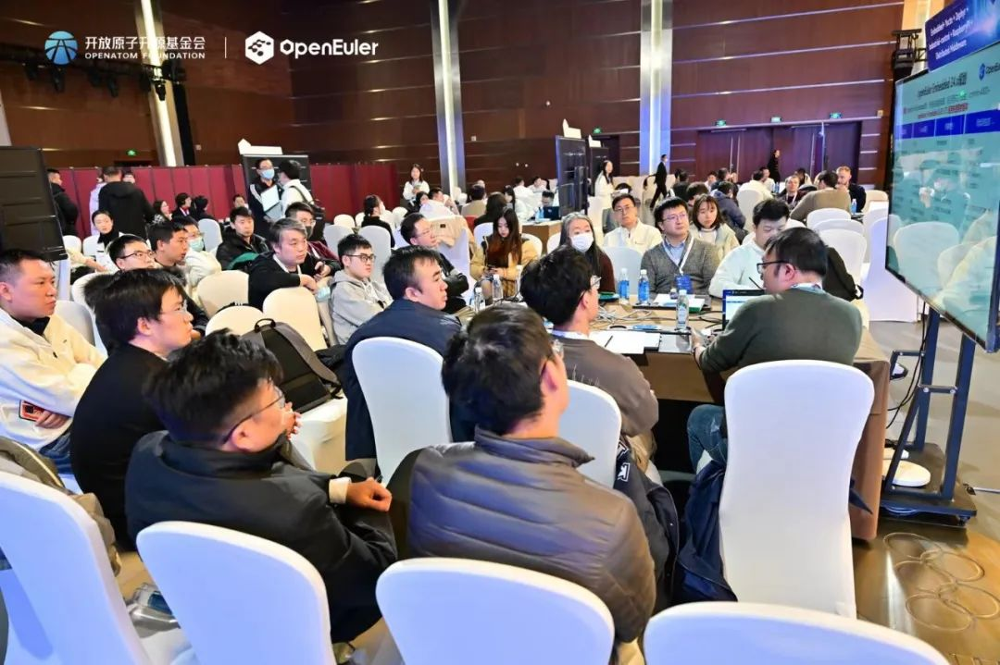
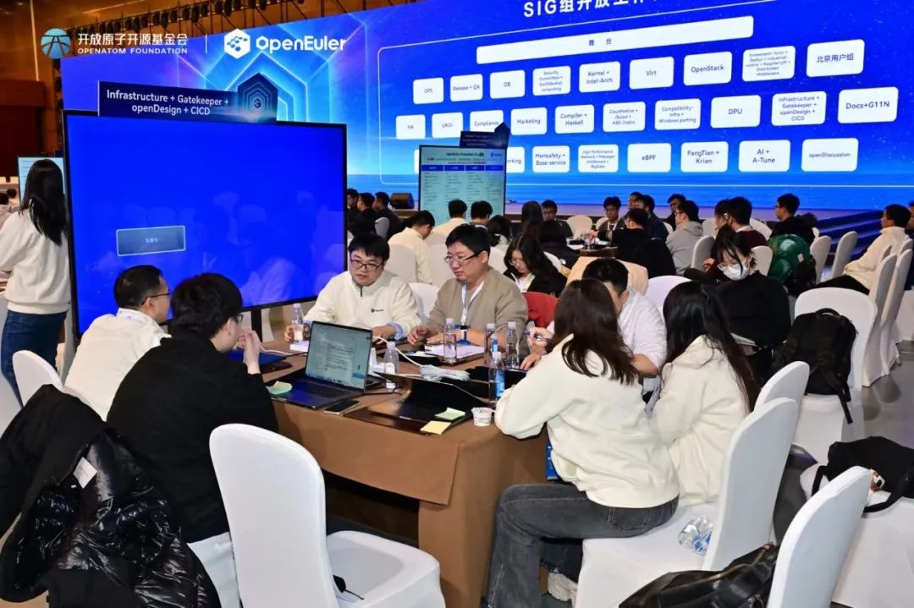
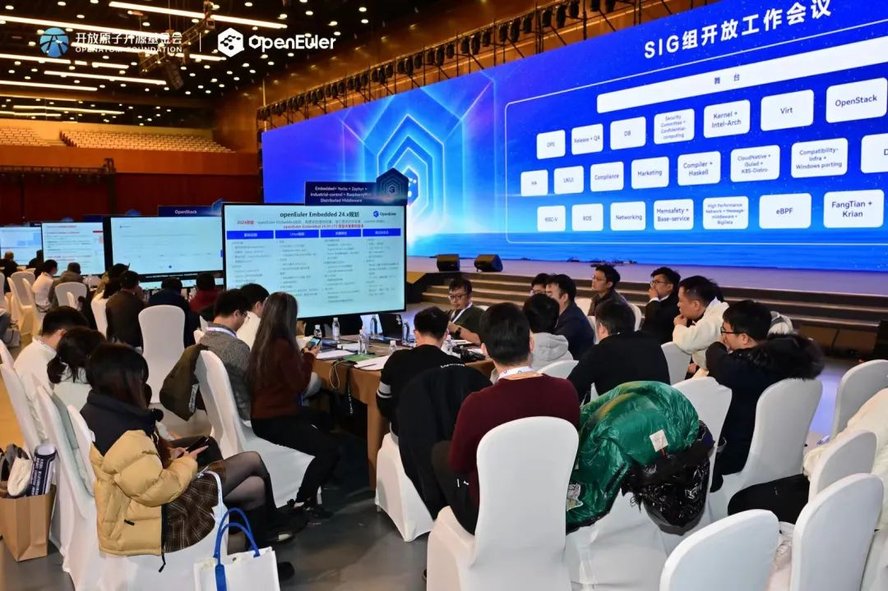
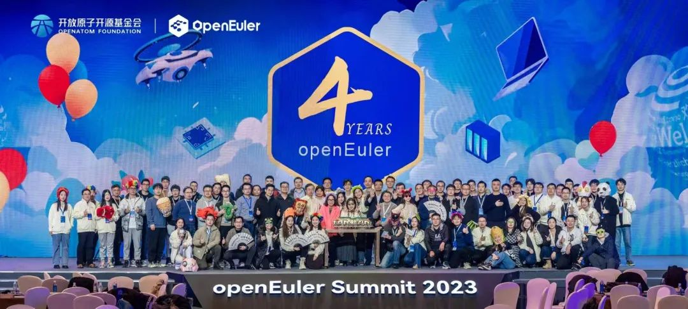

【北京，国家会议中心，2023年12月15日-16日】操作系统大会&openEuler Summit
2023在线上和线下同步举办。

作为大会重要的一环，SIG组开放工作会议吸引了众多开发者的关注。当天，40+个SIG组聚焦不同技术方向，同时展开SIG组开放工作会议，共同讨论需求优先级和下个版本的规划，气氛十分热闹。

**精彩回顾**
=====================================

**在SIG组开放工作会议上，40+个SIG组的分享干货满满，其中：**

**Release SIG**在会上分享了Release SIG运作机制讨论以及openEuler
版本演进计划，并与OSV伙伴、用户及开发者一起探讨版本质量规范及维护策略，探讨社区如何提供更安全可靠的高质量开源OS；

**RISC-V SIG** 就 RISC-V 架构在 openEuler
社区过去一年的工作和未来规划进行汇报，并总结 LLVM 平行宇宙计划在 RISC-V
架构支持的进展并对后续工作进行展望。同时与上海交通大学探讨蓬莱TEE可信执行环境与
openEuler
社区的合作方案；与赛昉科技和矽速科技讨论如何丰富社区生态，探索与上游芯片厂商在生态建设方面的合作可能。

**Compiler SIG**在会上分享了毕昇JDK、LLVM for openEuler、GCC for
openEuler在2023年主要工作进展及2024年新特性规划。现场与会人员针对毕昇JDK
21新版本特性、LLVM平行宇宙计划下一步工作方向、GCC多版本支持等话题进行了深入交流。点击链接即可了解详情并获取议题分享材料。

**OpenStack SIG**在会议中进行了 2023 工作复盘和 2024
工作规划。来自联通、华为、电信、同方有云、统信等多家厂商的开发者，一起讨论了openEuler下一版本OpenStack
版本选型、依赖软件版本、OpenStack 龙芯及申威架构支持、OpenStack
虚拟化场景 DPU 适配、SIG 工作范围、案例展示等议题。对如何更好提供基于
openEuler 原生可用的云基础设施和解决方案、SIG
的可持续发展进行了深入探讨。

**ROS SIG**讨论了ROS2-humble版本的开发历程，介绍了新特性开发技术方案，并现场演示了ROS软件包移植工具的使用。还在现场与机器人开发者热烈讨论了ROS在开源、小型化、轻量级、模块化机器人上的发展前景，并对于ROS
SIG未来的发展路线做了深入交流。

**SDS SIG**的Maintainer刘秦飞在会上总结了2023年SIG活动组织、创新项目、联创项目，会议深度讨论了ceph/lustre版本选型和2024工作方向。来自联通云的李韶雄详细介绍了新晋捐赠项目fastblock。fastblock重点面向高性能数据库场景和中小企业的虚拟化场景，除架构设计简单外，在只使用普通NVME介质的情况下，三副本单路单并发时延性能是ceph的5倍以上，其具备进一步开发基础。

**SIG开放工作会议是跨SIG交流的绝佳场合，在本次会议上不少SIG组就后续合作达成了交流：**

**Kernel + Intel Arch SIG** 的分享干货满满，分享了2023 年Kernel SIG
的工作总结和后续计划，以及Intel Arch
SIG后续的支持计划，还着重分析了openEuler kernel 后续特性适配计划和诉求。

**嵌入式场景相关SIG**与参会者一起讨论openEuler下一版本计划。探讨社区成员对嵌入式场景的诉求。帮助社区成员更好地了解嵌入式场景的现状和未来发展计划。

**Haskell SIG**分享了 GHC 编译器多架构的支持情况和演进方案，并计划与
RISC-V SIG 合作共同推进 GHC 编译器的 RISC-V 支持；在现场与 Release SIG
交流后，决定将 Haskell 相关包推入 EPOL
后摆脱二进制依赖；就自动化引入和测试框架的问题做了深入探讨，敲定了引入之后的测试方案。

**G11N SIG**在会上分享了社区英文化的工作进展，并计划与 doc SIG 在 2024
年联合开发更多英文技术宣传视频，扩大 openEuler 在海外影响力；**doc
SIG** 从资料开发、社区服务与支撑、自动化工具、技术生态等方面对 2023
年工作进行总结，分享了 markdownlint 新规则以及 docs 仓的写作规范；两个
SIG
共同讨论了大模型解决低错问题的可行性、英文化开发流程的简化方法以及开发英文短视频至海外视频平台的计划。

\...

**会议纪要**
=====================================

还有更多精彩内容，欢迎扫描下方二维码，查看本次开放工作会议所有SIG的会议纪要。

**总结**
=====================================

在SIG组开放工作会议上，不少SIG对明年的发展路线，尤其是对openEuler社区下个版本进行探讨(下个版本是openEuler社区长周期版本，将于2024年发布，后续将提供4年社区支持）。这些规划，也将在openEuler下一版本中体现。

openEuler
社区SIG组的繁荣发展离不开每一位成员的贡献。在这里，每一位参与者和组织者都能从中找到有价值的地方，最终\"百花齐放\"。明年的SIG组开放工作会议又将给开发者们带来什么惊喜？又将有怎样历史性的突破？让我们一起期待吧\~\~
