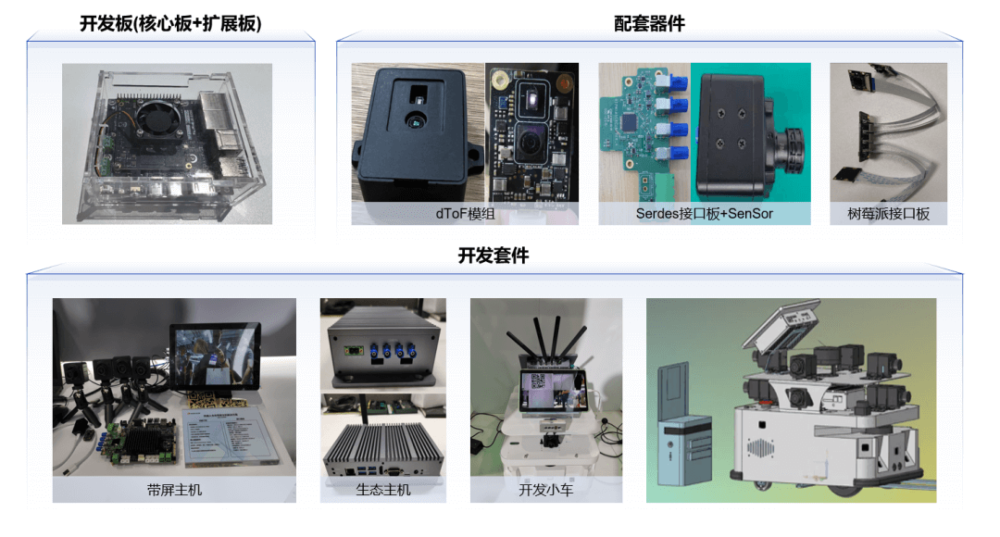
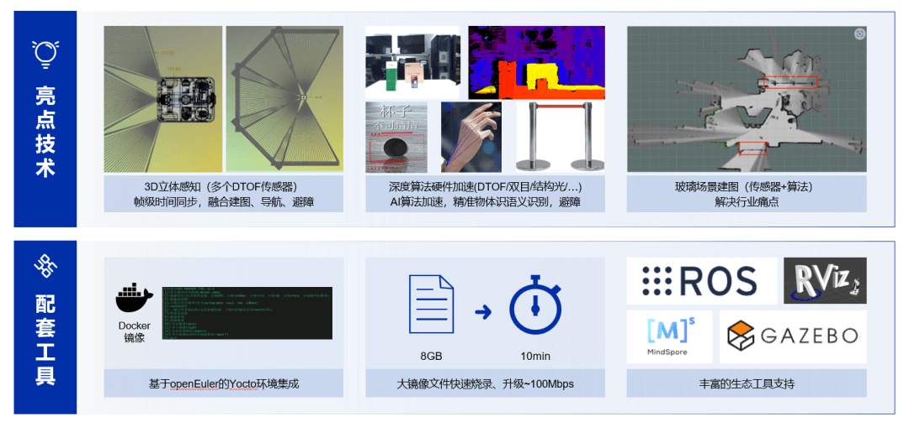
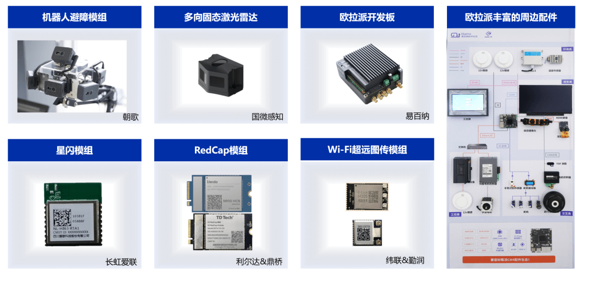
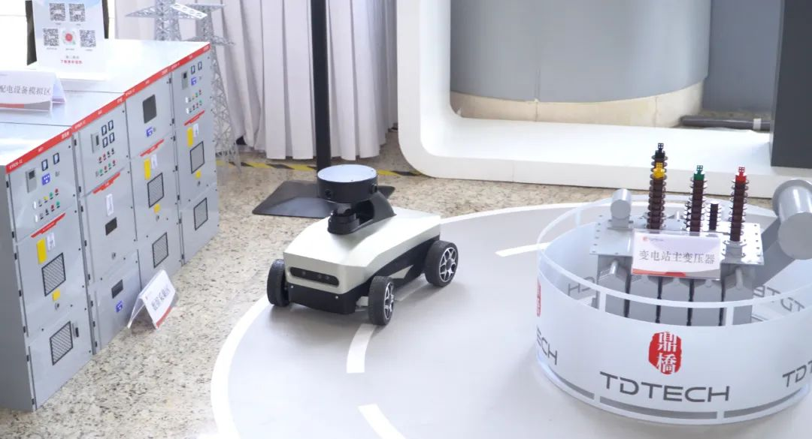

2023年12月15日至16日，openEuler Summit
2023峰会在北京召开，这是一场致力于推动操作系统产业发展的盛大峰会，聚焦推动操作系统技术不断创新，共建全球开源新生态。在本次大会上，海思携手多家合作伙伴，带来基于openEuler的机器人开发平台以及多样化解决方案。

**[基于openEuler的多传感器融合机器人开发平台]**
=====================================================

在这次峰会上，海思带来了基于openEuler的多传感器融合机器人开发平台，该方案在业界**首次实现了将dToF、视觉在内的多传感器拼接与融合，同时结合海思领先的分布式异构计算、全场景联接、精准执行/表达/交互等技术，成为强大的机器人开发平台**。峰会现场除了海思机器人开发平台和原型样机，还展示了合作伙伴基于海思平台开发的相关生态产品，包括微型固态激光雷达、多向固态激光雷达、短距星闪Wi-Fi通信模组、广域通信模组等，以及面向机器人、工业视觉、智能家居等场景的首款"欧拉派"开发板。

海思机器人开发平台具备强劲的智能化处理能力，包括高达10.4TOPS
INT8的NPU、4xA55、高性能RISC-V
CPU以及双核DSP等，可接入高达7路的dToF微型激光雷达传感器，以及4路摄像头输入，并具备4K60的高性能视频编解码能力，是一个以AI,
CPU和媒体处理为核心，并提供丰富的接口可接入强大的边缘智能处理平台。

在强大的端侧算力加持下，海思机器人开发平台首次实现了基于dToF全向3D立体感知拼接避障方案，通过MIPI或USB接口将2-8路dToF固态激光雷达Sensor采集到的深度信息，通过SoC的强大算力实现校准算法、搜峰深度计算算法、温度补偿算法、
滤波算法、点云转换等算法计算，并进行点云动态拼接。再结合openEuler的异构计算能力，通过DSP进行点云动态去除地面等算法加速，可以快速识别目标障碍物，然后通过ROS2系统进行路径优化，实时避障等操作。

机器人是一个复杂的系统，海思秉承"众行远"的理念，与多家伙伴深入合作，围绕机器人开发平台推出了多品类的生态产品与配件：**欧拉派首款开发板（易百纳）、机器人避障模组（朝歌）、多向固态激光雷达模组（国微感知）、Wi-Fi超远图传模组（纬联&勤润）、星闪模组（爱联）、RedCap模组（鼎桥&利尔达）**。这一系列配套产品不仅满足多传感器融合机器人各个环节的需求，同时通过深度整合，使其相互协同工作，构建更加智能、高效的机器人体系。在峰会现场可以看到鼎桥等合作伙伴基于海思机器人平台开发的**面向电力巡检场景的机器人小车**。

**[结语]**
=====================================================

在机器人行业的未来发展中，我们预见更多创新的可能性。随着技术的不断演进，多传感器将使机器人将更智能，适应性更强，拥有更广泛的应用领域。从智慧家庭到工业制造，再到医疗保健，海思机器人平台将为各行各业提供创新解决方案基座，助力迈向数字化智慧社会。未来，我们将持续与开发者、行业伙伴共同努力，为未来创造更加美好的生活。

如果希望了解更多信息，可以观看openEuler峰会嵌入式论坛海思相关解决方案的精彩回放：<https://hw.vhallyun.com/v2/watch/14128?lang=zh&thirdId=Ba&H&landScape=true>
