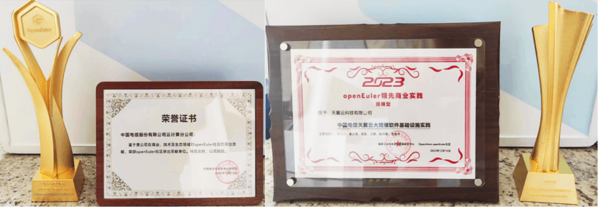
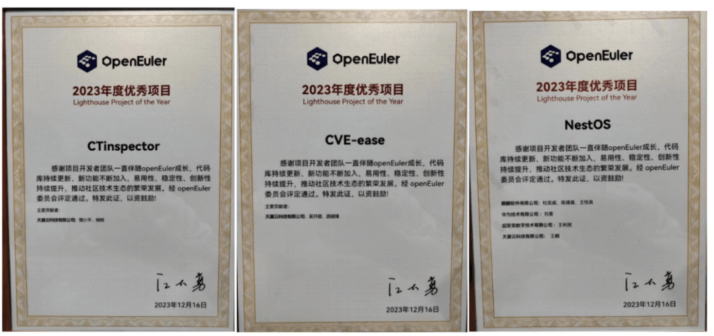
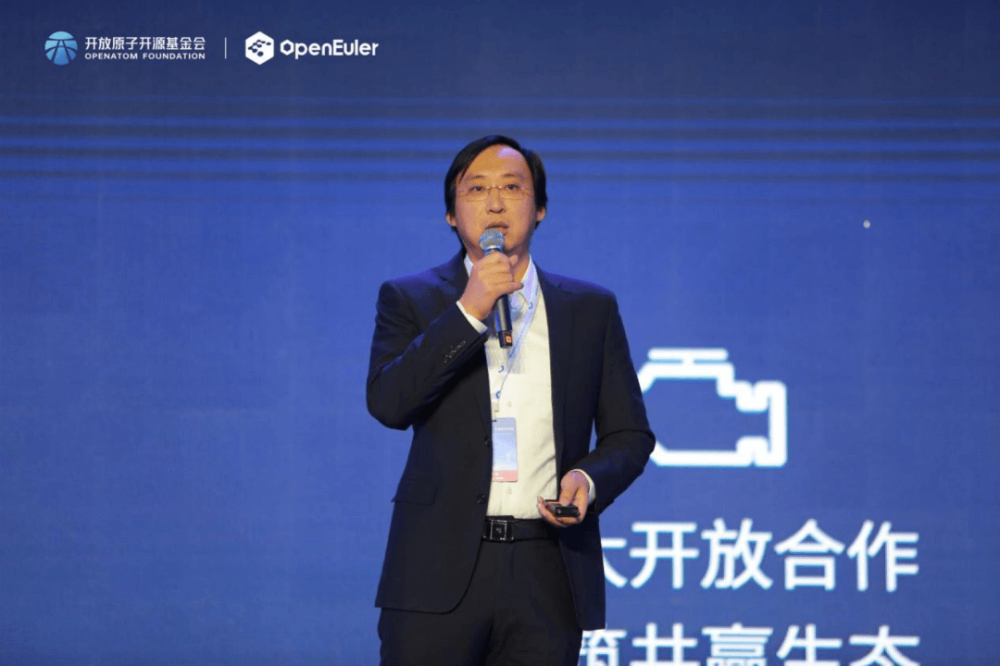
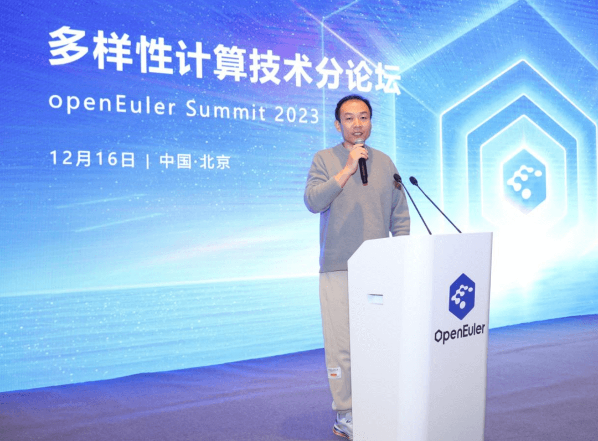
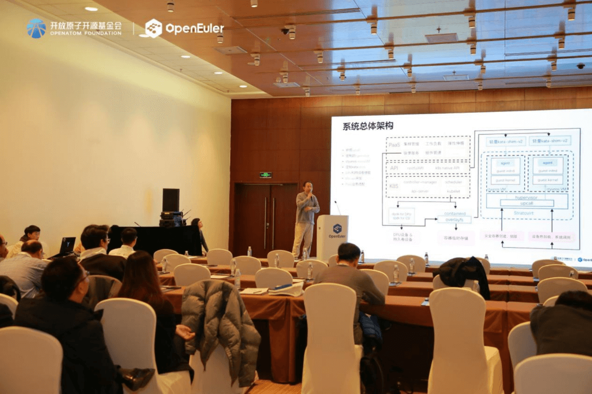
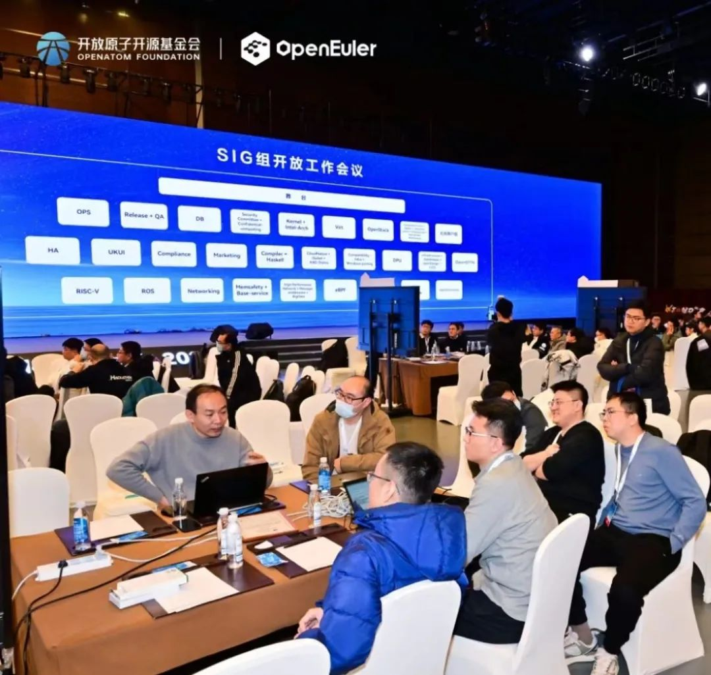

**共探操作系统产业发展，天翼云为数智未来贡献国云力量**
============================================================
**汇聚开源力量，激发创新活力，天翼云为数字中国建设注智赋能**
============================================================
近日，由开放原子开源基金会等主办，以"崛起数字时代
引领数智未来"为主题的操作系统大会&openEuler Summit
2023在北京举行。大会邀请院士、产业组织及全球开源基金会代表、学术领袖、领先行业代表、技术专家等1000+位海内外嘉宾，共探操作系统产业发展方向和未来机遇。

会上，天翼云荣获2023年度openEuler领先商业实践和2023年度openEuler社区突出贡献单位双重大奖；天翼云操作系统团队斩获CTinspector、CVE-ease、NestOS三项2023年度优秀项目奖。天翼云强大的技术实力和市场表现再获业界权威认可。

天翼云科技有限公司基础架构事业部副总经理郑文明参加大会主论坛，并以"筑牢天翼云基础设施底座，赋能千行百业数字化转型"为题发表演讲，分享了天翼云在自主研发CTyunOS操作系统方面的成就。从操作系统的硬件适配和软件支撑等工作，到操作系统产品化过程中的基础设施自主研发，再到社区共建，天翼云以科技创新，为中国操作系统发展及开源生态建设贡献国云力量。

在展台采访中，天翼云科技有限公司操作系统研发专家王麟详细阐述了天翼云围绕CTyunOS而构建的一整套纯自研软件基础设施，包括操作系统管理平台、SBOM软件供应链、卫星服务、编译构建发布工具链、安全漏洞发现及自动修复流水线、系统加固工具框架、CentOS升级替代工具、云原生基础设施及镜像安全更新服务，充分体现了CTyunOS自主研发的能力和产品。

在社区共建方面，天翼云目前已累计贡献安全更新工具cve-ease、云平台组件gostone、ebpf工具CTinspector、云原生基础设施安装与更新工具k8s-install在内的4款自研软件；累计贡献PR 400余个；拥有ebpf-sig、cloudnative-sig、openstack-sig在内的多位Maintainer，并积极主持SIG例会、分论坛事务、开放工作组会议，多次参与峰会及分论坛演讲和线下技术meetup的技术分享。此外，天翼云还展示发布了CTFaaS +
CTyunOS MicroVM的创新架构。

在峰会多样性计算力技术分论坛上，王麟致词并发布了天翼云DPUOS，着重展示了该产品在内核模块拆解、系统裁剪、容器使能、性能测试方面取得的成绩。

在云原生分论坛上，天翼云展示发布了CTFaaS +
CTyunOS MicroVM的创新架构，在天翼云、华为、电信研究院三方的共同合作下，使能CPU、内存热加载的upcall技术，创新结合stratovirt+kata+Nydus，在系统镜像尺寸和CPU内存消耗大幅削减70%的条件下，达成了业界同类技术的领先性能指标。

在SIG组工作会议上，天翼云发布了k8s-install多基线云原生基础设施安全更新项目。该项目解决了同一版本操作系统中，支持多个不同k8s版本项目，并且能及时打上软件包和容器镜像安全更新补丁的问题，获得了与会成员的一致认同，并投票批准在社区建仓维护。

随着数字化的不断发展，开源已经成为信息产业发展的基础，是加速技术创新和生态发展的重要力量。未来，天翼云将持续加强关键核心技术攻坚，贡献更多创新成果和资源，促进国产操作系统社区和生态繁荣，以自主可控的数字底座，使能千行百业转型升级。
