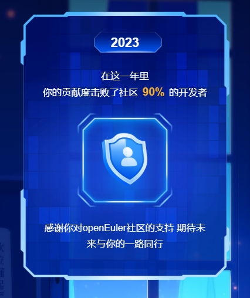

您对时间敏感吗？

2019年12月31日，openEuler在码云上正式亮相。转眼间，**openEuler已经4周岁啦**！

在过去的四年中，在社区各位开发者的支持下，openEuler成为了国内最活跃的操作系统开源社区。截止至目前，下载量达213W+，社区开发者17K+，参与贡献企业1400+家，社区ISSUE
74.8K+，PR
148.4K+，组建特别兴趣小组（SIG组）104个。在这里非常感谢openEuler的用户,社区开发者和爱好者的支持。

在openEuler Summit 2023上，社区开发者一起为openEuler
庆祝4周年的生日，现场气氛热闹，我们也感受到了开发者们对于社区积极的反馈。

为庆祝开源四周年，openEuler向朋友们准备了丰富的四周年活动，活动有趣，礼品多多，欢迎大家参加，一起回忆在社区的美好时光，继续创造更好的openEuler！

**活动详情**
========

\# **微信红包封面** \#

新年即将到来！是不是还没准备好过年的红包？

openEuler为你准备了专属红包封面

用上它，

你就是发红包最酷的那个仔！

**红包封面将于1月1日在openEuler公众号推文发放，**

**数量有限，先到先得！**

\#**年度贡献报告** \#

年度贡献报告新鲜出炉！

扫描二维码生成贡献者报告并将贡献报告截图

**分享到朋友圈加三个开发者交流群**

凭截图即可找小助手（openeuler123）兑换礼品一份

在这一年里，你的贡献度击败了多少开发者呢？

**让我们来看看可以领取哪些礼品吧！**

**领取时间：2023年12月29日-2024年1月15日**

**数量有限，先到先得！**

**数量有限，先到先得！**

**数量有限，先到先得！**

openEuler开源4周年，期待有您！

