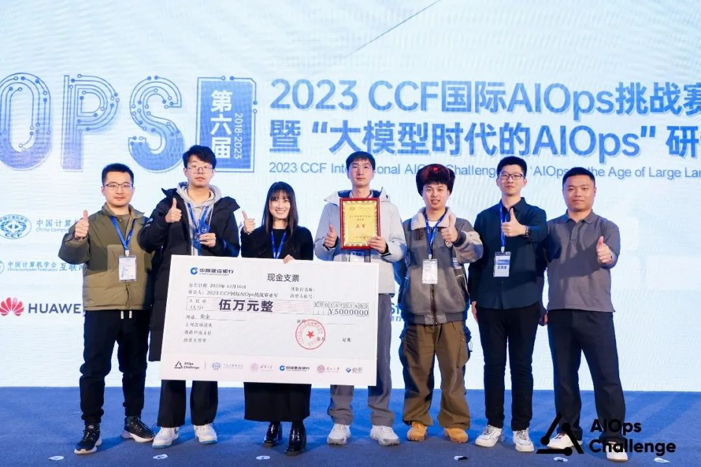
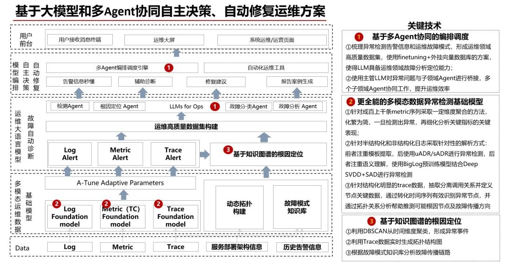

经过初赛、决赛长达五个月的激烈角逐，第六届 CCF 国际 AIOps
挑战赛2023年12月底成功收官。由华为集团 IT-UniAI 产品与 openEuler
系统智能团队共同组成的轻舟已过万重山战队在265支队伍中脱颖而出，斩获亚军！

**关于挑战赛**
==========================================================
CCF 国际 AIOps
挑战赛（以下简称挑战赛）是智能运维领域最具影响力的专业赛事，由中国计算机学会（CCF）和清华大学联合发起，面向全球开放。截止至
2023
年共计举办了六届，辐射圈层广泛涵盖产学研用各界行业代表，今年决赛的在线直播观看人数更是高达
5w+。

本届大赛首次采用开放式赛题。在建行云环境中，基于建行稳定性系统模拟建行生活类APP的真实环境，揭示企业运维团队面对规模庞大、结构复杂、动态变化的运维数据需要解决的一系列挑战。参赛队伍基于上述运维数据自主命题，包括但不限于基于指标、日志、调用链、CMDB等一种或多种数据源进行异常检测、故障根因定位、故障分类等。

**关于答题思路**
==========================================================
针对这次开放式赛题，轻舟已过万重山战队的详细方案如图1所示：

图1 基于大模型和Multi-Agent协同自主决策、自动修复运维方案

针对Log, Metric,
Trace三类运维数据，分别构建了异常检测基础模型，一但系统接受到异常即会通知LLM主管Agent，主管Agent对异常问题进行决策与子领域Agent进行桥接，多个子领域Agent协同工作，实现运维故障自动诊断和多个任务模型的编排，提升运维效率。

针对不同的数据源分别打造了三个基础模型，分别是Metric基础模型、Log基础模型、Trace基础模型，同时构建了以LLM为核心的Agent组件，并探索一套基于企业组织管理方法的Multi-Agent协同框架，例如通过KPI树方法分解任务，通过PDCA方法反馈循环提高Agent工作效率，通过企业高效会议管理方法来合理组织运维War
Room的Agent进入和退出，实现Multi-Agent的高效协同诊断。

方案提出基于企业组织管理方法的Multi-Agent协同框架，让复杂运维任务处理更高效；构建的多模态异常检测基础模型，包含Trace、Metric、Log数据处理能力，开箱即用；框架与算法不依赖具体特定应用场景，结合大模型实现较强的泛化能力；故障诊断报告体现可解释的故障爆炸半径，为实际生产运维故障快速恢复提供有力依据。

**团队介绍**
==========================================================
轻舟已过万重山队 的成员来自华为 IT-UniAI 产品和 openEuler A-Tune 团队。

华为 IT 平台服务部-UniAI 产品承载华为 AI 战略，专注实现企业场景
AI，深耕销售、服务、供应、制造、财经等 20+业务及颗粒化领域
900+海量场景，基于"场景、算法、数据、算力"四位一体，建设企业 AI
解决方案及服务，联接开放生态，践行智能之道。

openEuler系统智能团队致力于挖掘操作系统在智能时代的机会点，以调优、运维、安全、算力底座等场景为切入点，探索时间序列分析、强化学习、多Agent协同、异构算力融合等技术。当前团队还积极和海内外高校展开学术交流和访问，共同探索业界创新技术，构建国产基础软件核心竞争力。

**合作交流**
==========================================================
祝贺 2023 CCF 国际 AIOps 挑战赛决赛暨 AIOps 研讨会成功举办，期待国际
AIOps 挑战赛与 openEuler 两大社区后续继续深入交流与合作！

如果您对openEuler系统智能、AI等内容感兴趣，欢迎在openEuler社区中参加A-Ops
、AI 、A-Tune 等SIG组，与我们一起探讨\~

相关信息：

A-Tune SIG：致力探索AI辅助的性能分析和性能优化技术，提升系统性能指标。

 

订阅邮件列表：a-tune@openeuler.org

AI
SIG：旨在构建数字基础设施AI生态链，提供内置AI框架训练/推理软件，构建AI相关软件维护能力。

订阅邮件列表：dev@openeuler.org

A-Ops：专注打造系统智能运维能力，提供系统观测、异常检测、根因定位、系统升级等相关技术，提高运维效率和质量。

订阅邮件列表：ops@openeuler.org

