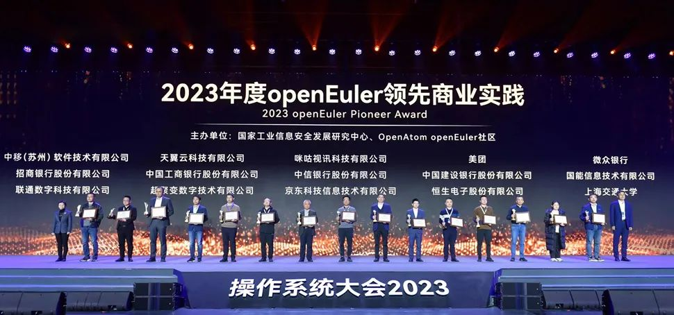

中国联通高度重视核心技术自主创新，致力于改变"卡脖子"局面，基于openEuler推出CULinux（China
Unicom Linux）。该操作系统现已得到广泛部署与应用，成为释放联通云网优势、推动千行百业转型升级、赋能数智未来的重要根基和支点。\
联通在操作系统自主可控方面作出了哪些贡献，CULinux又究竟强在何处？就让我们从最近举行的操作系统大会＆openEuler
Summit 2023上厘清脉络、寻找答案吧。

**融合开放，为基础软件产业贡献联通力量**
===========================================

我们当下正处在数字化、智能化的洪流中，对于任何一家企业或一个行业来说，数智化转型已经成为一个必选项。"工欲善其事，必先利其器"，以操作系统为代表的基础软件是数字业务落地不可或缺的载体，也是数据和算力价值得以充分释放的前提。然而不容忽视的是，我国基础软件产业长期以来面临"卡脖子"的问题，国家曾多次提出"关键领域核心技术突破"和"科技必须自主创新、自立自强"等相关指导政策，以推动国产技术的发展。\
联通云CTO钟忻在大会发言中指出，中国联通立足于"网络强国"与"数字中国"两大主责、"联网通信"与"算网数智"两大主业，全面建设新一代数字信息基础设施，在数字经济主航道上奋楫争先。作为努力的一大方向，**中国联通一直坚持开源与商业结合的技术路线来发展云计算基础架构技术体系，深度参与开源社区建设，为我国基础软件产业发展贡献联通力量**。\
**2020年7月**，联通云加入openEuler社区，成为OpenStack
SIG首批维护者及贡献者；**2021年6月**，联通参加 openEuler Developer Day
2021，正式成为openEuler委员会成员。\
**在openEuler
2021峰会上，联通云推出了CULinux数据中心欧拉版**，成为联通在核心技术领域向前迈进的一个重要里程碑，为联通云基础设施带来一次焕新升级，运行环境上为联通云提供可靠的基础；**同年12月**，联通云对象存储YIG也从1800余项开源产品中脱颖而出，入选中国科科创中国"开源创新榜年度优秀开源产品。\
**2022年12月**，CULinux荣获"2022年度openEuler领先商业实践"大奖；**2023年1月**，荣获中国软件行业协会"2022年软件行业典型示范案例"大奖，标志着CULinux在技术创新、实践应用等方面均得到了业界广泛认可；**2023年9月**，联通云数据库CUDB荣获中国信息通信研究院、中国通信标准化协会颁发的OSCAR开源技术创新大奖。

**持续创新，筑强联通云安全技术底座**
===========================================

人工智能时代的到来，催生了智能计算和边缘计算的巨大需求。依靠单一数据中心算力提供服务，已经越来越难以支撑产业的发展，"算网融合"成为大势所趋。联通云顺势而为，全面升级为**"安全数智云"**，提供多样化、普适化、泛在化的算存网融合服务，**打造数字经济"第一算力引擎"**。\
钟忻介绍说，联通云7.0版本为赋能产业发展，提供**"联接+感知+计算+智能+安全"**一体化算网服务，实现四大技术能力突破。**在架构方面**，支持行业云、私有云版，满足超4亿用户使用，日调用次数超过30亿次，通过云网融合实现一点接入、一跳如云；**在性能方面**，单集群实现万级节点管理，亿级大数据下支持超250万并发处理，云原生容器平台在运营商中是唯一获信通院卓越级认证，并且通过技术能力提升，提供高性价比存储，较通用型产品价格降低50%；**在安全方面**，联通云全栈产品100%自主开发，支持多厂家架构混合部署，实现一云多芯，并通过多项安全认证；**在行业能力方面**，联通云具备100多个行业的PaaS组件，20多个场景细分解决方案，全面满足用户多样化需求。\
作为面向云原生数据基础设施的国产化操作系统，CULinux面向服务器、边缘计算、云基础设施等多种场景，全面适配国内外主流芯片，提供多个定制版本，在云边端等场景化支撑和可信安全方面有显著提升。**2023年以来，基于openEuler
5.10内核的CULinux3.0更是在六大方面持续创新，以筑强安全技术底座。**\
**在自主性方面**，发布符合等保标准的CULinux版本，满足网络安全国家标准中对操作系统提出的等级保护要求，在身份授权验证、系统文件权限加固、操作命令权限控制等方面进行安全加强；**在性能提升方面**，CULinux基于DPDK/SPDK/VFIO等技术栈，提供高性能网络、高性能网关、智能网卡、高性能存储，并针对硬件驱动、vDPA等进行优化，网络转发性能可达千万PPS；**在扩展性方面**，CULinux
100%适配国内外主流CPU，与多家软硬件厂商完成互认证，为产品稳定运行保驾护航。\
**在运维监控方面**，CULinux提供全栈式系统诊断利器，通过更微观地监测手段，加速问题诊断，故障定位定界时间缩短40%以上，实现系统高效运维；**在CPU特性支持方面**，CULinux增加对Intel第四代至强Sapphire
Rapids和AMD
Genoa的支持，在大数据/数据库内存数据分析场景性能提升5倍以上，AI深度学习场景性能提升2\~4倍；**在易用性方面**，CULinux提供完善的系统迁移工具，实现CentOS向CULinux的平滑迁移，使企业应用轻松过渡到CULinux操作系统。\
值得一提的是，CULinux团队近来还向openEuler积极贡献了**FastBlock和SafeGuard**两大核心技术产品。其中，FastBlock是新一代高性能全闪块存储产品，重点面向数据库场景和中小企业虚拟化场景，通过分布式技术实现系统高可用、高可靠，在仅采用普通NVMe介质情况下，并发时延性能超过开源Ceph
5倍以上。SafeGuard是基于eBPF和KRSI的Linux
安全防护系统，通过系统漏洞检查、弱配置检查、入侵检测、病毒扫描等功能，实现对文件、进程、网络等操作的拦截及审计记录，达到事前主动防御、事后审计追溯的效果，全面保障操作系统的安全性和稳定性，目前SafeGuard已在CULinux中广泛应用，助力联通云打造高安全操作系统。

**广泛部署，助力千行百业数智转型升级**
===========================================

不同行业、不同企业禀赋各异，在转型升级过程中遇到的实际问题也不尽相同，唯有与具体的场景深度绑定，才能真正发挥云计算乃至数智化转型的赋能作用。\
得益于中国联通的大力投入推动以及来自openEuler社区的支持，CULinux能够稳定运行于各类行业场景，实现**从研发测试到生产环境，从内部应用到外部客户、从行业云到私有云**的多场景突破。\
**在外部客户场景方面**，CULinux作为联通云政务云、教育云等私有云场景的主推系统，为黑龙江哈尔滨5G专网、同济大学等重点客户项目提供支持，并已成为行业云池宿主机的默认操作系统。**在内部应用方面**，CULinux支撑联通软研院云原生平台、联通智网科技大数据平台、黑龙江联通、北京联通等内部上云项目，并广泛应用于联通云研发测试环境。\
迄今为止，**CULinux的部署已遍及全国十数个省市，服务上千家客户**。除了联通云自身使用以外，中国联通还发起联合攻关项目，帮助客户解决安全和CentOS停服问题，**大力推广CULinux在客户侧的使用**。客户自行部署以及在联通云官网自助使用的CULinux操作系统云服务器，**规模也达到数千台**。\
钟忻同时还表示，希望能够携手芯片、操作系统、系统集成、内容应用及各类软硬件合作伙伴，共建联合实验室，**在生态认证适配、自主创新验证、创新技术孵化**等方面进行创新实践，共同探索云端生态、算力一体、算网融合更多新场景、新模式、新业态。\
*"志不求易者成，事不避难者进"，无论算网融合大趋势还是数智变革新浪潮，都离不开基础软件的强力支持。以openEuler为主要技术路线，通过与开源社区深度合作，中国联通在操作系统自主创新方面走出了一条康庄大道，也为其他信息通信企业、云服务提供商提供了一个极具参考价值的标杆。随着核心技术能力的不断提升，相信CULinux必将成为打造联通云业务领先优势的新抓手，助力中国联通服务千行百业，共筑数字经济高质量发展新篇章。*
