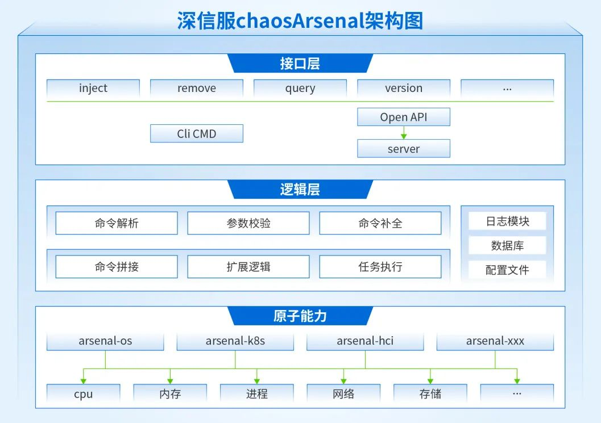
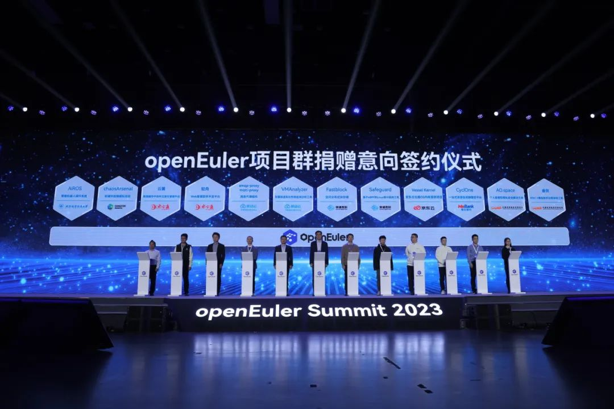
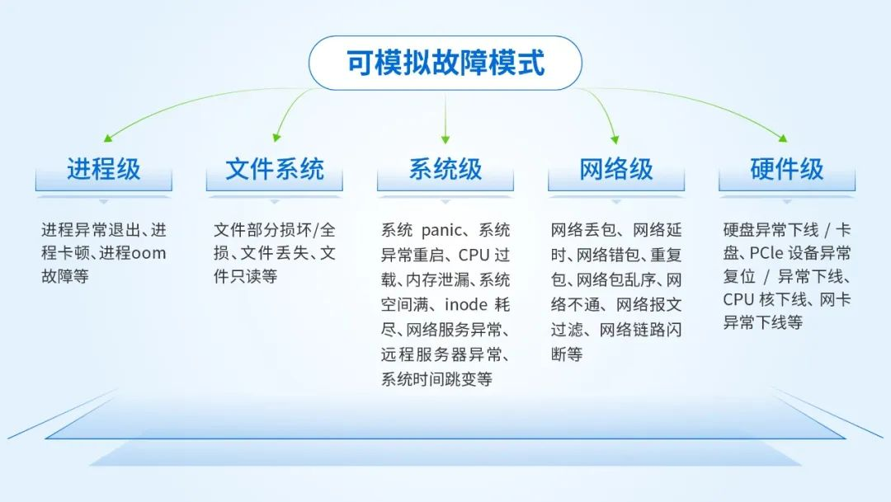
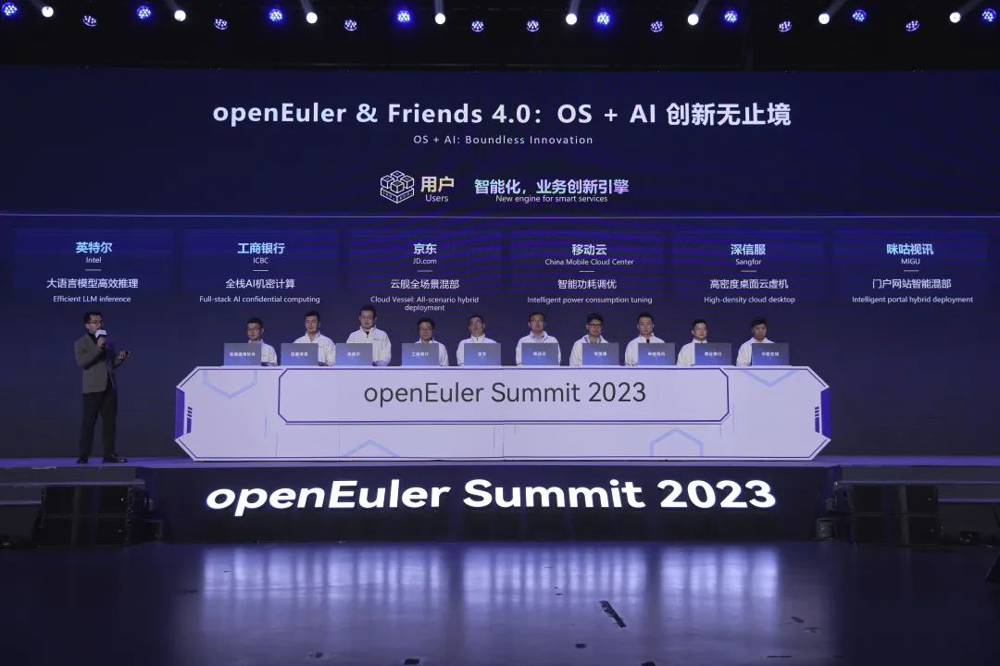

12月15-16日，「崛起数字时代 引领数智未来」操作系统大会 & openEuler
Summit
2023在北京国家会议中心举行，**深信服作为openEuler开源社区成员和共创合作伙伴受邀参加。**

openEuler
Summit是由openEuler社区发起并举办的年度开源操作系统峰会，汇聚产业组织、全球开源基金会、学术领袖、行业用户、生态伙伴与开发者，共同探讨科技创新与操作系统产业发展机遇，并展现最新的科技成果。

在这个开放、合作、共享的平台上，**深信服研发成果Sangfor
chaosArsenal正式加入openEuler项目群，并于现场签订捐赠意向。**

深信服现场签署向openEuler捐赠意向

此次捐赠内容包括------

**arsenal接口框架、arsenal-os和arsenal-hardware两个原子故障注入组件。**

Sangfor
chaosArsenal是一款**在Linux系统下通用的可靠性测试工具，通过在系统中模拟软/硬件故障，验证系统对于故障发生的抵御能力**.同时不断丰富分布式系统故障场景及故障注入技术，未来可满足用户对基础硬件、操作系统、中间件、业务应用等各种通用可靠性测试需求。

目前，Sangfor chaosArsenal开源的故障注入能力项如下：

Sangfor
chaosArsenal可快速部署上线，工具解压即可使用，提供CLI和OpenAPI两种方式调用，有效降低各行业用户可靠性测试评估的入门门槛与自建成本，用户还可基于自身实际业务模型快速添加自定义故障注入能力。

此次通过这项技术的开源捐赠，深信服希望为国内软件操作系统的发展贡献出一份实际的力量，不仅成为OpenEuler操作系统中重要的可靠性工程能力，**让更多用户因这项技术提升底层平台和业务系统的可靠性，**而且，深信服也希望这项贡献能为技术发展打开全新的可能性，**让更多产业生态伙伴、开发者在此基础上探索出更有效的可靠性技术，共同推动我国操作系统产业升级。**

捐赠后，深信服仍会对chaosArsenal进行迭代，优化架构、增强故障注入能力等，实现技术突破，为打造一个更加稳定可靠的云平台而努力。

在本次大会上，深信服还发布了**桌面云虚机高密度解决方案**.此方案在鲲鹏服务器硬件特性的基础上，通过深信服的智能AI调度算法和openEuler的算力负载均衡技术，深度结合，协同优化，**将桌面云虚机密度提升30%，同时将虚机内业务性提升6%。**

围绕用户实际使用场景，深信服分享桌面云创新方案

开源贡献、技术突破、能力进化，在这样一场科技的盛会上，与各行业用户、产业伙伴、科技同仁们以创新成果促进技术发展与资源共享，推动我国操作系统以及云计算产业的升级，深信服有幸参与其中。
