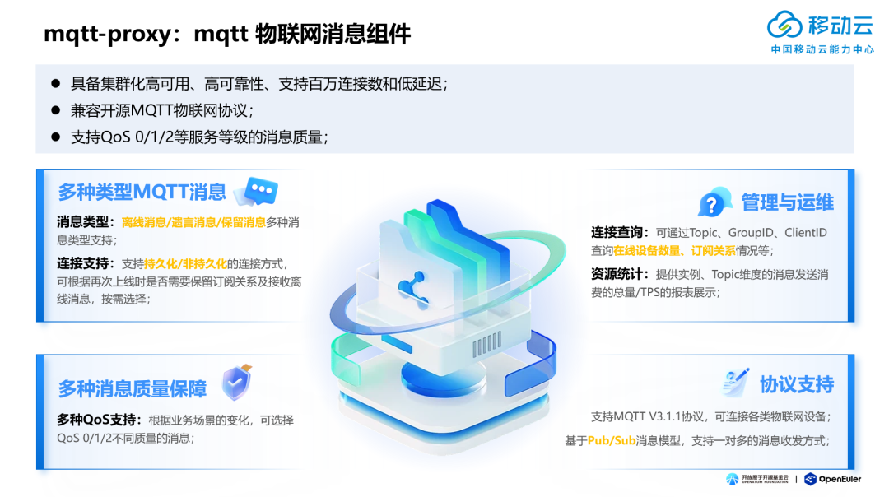
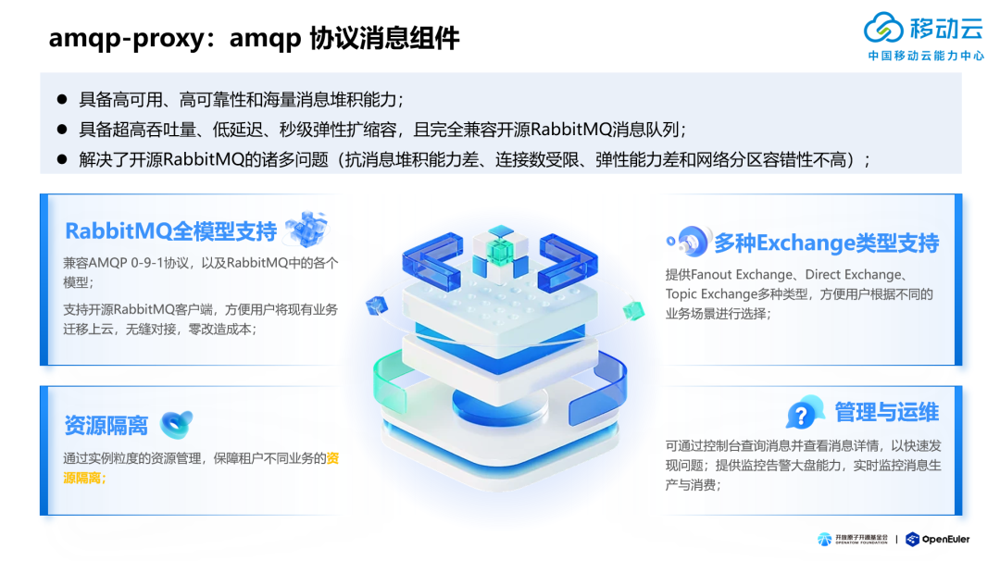
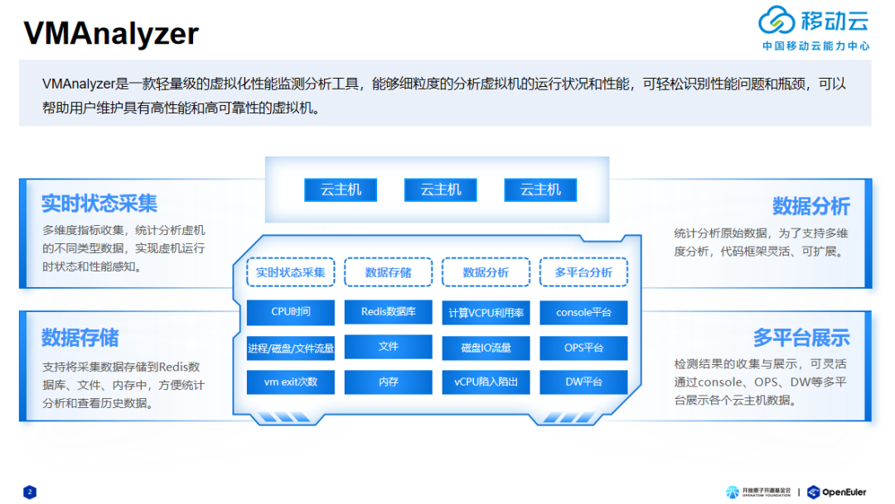

2023年12月15日，以"崛起数字时代 引领数智未来"为主题的操作系统大会&openEuler
Summit
2023在北京召开，移动云的三款开源项目加入openEuler，助力社区繁荣发展：物联网消息组件（mqtt-proxy）、AMQP协议消息组件（amqp-proxy）和虚拟化性能检测分析工具（VMAnalyzer）。截至目前，移动云累计5个项目加入openEuler项目群，并主导成立了消息中间件SIG组，推动openEuler生态的持续扩大,加速了新一代基础软件生态的繁荣。

**物联网消息队列组件（mqtt-proxy）**
===================================================
mqtt-proxy是一款MQTT物联网消息组件，其具备高可用、高可靠性、支持百万连接数、低延迟且兼容开源MQTT物联网协议的特性；相比Mosquitto等开源MQTT消息队列，其具备集群高可用能力，支持QoS
0/1/2等服务等级的消息质量。

**「多种类型MQTT消息」**：支持离线消息、遗言消息、保留消息等多种消息类型。支持持久化/非持久化的连接方式，可根据再次上线时是否需要保留订阅关系及接收离线消息，按需选择。

**「多种消息质量保障」**：根据业务场景的变化，可选择QoS
0/1/2不同质量等级的消息。

**「协议支持」**：支持MQTT
V3.1.1协议，可连接各类物联网设备，基于Pub/Sub消息模型，支持一对多的消息收发方式。

**「管理与运维」**：通过Topic、GroupID、ClientID查询在线设备数量、订阅关系情况。提供实例、Topic维度的消息发送/订阅的总量/TPS的报表展示。

mqtt-proxy主要用于智能家居、车联网、工业物联网等场景下，实现设备端与服务端间的消息通信 。

**AMQP消息组件（amqp-proxy）**
===================================================
amqp-proxy是一款AMQP协议消息组件，其具备高可用、高可靠、海量消息堆积和秒级弹性扩缩容能力，且完全兼容开源RabbitMQ消息队列。在保障集群高性能的前提下可支持万级队列，亿级消息堆积。

**「RabbitMQ全模型支持」**：兼容AMQP
0-9-1协议以及RabbitMQ中的各个业务模型；支持开源RabbitMQ客户端，方便用户将现有业务迁移至amqp-proxy，无缝对接，零改造成本。

**「多种Exchange类型支持」**：提供Fanout Exchange、Direct
Exchange、Topic Exchange多种类型，方便用户根据不同的业务场景进行选择。

**「资源隔离」**：支持实例粒度的资源管理，保障租户不同业务的资源隔离。

**「管理与运维」**：通过运维工具支持查询消息及详情，快速发现问题，提供监控告警大盘能力，实时监控消息生产与消费。

amqp-proxy解决了开源RabbitMQ在OpenStack大规模应用场景中遇到的诸多问题（抗消息堆积能力差、连接数受限、弹性能力差和网络分区容错性不高）。该项目是业界首个完成OpenStack超大规模应用的消息中间件项目。

**虚拟化性能检测分析工具（VMAnalyzer）**
===================================================
VMAnalyzer是一款轻量级的虚拟化性能监测分析工具，能够细粒度的分析虚拟机的运行状况和性能，可轻松识别性能问题和瓶颈，可以帮助用户维护具有高性能和高可靠性的虚拟机。

**「实时状态采集」**：多维度指标收集，统计分析虚机的不同类型数据，实现虚机运行时状态和性能感知。

**「数据存储」**：支持将采集数据存储到Redis数据库、文件、内存中，方便统计分析和查看历史数据。

**「数据分析」**：统计分析原始数据，为了⽀持多维度分析，代码框架灵活、可扩展。

**「多平台展示」**：检测结果的收集与展示，可灵活通过console、OPS等多平台展示各个云主机数据。

移动云自加入 openEuler 社区以来，积极参与社区共建，同时担任 openEuler
委员会委员和用户委员会主席，先后在消息中间件、虚拟化、内核、云原生和兼容性等多个
SIG 组参与开源共建，并在多个 SIG 组担任 Maintainer。未来，也将继续携手
openEuler
社区，深化联合创新，贡献更多开源项目，共享开源价值，积极推动中国开源软件生态的繁荣发展。
