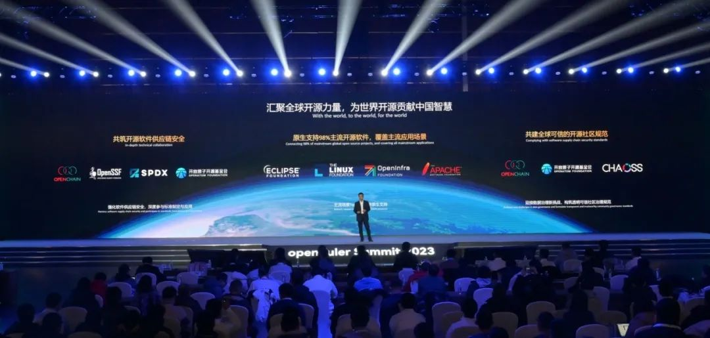
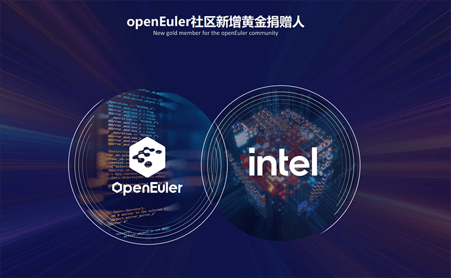

**概述**
====================================
2023年12月中旬，2023-2024年openEuler委员会会议在北京举办，全体委员正式欢迎英特尔（中国）有限公司的杨继国成为openEuler委员会委员之一。英特尔（Intel）成为openEuler社区成员单位新增黄金捐赠人。同时，根据《openEuler项目群开源治理制度》，经全体委员同意，熊伟
成为openEuler委员会新任执行总监。同期，在2023-2024年openEuler技术委员会上，各TC委员对2024年的工作方向做了初步规划，为社区未来一年的技术发展奠定了基础。

过去一年，openEuler加速发展。截至目前，openEuler系累计装机量超过610万套，根据IDC预测，2023年openEuler系在中国服务器操作系统市场份额达到36.8%。开源四年，openEuler实现了跨越式发展，成长为中国第一服务器操作系统，并在技术创新、生态发展、社区合作、商业落地上建立了完善的发展体系，形成了产业正循环。

在技术与生态发展方面，海思宣布A²MCU和MPU全面支持openEuler；由Intel主导的开源大语言模型在CPU的加速推理解决方案xFasterTransformer、openEuler
22.03 LTS
LoongArch、openEuler安全配置基线标准、结合stratovirt+kata+Nydus的创新架构CTFaaS CTyunOS
MicroVM、云脉芯联metaConnect-50智能网卡以及相继发布；沐创N10G-X2两端口10G网卡驱动在社区开源。openEuler联手全球主流基金会建设技术生态和开源软件供应链安全体系。

秉持着"OS for AI, AI for
OS"的理念，openEuler逐步推进在人工智能方面的探索。RISCV SIG
成功实现首个LPi4A-ROS 智能机器人；生肖Robot系列正在启动。Embedded
SIG与伙伴们多项成果落地：联合上海海思及伙伴的轻量级ROS2及混部技术，在电力、人工智能、工控领域等多个场景中应用；联合超聚变落地小型化、快速启动技术，正应用于数据中心全系列产品；携手Intel工业边缘团队，推出基于Intel第十二代处理器的工业计算机；联合计算鲲鹏、华为云等伙伴成立BMC
SIG孵化原创项目MetaBMC；与湖南大学和北京航空航天大学在社区贡献原创项目---ZVM实时虚拟化、Rust-Shyper高安全虚拟机监控器关键技术，均可应用在工控领域实现多实例部署；联合润和软件突破分布式软总线的联结总数，将应用场景从嵌入式扩展到服务器和边缘，实现了与OpenHarmony生态的互联互通；奥思维基于openEuler
Embedded底座发布OSWare
BaseOS，融合嵌入式、边缘两大能力，覆盖家庭大脑核心场景。

12月，移动云、联通数科、中国科学院软件研究所、北京航空航天大学、微众银行、东方通、深信服、京东科技等8家公司的13个开源项目加入openEuler，感谢伙伴朋友们的贡献。

在社区活动方面，除了年度盛会操作系统大会 & openEuler Summit
2023、OpenAtom 开发者大会 openEuler Code
Camp之外，openEuler携手伙伴积极参加FOSS year-end mashup（新加坡）、FICC
2023、OpenInfra Days China
2023等多场活动，向全球开发者多方面展现社区繁荣生态。

从2019年12月31日开源至今，openEuler基于广大开源社区的成果进一步发展而来，实现跨越式的发展。2024年，让我们携手前行，共建更好的openEuler，引领数智未来！

openEuler
2023年度开发者贡献报告已上线，欢迎体验（https://summary.openeuler.org/）。

本月报阅读时长预计30分钟。

**社区规模**
====================================
截止2023年12月31日，openEuler社区用户累计超过213万。超过17,000名开发者在社区持续贡献。社区累计产生
149.4K个PRs、75.2K条Issues。截至目前，加入 openEuler
社区的单位成员超过1400家，12月新增141家。

社区贡献看板（截至2023/12/31）

**社区大事件**
====================================
**操作系统大会 & openEuler Summit 2023 圆满落幕**

2023年12月15-16日，以"崛起数字时代，引领数智未来"为主题的操作系统大会&openEuler
Summit 2023 在北京举办。

大会持续两天，12大重磅看点、8场技术分论坛，40+个SIG组工作会议，不仅全面展现了openEuler在技术创新、行业应用、产业生态和全球化等方面所取得的重大进展，更体现了开源4年来，在伙伴和开发者们的共同努力下，openEuler所实现的跨越式发展成果。感谢大家的支持，一起共建更好的openEuler，引领数智未来！

**openEuler系市场份额达36.8%，服务器操作系统市场份额第一**

过去一年，openEuler加速发展。截至目前，openEuler系累计装机量超过610万套，根据IDC预测，2023年openEuler系在中国服务器操作系统市场份额达到36.8%。开源四年，openEuler实现了跨越式发展，成长为中国第一服务器操作系统，并在技术创新、生态发展、社区合作、商业落地上建立了完善的发展体系，形成了产业正循环。

**openEuler携手全球开源组织共建开源新生态**

openEuler致力于打造国际化开源协助平台，与国际主流基金会深度合作，目前已支持全球98%的主流开源软件。

openEuler深度参与OpenChain、OpenSSF等全球主流软件供应链安全标准与规范的制定、推广，率先通过OpenChain
ISO 5230开源软件协议认证，社区基础设施达到OpenSSF SLSA
L3标准。此外，社区与SPDX、CHAOSS等全球主流社区和组织合作，满足全球各区域本地化要求，规范openEuler社区的国际化治理。openEuler联手全球主流基金会建设技术生态和开源软件供应链安全体系。

**13个开源项目正式加入openEuler**

12月，来自中国移动云能力中心、联通数字科技有限公司、中国科学院软件研究所、北京航空航天大学、微众银行、北京东方通科技股份有限公司、深信服科技股份有限公司及京东科技信息技术有限公司等8家公司的13个开源项目加入openEuler，为社区注入新的创新力量，进一步增强社区技术创新能力，促进社区生态繁荣。

**openEuler & Friends 4.0，十大联合创新成果走向行业用户**

openEuler不为创新而创新，将创新带给千行万业，让创新成果走向更多行业用户。在本次峰会上，浪潮UBML、浩瀚深度、英特尔、工商银行、京东、移动云、深信服、咪咕视讯、微众银行和中移在线10家企业围绕用户实际使用场景进行全流程、全场景的联合创新。openEuler通过强化跨平台支持和提升AI、ML支持，在为开发者提供更加方便、强大的技术支持，推动整个开源操作系统生态的繁荣和发展。

**十所高校联合openEuler发布合作成果**

人才是产业发展的原动力，高校是产业人才的摇篮。自去年7月\"开放原子校源行"启动以来，openEuler作为开放原子开源基金会的重要项目群，也积极参与到这个项目中来，和北京航空航天大学、北京大学、上海交通大学、湖南大学、大连理工大学、兰州大学等多所高校深度合作，相关研究成果已通过社区，快速完成实践和验证，开创了产研融合、产教融合的新模式。

同时，openEuler高校技术小组正在成立中，为高校学子提供更多资源与渠道，推动开源人才的培养。

高校贡献与openEuler技术小组：

https://www.openeuler.org/zh/universities/

**openEuler社区2023年度各大奖项相继揭晓**

openEuler的繁荣离不开行业用户、社区伙伴、开发者的持续贡献。 2023年度openEuler领先商业实践项目、2023年度openEuler社区突出贡献单位、2023年度优秀项目、2023年度贡献之星等奖项相继在大会中揭晓。感谢大家对社区的贡献与支持。

**OpenAtom 开发者大会 openEuler Code Camp在无锡举办**

12月17日，OpenAtom 开发者大会 openEuler Code Camp 在无锡举办。openEuler
社区Maintainer郑振宇在会上介绍了openEuler开源四年来，在技术创新、开发者生态、海外合作等方面取得的成果以及未来的发展规划。此外，openEuler
开发工程师花逢春、曹梦晴于会上联合演讲了《openEuler+Ascend 的 OpenCV
原生支持之路》，揭秘 openEuler+Ascend 的 OpenCV 原生支持是如何实现的。

**FOSS year-end mashup在新加坡举办**

12月6日，由KCC@Singapore 与 Free and Open Source Singapore、Varnish
software、Couchbase 和 openEuler 联合举办的FOSS year-end mashup
在新加坡进行。

openEuler 社区社区技术委员会成员&傲空间团队项目发起人之一
王建民、Varnish Software 社区亚太区解决方案工程师主管和高级架构师 Henry
Choi 及 Couchbase 社区亚太区解决方案工程师 Kevin Johnson
等嘉宾参与其中，就自身的实践经验与成果进行分享和交流。

**opeEuler技术委员会委员、安全委员会主席朱健伟 受邀参加 FICC 2023**

12月3-6日，openEuler受邀参加2023国际测试委员会智能计算与芯片联邦大会(FICC
2023)。FICC的使命是通过汇总和推进芯片、人工智能、开源系统、基准和评估等领域的最新技术和实践，提供开创性的技术地图。

openEuler技术委员会委员、安全委员会主席朱健伟代表openEuler参加了2023开源计算机系统分会的研讨，并进行了议题分享：

《Bringing New Opportunities to the Diversified Computing
Era》。该议题详细介绍了社区在根技术创新、生态繁荣以及商业落地取得的成果，会上得到了国内外参会专家的一致认可，并获得优秀开源项目奖。

大会官网：

https://www.benchcouncil.org/ficc2023/index.html\#cfa

**OpenInfra Days China 2023 在北京举办**

12月1日，OpenInfra Days China 2023 在北京举行。本次大会由 OpenInfra
基金会授权，社区志愿者团队共同筹划组织。openEuler社区Maintainer郑振宇、王玺源、韩光宇，社区Contributor王锦涛、姜冬旭出席本次大会，并就OS、云基础设施、云原生平台、DPU、算力网络等方面展开讨论与分享。

原文阅读：

回顾 \| openEuler 参加 OpenInfra Days China 2023

**openEuler 用户案例持续征集中**

openEuler社区与社区伙伴们正在共同打造《openEuler开源操作系统行业应用案例集》，以展示openEuler在不同行业的应用场景与优势，为其他用户提供借鉴和参考，共同探索openEuler的更多可能性。

如果您想投稿案例，欢迎联系 user@openeuler.sh

**社区治理**
====================================
**2023-2024年openEuler委员会会议在北京召开**

2023年12月14日，2023-2024年openEuler委员会第五次会议在北京国家会议中心召开。

本次会议上，全体委员正式欢迎来自英特尔（中国）有限公司的杨继国加入openEuler委员会。同时，根据《openEuler项目群开源治理制度》，经全体委员同意，熊伟
成为新任执行总监。

此外，openEuler委员会在会上审议了2023年openEuler项目群工作进展和2024年的工作规划，并就社区未来发展方向提出了指导建议。

原文阅读：

2023-2024年openEuler委员会第五次会议召开

**英特尔成为openEuler社区新增黄金捐赠人，携手共建生态底座**

英特尔自2021年签署CLA加入openEuler社区，积极贡献x86平台的生态适配和技术优化，将x86的多代平台Ice
Lake、SPR、Emerald
Rapids引入到openEuler上，并将AI计算加速框架集成到openEuler，同时在openEuler的多个核心的SIG都有深入贡献。英特尔开源技术中心总监杨继国担任openEuler委员会委员，他表示："未来Intel将持续把Intel的上游开源项目集成到openEuler，并与openEuler共同在AI上持续发力，从软硬协同使能AI算力，满足各行业对于AI智算技术的需求。

**2023-2024年openEuler技术委员会12月会议摘要**

12月15日，2023-2024年openEuler技术委员会会议在北京召开。本次会议上，各委员对2023年度在社区所做的工作进行了轮流述职，并对2024年工作进行了初步规划，为社区未来一年的技术发展奠定了基础。

在本月的工作例会中，经技术委员会讨论决定，openEuler社区正式成立BMC
SIG。BMC
SIG由超聚变、鲲鹏、华为云、天翼云等组织与单位共同发起成立。该SIG组将openEuler社区作为孵化平台，面向算力基础设施领域探讨一个能兼容多样性算力平台的开发、安全、灵活的BMC方案，欢迎感兴趣的开发者关注。

同时，经技术委员会同意，来自移动云的mqtt-proxy、amqp-proxy、VMAnalyzer；东方通的轻舟、云翼；深信服的chaosArsenal；中国科学院软件研究所的AO.space
等多个项目加入到openEuler中发展。感谢朋友们的贡献！

**2023-2024年openEuler品牌委员会会议在北京召开**

12月16日，2023-2024年openEuler品牌委员会会议在北京召开，本次会议，总结了
openEuler 品牌委员会2023年的整体工作进展，并与各委员完成了对
2024年工作进行了初步规划。为社区2024年的品牌建设工作奠定了基础。会议还邀请到了来自IDC的助理研究总监李昭来为各位委员分享了《中国服务器操作系统市场追踪》，向各位委员详细介绍了目前报告中openEuler在各行业的装机量和占比。会议最后分享了运作一年的
Call for X 计划在讲师资源、技术教程资源、基础设施资源和场地资源的成果。

新的一年，openEuler
品牌委员会希望能够广泛的聚合社区中的各个企业的力量，协同企业和社区的品牌规划，联合技术委员会、用户委员会，让openEuler社区在技术、生态和商业方面的品牌工作更上一层楼。

**2023-2024年openEuler用户委员会会议在北京召开**

12月15日，2023-2024年openEuler用户委员会线下闭门会议在北京召开。会上，用户委员会委员对2023年的工作进行了总结。各委员就如何更好地发挥用户委员会的职能、如何更好地连接用户及打造用户生态进行探讨，初步规划了2024年用户委员会的工作方向。

**技术进展**
===========
**海思宣布A²MCU和MPU全面支持openEuler**

12月16日，在openEuler Summit
2023上，海思宣布A²MCU和MPU全面支持openEuler。海思A²
是海思针对家电、能源、工业、汽车等领域推出的全新解决方案，它不仅涵盖了基于RISC-V的系列化的MCU，还包含了高性能兼容ARM指令集的MPU，以及与之紧密配合并优化的操作系统。

海思A²解决方案把从强调高实时性的MCU到需要高性能实时计算的MPU芯片全面和openEuler进行了深度的协调和优化，因而openEuler和基于openEuler的开源实时操作系统UniProton也成为了海思A²解决方案里重要的组成部分。通过芯片和操作系统在底层的紧密配合，海思A²解决方案可以针对行业专用化场景进行更为深度定制和优化，从而挖掘出芯片全部的性能。比如针对工业控制场景通过对芯片与openEuler实时操作系统进行深度适配和优化，可以实现极致的工业级低延时和确定性。

针对高性能MPU，海思成功的实现了基于openAMP（开放非对称多处理）的多操作系统框架混合部署，基于该框架，用户可以在一颗MPU芯片上同时部署多个操作系统实例。

目前海思A²MCU和MPU方案已经在多个行业场景进行了部署。比如在家电场景，海思MCU可以实现空调调温阶段节能16%。在工业运动控制场景，海思MPU芯片可以实现在125us运动周期控制下，把时间抖动控制在1us以内，从而帮助半导体、激光等领域场景实现更快的任务处理和更高的确定性。

原文阅读：

从MCU到A²MCU，且看海思和openEuler如何碰出创新火花

**由Intel主导的xFasterTransformer亮相openEuler
Summit，提升大模型在CPU上的推理速度**

在openEuler Summit
2023上，Intel展示了开源大语言模型在CPU的加速推理解决方案xFasterTransformer。该方案使用的高性能算子库oneDNN和高性能通信库oneCCL都来自Intel
oneapi编程套件，充分发挥Intel
CPU强大的AI加速能力，可加速主流开源大模型推理，如llama，chatglm等。xFasterTransformer高效的算子实现和分布式支持，可以提升大模型的首词速度（TTFT）和词生成速度（TPOT），使用65B模型测试生成词吞吐大于10
token/s。为广大开发者做大模型本地部署提供了另一种选择。

作为openEuler的联创项目，Intel正在积极推进，争取加入到openEuler的最新发布版本中，同时，也在积极探索与社区中其他模型和工具的集成，为openEuler的AI生态贡献力量。

**openEuler 22.03 LTS LoongArch 发布**

openEuler 社区 LoongArch64 SIG 联合 Release SIG、QA
SIG，共同完成了社区主线代码归一，CI/CD 工程整合工作，同时， openEuler
22.03 LTS 实现了对 LoongArch 的完整支持，并发布系统镜像，支持
Everything、EPOL 软件仓库中的所有软件（约 3.5 万个）。龙架构正式成为
openEuler 官方支持的芯片架构，是 openEuler 社区发展进程中的重要里程碑。

原文阅读：

openEuler 22.03 LTS LoongArch
发布，龙架构进入社区主线，支持Everything和EPOL软件仓库

**微众银行开源项目CyclOne加入openEuler**

微众银行自研的一站式资源全周期管控平台开源项目CyclOne加入openEuler，助力开源生态的繁荣发展。

CyclOne
是一款资源管控平台，旨在提供一站式物理机全生命周期闭环管理，通过基于openEuler定制内存运行的小型操作系统实现硬件自动化管理和规模化部署，从而显著提升自动化交付能力。

作为全球领先的数字银行，微众银行不仅在金融服务领域不断创新，还积极参与开源社区建设，与openEuler一起繁荣开源生态。

**移动云3个开源项目（mqtt-proxy、amqp-proxy、VMAnalyzer）加入openEuler**

由中国移动云能力中心主导的三个项目：物联网消息组件（mqtt-proxy）、AMQP协议消息组件（amqp-proxy）和虚拟化性能检测分析工具（VMAnalyzer）于日前加入openEuler，并在社区开源。

MQTT物联网消息组件mqtt-proxy，具备高可用、高可靠性、支持百万连接数、低延迟且兼容开源MQTT物联网协议的特性；相比Mosquitto等开源MQTT消息队列，其具备集群高可用能力，支持QoS
0/1/2等服务等级的消息质量。

AMQP协议消息组件amqp-proxy，具备高可用、高可靠、海量消息堆积和秒级弹性扩缩容能力，且完全兼容开源RabbitMQ消息队列。在保障集群高性能的前提下可支持万级队列，亿级消息堆积。

轻量级的虚拟化性能监测分析工具VMAnalyzer，能够细粒度的分析虚拟机的运行状况和性能，可轻松识别性能问题和瓶颈，可以帮助用户维护具有高性能和高可靠性的虚拟机。

截至目前，移动云已经向openEuler累计贡献了5个项目（操作系统安全扫描工具secScanner、数据编解码套套件ksPack），并主导成立了消息中间件SIG组，推动openEuler生态的持续扩大，加速了新一代基础软件生态的繁荣。

**东方通开源项目（轻舟、云翼）加入openEuler**

经过openEuler技术委员会（TC）审核批准，东方通两个项目正式加入openEuler社区：面向Web管理软件的开发平台------轻舟，以及数据缓存中间件云原生管理平台
------云翼。

轻舟：是基于java语言实现的一款软件产品开发框架，其设计理念是充分复用软件开发过程中的架构设计和通用组件，以缩短产品的开发周期，并减轻上线后的运维成本。它总结了东方通在中间件软件类产品多年的开发经验，通过封装底层通用基础核心功能，只需要按照模板约束，编写简单POJO和注解，就可以自动实现软件的Web管理前后端功能，可以大幅提升软件管理类功能的开发效率。

云翼：可以满足企业用户对数据缓存产品云服务化的迫切需要，通过对数据缓存中间件的服务纳入管理，增加数据缓存产品的云服务能力，适应云平台需要具备的动态扩展、自动部署、故障自动恢复、统一接口服务能力，对原数据缓存节点进行云化管理，包括对缓存服务节点的监控、
数据操作等功能，为企业用户向云原生转型提供了一个便捷的工具。

两个项目均采用木兰v2宽松License协议，使用领域内主流的Java语言进行开发。东方通期望可以跟社区的小伙伴一起努力，打造新一代的基础软件基石。

**深信服可靠性故障注入工具chaosArsenal加入openEuler**

chaosArsenal
是基于openEuler操作系统提供一套能够模拟软硬件故障的能力集，致力于打造业界故障模拟能力最全、注入技术高度认可的开源工具能力。

它是在Linux系统下通用的可靠性故障注入工具，通过在系统中模拟软/硬件故障，验证系统可能发生故障时的抵御能力或帮助发现系统中可能存在的漏洞，用户可直接调用，无需自建。

chaosArsenal
已经加入openEuler，当前版本支持模拟Linux系统进程级、文件系统、系统资源、网络、硬盘等30+故障，可以在x86、arm架构下的主机、虚拟机、容器运行环境中(openEuler
OS)运行，提供CLI和HTTP两种方式被集成或调用执行，后续将持续推进，成为openEuler操作系统中重要的可靠性工程能力。

**中国科学院软件研究所保护个人数据和隐私安全的解决方案AO.space加入openEuler**

AO.space
是一款由中国科学院软件所主导研发的保护个人数据和隐私安全为核心的开源解决方案，通过端对端加密、基于设备认证等技术，确保用户完全掌控个人账号和数据。同时，采用平台透明转发、点对点加速、局域网直连等技术，让用户随时随地的极速访问个人数据。利用
PWA（Progressive Web
App）和云原生技术，设计并打造前后端一体的应用生态。在日前结束的openEuler
Summit 2023上，中国科学院软件所将该方案贡献到社区。

AO.space团队坚信保护个人数据和隐私安全的重要性，主动拥抱开源，让更多的开发者能够参与贡献并发挥创造力。与其他解决方案中的平台不同，AO.space中的个人账号由个人设备上的服务端管理，数据只能在个人设备上解密，平台无法管理和解析个人的任何数据，实现用户的个人数据完全由用户掌控在个人设备上。

AO.space项目主仓：

https://github.com/ao-space/ao.space

**RISCV SIG 成功实现首个LPi4A-ROS 智能机器人**

LPi4A-ROS小车是由 openEuler23.09 （RISCV）系统软件，亚博智能的 ROSMASTER
X3小车和矽速的LicheePI4A 开发板组成，目前已经实现了基于 ROS
订阅服务的四轮底盘控制和摄像头 AI
检测识别。未来将继续完善深度相机和激光雷达的适配，最终实现 SLAM
建图和自动驾驶的功能。

与此同时，RISCV SIG还与中国科学院空天信息创新研究院合作，基于 LicheePI4A
开发出了首个基于 RISC-V 架构 和openEuler
系统的无人机原型。项目采用了mavlink和ardupilot 技术，并正在推进 ROS
方向的研发工作。

**开源机器人项目 --- 生肖Robot 正式启动**

生肖Robot是一个支持openEuler的多种类开源机器人原型系列。项目以开源、好玩、多元化为核心理念，计划发布多种可以独立制造的完整机器人系统。

生肖Robot把机器人技术、机器人制造工艺和开源社区相结合，是一个开放的接触与实践机器人技术的平台，旨在实现机器人的不同硬件形态、开发具有创造性的机器人应用。该项目以ROS作为机器人中间件，与ROS
SIG、嵌入式SIG合作，探索欧拉与机器人结合的可能性。

目前生肖Robot系列发布了两款移动机器人，电鼠V1.0和迷你鼠V1.0。

项目主页：

https://gitee.com/shengxiaorobot/sheng-xiao-robot

**云脉芯联metaConnect-50智能网卡
XSC驱动正式作为inbox驱动随openEuler系统发布**

云脉芯联metaConnect-50智能网卡是云脉芯联自主研发的2口25G主打RDMA高性能网络的智能网卡产品，支持高性能RoCEv2无损网络及虚拟网络卸载加速。该卡支持云脉芯联自研可编程拥塞控制算法平台，可以根据不同的业务类型，灵活设计和应用适合的拥塞控制算法，显著提升端到端的网络性能和可靠性。

}

metaConnect-50智能网卡可应用于各类云计算、网络卸载加速、高性能存储等场景。目前相关产品已在互联网云计算、高性能存储等场景测试、使用，能够提供高性能、高可靠的网络体验。

作为国内领先的DPU芯片提供商，云脉芯联持续推动DPU应用落地，未来将在openEuler陆续开源更多智能网卡、DPU产品驱动，为用户提供更优质便捷的服务，进一步丰富openEuler的软硬件生态。

**沐创N10G-X2两端口10G网卡驱动在openEuler开源**

N10G-X2-DC网卡是沐创自主研发的第一代内生安全智能网卡，基于沐创N10G-X2智能网络控制器设计。该网卡具有两个10G
SFP+网络接口，支持网络虚拟化SR-IOV应用、多队列RSS
、IP/TCP及IP/UDP校验和卸载、FC/PFC流控机制、PTP/IEEE
1588v2、9564字节巨帧、PXE
远程网络启动，支持NC-SI边带管理等高级网络功能。

N10G-X2-DC网卡主要应用于数据中心、云计算以及网络安全和工业控制领域。提供内核态，用户态驱动，可通用适用于不同架构的平台（包含X86/ARM/MIPS/LoongArch/Alpha处理器架构）。

此次沐创N10G-X2
两端口10G网卡驱动在openEuler开源，沐创具备全谱系的网络NIC的解决方案，后续沐创更多的网卡驱动将持续开源，进一步丰富openEuler的国产硬件生态。

**openEuler安全配置基线标准发布**

为了应对日益增长的网络安全风险，保护企业信息系统和核心资产的安全，启明星辰、移动云、统信、麒麟软件、麒麟信安、超聚变、华为等多家公司联合推出了首个匹配业界优秀安全实践的基线标准《openEuler
安全配置基线标准 v1.0》，满足国内外桌面及服务器市场基础安全诉求
，帮助用户在投入最少工作量的情况下，快速并显著的提升系统整体安全防护能力，助力各种安全配置核查诉求。目前，该基线标准已在openEuler
Summit 2023上发布。

openEuler 安全配置基线 v1.0发布地址：

https://gitee.com/openeuler/security-committee/blob/master/secure-configuration-benchmark/release/openEuler安全配置基线.md

**结合stratovirt+kata+Nydus的创新架构发布：**

**CTFaaS + CTyunOS MicroVM**

由天翼云主导的CTFaaS + CTyunOS MicroVM的创新架构在openEuler Summit
2023（云原生技术分论坛）上发布。在天翼云、华为、电信研究院三方的共同合作下，该架构使能CPU、内存热加载的upcall技术，创新结合stratovirt+kata+Nydus，在系统镜像尺寸和CPU内存消耗大幅削减70%的条件下，达成了业界同类技术的领先性能指标。

目前，天翼云已在openEuler社区累计贡献安全更新工具cve-ease、云平台组件gostone、ebpf工具CTinspector、云原生基础设施安装与更新工具k8s-install在内的4款自研软件；累计贡献PR
400余个；拥有ebpf-sig、cloudnative-sig、openstack-sig在内的多位Maintainer，并积极主持SIG例会、分论坛事务、开放工作组会议，多次参与峰会及分论坛演讲和线下技术meetup的技术分享。未来，天翼云将持续共建openEuler，促进社区技术生态的繁荣。

**openEuler Embedded 多项成果在大会上展示**

Embedded SIG 联合多家伙伴在openEuler Summit
2023的各大展区以及嵌入式分论坛中呈现多项落地成果与实践经验，进一步繁荣社区生态：

联合上海海思及伙伴初步落地轻量级ROS2及混部技术，启诺推出首款"欧拉派"系列开发板，鼎桥展示电力巡检机器人，菁蓉构建JG领域的人工智能数字底座，米尔发布工控领域的控制器解决方案，覆盖智慧视觉、工业控制等场景。

联合超聚变落地小型化、快速启动技术，正应用于数据中心全系列产品，2024年上量空间达200W台，同时联合计算鲲鹏、华为云等伙伴成立SIG-BMC孵化原创项目MetaBMC，阿里云、天翼云、百敖等均表示参加意愿，获得年度openEuler优秀领先商业实践。

携手Intel工业边缘团队，基于软实时技术突破分级实时能力，推出基于Intel第十二代处理器的工业计算机，可应用于工业机器人和机器视觉等场景。

携手湖南大学和北京航空航天大学，在社区贡献原创的ZVM实时虚拟化、Rust-Shyper高安全虚拟机监控器关键技术，均可应用在工控领域实现多实例部署，双双获得社区年度优秀项目。

 

联合润和软件突破分布式软总线的联结总数，利用容器实现全场景的软总线技术方案归一，将应用场景从嵌入式扩展到服务器和边缘，实现了与OpenHarmony生态的互联互通。

奥思维基于openEuler Embedded底座发布OSWare
BaseOS，使能嵌入式虚拟化，融合嵌入式、边缘两大能力，覆盖家庭大脑核心场景。

**secGear 新增支持华为云QingTian Enclave**

由 Confidential Computing SIG 维护的机密计算统一开发框架 secGear
新增支持华为云QingTian Enclave。用户可在华为云上基于 secGear
开发、部署机密计算应用，帮助用户聚焦业务，降低开发成本，助力机密计算应用生态发展。

secGear 是 openEuler 推出的机密计算统一开发框架，屏蔽 TEE SDK
差异，提供统一开发接口，实现不同架构共源码，已支持 Intel SGX、鲲鹏
Trustzone、RISC-V Penglai、华为云 QingTian Enclave等。

原文阅读：

secGear 携手华为云QingTian Enclave，助力云上数据安全

**软硬件兼容性认证**
===========
2023年12月，openEuler兼容性方案累计1401个，北向907个，南向 436个，OS
124个。12月新增北向 77个，南向 3个，OS 7个。

社区兼容性列表：

https://www.openeuler.org/zh/compatibility/

**安全公告**
===========
2023年12月社区共发布安全公告117个，修复漏洞88个（其中 Critical 7个，High
50个，其它 31个）。

**重点漏洞提醒**

如下漏洞评估影响较大，请重点关注：

**5.9.12版本之前的strongswan软件存在缓冲区溢出漏洞（CVE-2023-41913）**

**CVSS评分为9.8分**

公告链接：

https://www.openeuler.org/zh/security/cve/detail/?cveId=CVE-2023-41913&packageName=strongswan

影响范围：

openEuler-20.03-LTS-SP1

openEuler-20.03-LTS-SP3

openEuler-20.03-LTS-SP4

openEuler-22.03-LTS 

openEuler-22.03-LTS-SP1

openEuler-22.03-LTS-SP2

**2.7.1版本之前的hsqldb1软件存在RCE漏洞（CVE-2022-41853）**

**CVSS评分为9.9分**

公告链接： 

https://www.openeuler.org/zh/security/cve/detail/?cveId=CVE-2022-41853&packageName=hsqldb1

影响范围：

openEuler-20.03-LTS-SP1

openEuler-20.03-LTS-SP3

openEuler-20.03-LTS-SP4

openEuler-22.03-LTS

openEuler-22.03-LTS-SP1

openEuler-22.03-LTS-SP2

**4.1.3版本之前的nodejs-tough-cookie软件存在Prototype
Pollution问题（CVE-2023-26136）**

**CVSS评分为9.8分**

公告链接：

https://www.openeuler.org/zh/security/cve/detail/?cveId=CVE-2023-26136&packageName=nodejs-tough-cookie

影响范围：

openEuler-20.03-LTS-SP1

openEuler-20.03-LTS-SP3

openEuler-20.03-LTS-SP4

openEuler-22.03-LTS 

openEuler-22.03-LTS-SP1

openEuler-22.03-LTS-SP2

**5.38.2版本之前的perl软件存在未分配内存写问题（CVE-2023-47100）**

**CVSS评分为9.8分**

公告链接：

https://www.openeuler.org/zh/security/cve/detail/?cveId=CVE-2023-47100&packageName=perl

影响范围：

openEuler-22.03-LTS

openEuler-22.03-LTS-SP1

openEuler-22.03-LTS-SP2

**2.7.1版本之前的hsqldb软件存在RCE漏洞（CVE-2022-41853）**

**CVSS评分为9.8分**

公告链接：

https://www.openeuler.org/zh/security/cve/detail/?cveId=CVE-2022-41853&packageName=hsqldb

影响范围：

openEuler-20.03-LTS-SP1

openEuler-20.03-LTS-SP3

openEuler-22.03-LTS 

openEuler-22.03-LTS-SP1

openEuler-22.03-LTS-SP2

**23.3.4.15之前版本、
24.3.4.2之前的24.x版本和25.0.2之前的25.x版本的erlang软件包存在客户端身份验证绕过漏洞（CVE-2022-37026）**

**CVSS评分为9.8分**

公告链接：

https://www.openeuler.org/zh/security/cve/detail/?cveId=CVE-2022-37026&packageName=erlang

影响范围：

openEuler-22.03-LTS

openEuler-22.03-LTS-SP1

openEuler-22.03-LTS-SP2

**python-cryptography软件存在空指针解引用漏洞（CVE-2023-49083）**

**CVSS评分为9.1分**

公告链接：

https://www.openeuler.org/zh/security/cve/detail/?cveId=CVE-2023-49083&packageName=python-cryptography

影响范围：

openEuler-20.03-LTS-SP1

openEuler-20.03-LTS-SP3

openEuler-22.03-LTS

openEuler-22.03-LTS-SP1

openEuler-22.03-LTS-SP2

**漏洞防护**

openEuler社区针对在维版本例行修复漏洞，发布安全补丁。建议用户关注openEuler官网安全公告，及时安装漏洞补丁进行防护。

openEuler安全公告：

https://www.openeuler.org/zh/security/security-bulletins/

**感谢每一位朋友、开发者的支持**

因为大家的辛勤贡献，openEuler的每一天都发生着好的事情。小编限于视野和能力，难免有所遗漏，在此表示歉意。同时，衷心感谢社区朋友、开发者们以及openEuler
SIG组成员的贡献：

\* 以上不分先后顺序

如果您希望在月报中增加您的工作内容，或对内容有任何改进建议，请联系wengqiaozhen@openeuler.sh。
