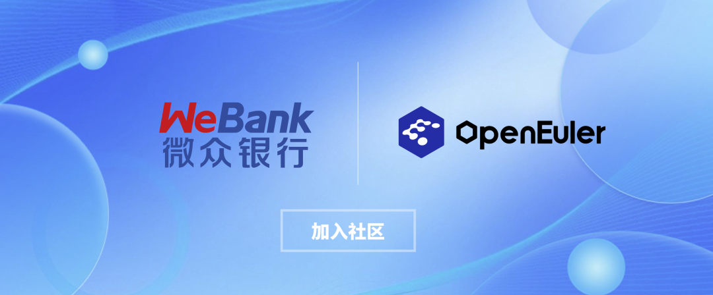
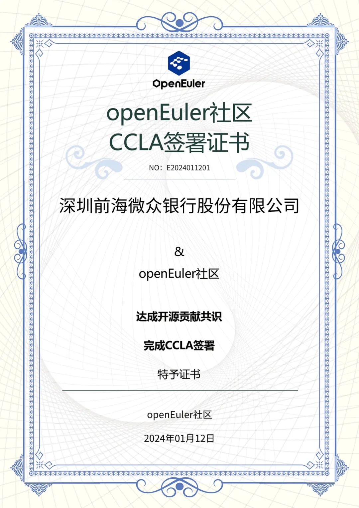

近日，**微众银行**签署了企业级贡献许可协议（Coperation Contribution
License Agreement，CCLA），正式加入**openEuler社区**。

**关于微众银行**
===================================================
作为全球领先的数字银行，微众银行始终积极拥抱开源技术，提升自主可控水平。从立行之初，微众银行就基于"开放蜂巢Openhive"技术，利用标准化硬件和开源软件，构建了国内首个基于安全可控技术的全分布式银行系统架构，不断深化科技自主创新，秉承开放共享的理念，通过开源生态，将科技成果在全球范围内共享，提升行业数字化水平。加入openEuler社区后，**微众银行将自研的一站式资源全周期管控平台开源项目CyclOne开源并加入openEuler项目群**，积极为国内开源基金会和开源社区贡献能力、助力操作系统应用与发展的重要实践。\
\
CyclOne
以全生命周期闭环管理的设计理念打造企业级平台解决方案，从资源准入到服役结束形成闭环，以openEuler为基座，支持多架构、全自动的规模化资源部署，有效提高资源管理效率，降低企业运营成本，为行业提供了切实可行的解决方案。

**关于openEuler社区**
===================================================
openEuler社区，全称为OpenAtom
openEuler社区，是一个面向数字基础设施操作系统的开源社区，简称openEuler或者openEuler社区。由开放原子开源基金会（以下简称"基金会"）孵化及运营。openEuler是一个面向数字基础设施的操作系统，支持服务器、云计算、边缘计算、嵌入式等应用场景，支持多样性计算，致力于提供安全、稳定、易用的操作系统。通过为应用提供确定性保障能力，支持OT领域应用及OT与ICT的融合。
