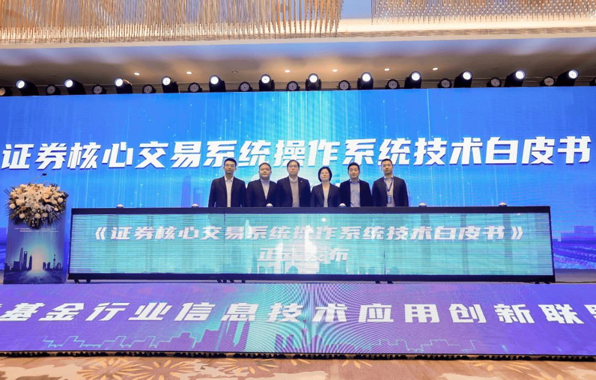

【中国，上海，2024年1月23日】今日，在证券基金行业信息技术应用创新联盟2023年度工作会议上，《证券核心交易系统操作系统技术白皮书》正式发布。该白皮书由上交所技术有限责任公司和openEuler社区技术委员会联合编纂，旨在探讨证券核心交易系统参与基础软件根技术发展的模式和路径，并为其他系统场景及证券行业走向数字化的深水区提供参考。上海证券交易所信息科技部副总唐忆女士；上海证券交易所低时延实验室负责人、G4项目技术定义小组负责人刘凯先生；海通证券党委委员、副总经理兼首席信息官毛宇星先生；东方证券首席信息官卢大印先生；开放原子开源基金会TOC副主席、openEuler委员会执行总监熊伟先生；华为中国区证券行业总经理李静先生共同参与了发布仪式。

**《证券核心交易系统操作系统技术白皮书》发布仪式**
=========

白皮书梳理了证券核心交易系统发展历史、趋势与当前面临的挑战，深入分析基础软件根技术在证券核心交易系统中的战略意义，结合新一代分布式交易系统的整体架构与关键特性，梳理当前OS层面可应用于证券交易系统的特性及方案，并通过"低时延实验室"基于上交所的实际业务场景验证可行性及收益，定义可落地的证券核心交易系统操作系统构建方案。全文有需求、有根据、有实践。随着中国证券交易市场快速发展，市场投资者和交易业务量不断攀升，业务创新、金融科技创新脚步不断加快，对于可信交易系统的业务支持速度、并发处理能力、灾备支持能力等均提出了更高要求。同时，随着新兴数字基础设施技术不断加强，在证券核心系统改造建设持续深入背景下，分布式交易系统建的建设对操作系统性能、兼容性、稳定性、创新性、可运维性、安全性等方面的要求也不断提升和细化。

上海证券交易所低时延实验室负责人、G4项目技术定义小组负责人刘凯表示："上交所加速业务创新，建设世界一流的证券交易所，我们未来进行G4新核心系统改造，要求实时交易系统的端到端全链路，包含底层硬件，操作系统、编译器、数据库，应用层等组成部分持续优化。通过与华为开展联合创新，在软硬件层面协同优化，打造基于
openEuler
的低时延操作系统，并最终通过一套组合方案，实现核心交易系统端到端时延再降低20%。"

openEuler是面向数字基础设施的开源操作系统，支持服务器、云计算、边缘计算和嵌入式四大场景，支持多样性计算。该项目由开放原子开源基金会孵化及运营的开源项目。截至
2023 年 11 月，openEuler
累计装机量已经达到610万+套，在政府、金融、运营商、电力、能源五个行业新增装机量排名第一。
