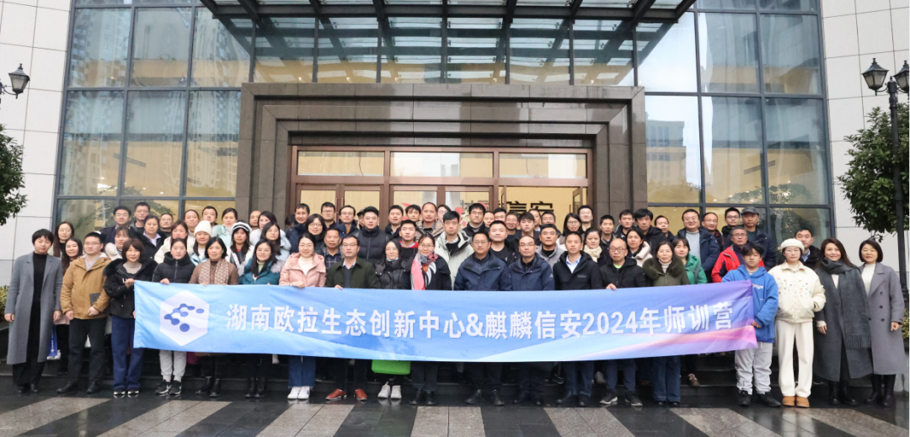
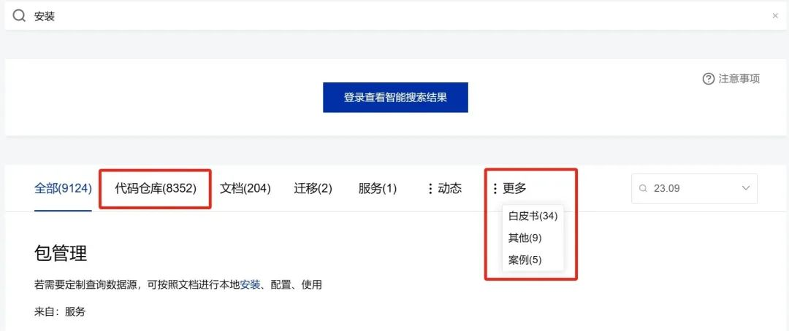
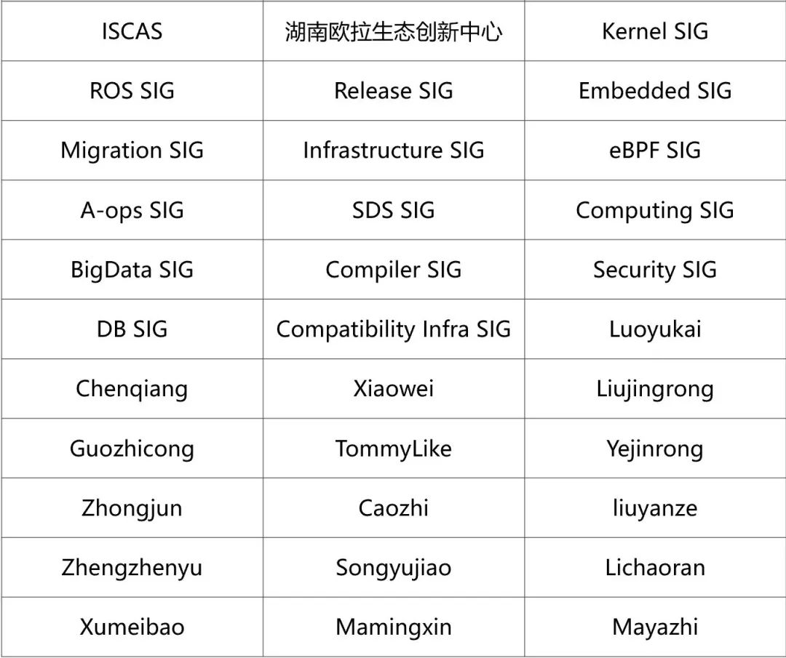

**概述**
===================================
2024年1月底，openEuler委员会会议在北京召开，会上总结了社区2023年的运营治理成果和经验，并审议了openEuler社区2024年的目标和计划。

在本月SIG组的运作上，ROS
SIG继续拓展ROS2移植版图，新增支持ROS2软件包若干，目标在openEuler
24.03版本上完善ROS2-Humble Desktop版本；同时，ROS SIG开始了ROS1
noetic版本的重构，新版本做到了与社区依赖库的大面积接耦，预计在2024年随社区版本发布。在嵌入式领域，为打造开箱即用的智能机器人操作系统，Embedded
SIG新增孵化AiROS智能机器人操作系统。BigData
SIG新增创新项目uadk-bigdata和bigtop-manager，持续丰富和构建社区大数据生态。

在其他技术发展方面，完整功能的Lustre已完全引入openEuler，相关使用文档可在社区官网上查阅。GreatSQL数据库8.0.32-25版本已发布了for
openEuler LTS
RPM包。作为A-Ops的可观测组件，gala-gopher项目围绕eBPF技术以及对云原生场景运维的分析，介绍了openEuler通过集成探针快速构建观测能力的实践情况。

openEuler与FOSSASIA携手举办的国际年度编码竞赛CodeHeat已于日前启动。整体赛事将持续到2024年3月31日，参赛作品提交日期截止至2024年3月6日。海内外朋友可以在FOSSASIA
 CodeHeat官网注册（https://codeheat.org/），选择感兴趣的项目参赛。

本月报阅读时长预计15分钟。

**社区规模**
===================================
截止2024年1月31日，openEuler社区用户累计超过216.4万。超过17,000名开发者在社区持续贡献。社区累计产生
152.8K个PRs、77.6K条Issues。截至目前，加入 openEuler
社区的单位成员1438家，本月新增17家。

社区贡献看板（截至2024/01/31）

**社区大事件**
===================================
**国际开源竞赛FOSSASIA  CodeHeat启动中，欢迎报名**

     
 由FOSSASIA组织举办的国际年度编码竞赛CodeHeat于日前启动。作为开源操作系统的关键项目，openEuler参与其中并贡献赛题，旨在鼓励开发者们参与到项目开发中，通过解决实际问题和提升项目功能，推动开源社区的创新和发展。海内外朋友可以在FOSSASIA
 CodeHeat官网注册，选择感兴趣的项目进行贡献。

       赛事将持续到2024年3月31日，参赛作品提交日期截止至2024年3月6日。

官网更多了解：https://codeheat.org/

**湖南欧拉生态创新中心**

**2024年openEuler师训营圆满结营**

1月22日，由湖南欧拉生态创新中心、国家关键领域信创行业产教融合共同体主办的全国首个openEuler师训营圆满结营。师训营为期5天，汇集来自openEuler社区、湖南省鲲鹏生态创新中心、华为、麒麟信安、湖南欧拉生态创新中心的专家和优秀讲师。课程内容包含openEuler理论学习、案例分析、实践操作、OECA"学练考证"等多方面，有效促进学员们相关专业素养提升。

**openEuler 用户案例持续征集中**

由openEuler社区与社区伙伴们共同打造的《openEuler开源操作系统行业应用案例集》，展示了openEuler在不同行业的应用场景与优势，为其他用户提供借鉴和参考，共同探索openEuler的更多可能性。

如果您想投稿案例，欢迎联系 user@openeuler.sh

**社区治理**
===================================

**2023-2024年openEuler委员会第六次会议摘要**

1月25日，2023-2024年openEuler委员会第六次会议在北京中国科学院软件研究所召开。

会上，openEuler社区的技术委员会、品牌委员会、用户委员会、社区运营和项目群办公室的各位代表总结了社区2023年的运营治理成果和经验，展望规划了openEuler社区2024年的行动计划与落地方案。

openEuler委员会在会上审议决策了社区2024年的目标与计划。

**技术进展**
===================================

**Embedded
SIG联合北航探索基于异构多核混合部署平台的机器人智能软件栈研究**

openEuler Embedded
SIG新增孵化AiROS智能机器人操作系统，致力于打造开箱即用的智能机器人操作系统。

**新增RobotBrain仓库**\
针对EtherCAT总线的六轴工业机械臂进行适配，搭建机器人控制器程序，包含机器人正逆解运动、数据管理、配置管理、示教等。

项目地址：https://gitee.com/openeuler/RobotBrain

**新增RobotStudio仓库**\
配合RobotBrain控制器运行时程序，提供一套基于Electron+VueJS的上位机操作程序，同时，采用QT+WebEngine+VueJS的方案，支持手持示教器软件的部署。

项目地址：https://gitee.com/openeuler/RobotStudio

**openEuler Embedded发布22.03-LTS-SP3版本**

openEuler
Embedded发布22.03-LTS-SP3版本，基于SP2版本，提升了整体质量，以及完善了部分特性。

22.03-LTS-SP3版本完善了拉取源码的相关工程，提升了构建效率。新增了多款bsp支持，如RK3588和RK3399，以及全志A40i，拓宽了本版本的运行范围。内核小版本升级为5.10.0-177.0.0，综合性能提升约2%。

完善iSula支持，当前iSula大部分功能均可在openEuler
Embedded上使用，进一步融入社区容器生态。修复了https下载相关的问题，使能iSula和其他依赖HTTPS的进程正确访问互联网，进一步增强生态互联能力。

**openEuler原生支持Lustre**

Lustre是HPC/AI领域流行的分布式文件系统，具有高可扩展、高性能、高可用等特点。

继openEuler 22.03 LTS SP2引入Lustre
client端组件rpm包后，最新发布的openEuler 22.03 LTS SP3如期引入了Lustre
server端组件rpm包。至此完整功能的Lustre宣布完成引入openEuler。此次引进的Lustre版本在上游社区最新2.15.4
LTS版本基础上回合了上游社区master主分支对openEuler支持的patch
set。欢迎广大社区用户测试和使用，安装使用文档请查看用户说明文档。

说明文档：

https://docs.openeuler.org/zh/docs/22.03\_LTS\_SP3/docs/lustre/user-guide.html

**BigData SIG 工作进展**

BigData
SIG持续构建和完善openEuler社区下的大数据生态，打造活跃的大数据交流平台，丰富和提升大数据组件功能和性能，发掘用户大数据需求，孵化有潜力的大数据组件。本月，BigData
SIG工作中技术创新项目进展：

1.  **新增uadk-bigdata项目**\
本项目旨在为大数据领域构建一个从硬件到应用层的全栈加速解决方案，整合UADK的能力和OpenSSL
3.0建立一个有效的通路，并将JDK与OpenSSL
3.0连接起来，从而为大数据应用提供一个完整的硬件加速方案。\
项目地址：https://github.com/openeuler-mirror/uadk-bigdata

1.  **新增bigtop-manager项目**\
bigtop-manager是一款现代化的，面向云原生的大数据集群管理平台，提供了一套轻量级的方案高效地管理bigtop所支持的大数据组件。初始代码已上库，欢迎大家参与到项目中来，我们力争从openEuler社区孵化毕业进入Apache社区。\
项目地址：https://gitee.com/openeuler/bigtop-manager

1.  更多技术创新项目正在规划和上架中，欢迎大家敬请期待。

    BigData SIG链接：https://gitee.com/openeuler/bigdata

**ROS SIG 工作进展**

2024年1月，ROS
SIG继续拓展ROS2移植版图，新增支持ROS2软件包若干，目标在openEuler
24.03版本上完善ROS2-Humble
Desktop版本。此外，ROS2在RISC-V架构上的迁移取得新进展，成功在RISC-V小车上运行起SLAM与Navigation等大型ROS软件包。

本月，ROS SIG开始了ROS1
noetic版本的重构，新版本做到了与社区依赖库的大面积接耦，预计在2024年随社区版本发布。

ROS SIG：

https://www.openeuler.org/zh/sig/sig-detail/?name=sig-ROS

**Infrastructure SIG 工作进展**

深入分析并提升开发者使用体验，一直是基础设施团队努力的方向。

基于开发者对文档资料的使用感受，Infrastructure
SIG对官网智能搜索进行了升级，在原有的基础上增加代码仓库、白皮书、案例的检索。

社区新增镜像站点：

江西理工大学：https://mirrors.jxust.edu.cn/openeuler/

德国亚琛工业大学：

https://ftp.halifax.rwth-aachen.de/openeuler/

**GreatSQL数据库加入openEuler**

GreatSQL数据库是一款开源免费数据库，可在普通硬件上满足金融级应用场景，具有高可用、高性能、高兼容、高安全等特性，可作为MySQL或Percona
Server for
MySQL的理想可选替换。GreatSQL已经加入openEuler，最新的GreatSQL
8.0.32-25版本已发布了for openEuler LTS
RPM包，该版本支持基于MGR的高可用能力，并兼容绝大多数Oracle特性，支持AP分析引擎、InnoDB并行查询、并行LOAD
DATA，更多企业级安全特性。用户可下载安装，体验更流畅、更好用的MySQL可选替代方案。

项目地址：

https://gitee.com/src-openeuler/greatsql

**云原生可观测洞察及openEuler社区实践**

gala-gopher作为openEuler社区项目A-Ops的可观测组件，为提供Metrics、Event、Perf等数据。针对云原生时代的可观测性存在的问题，gala-gopher项目围绕eBPF技术，分析云原生场景运维带来的变化与挑战，提出eBPF的局限性及解决方案，并介绍了
openEuler 通过集成探针快速构建观测能力的实践情况。

相关链接：

https://mp.weixin.qq.com/s/OdDy1sNoQNy5zUwMxxAG\_A

**软硬件兼容性认证**

2024年1月，openEuler兼容性方案累计1486个，北向974个，南向 449个，OS
129个。12月新增北向 67个，南向 13个，OS 5个。

社区兼容性列表：

https://www.openeuler.org/zh/compatibility/

**安全公告**
===================================
2024年1月，社区共发布安全公告107个，修复漏洞88个（其中 Critical
6个，High 43个，其它 39个）。

**重点漏洞提醒**

如下漏洞评估影响较大，请重点关注：

**libexif软件存在越界写漏洞（CVE-2020-0452）**

**CVSS评分为9.8分**

公告链接：

https://www.openeuler.org/zh/security/cve/detail/?cveId=CVE-2020-0452&packageName=libexif

影响范围：

openEuler-20.03-LTS-SP1

openEuler-20.03-LTS-SP4

openEuler-22.03-LTS

openEuler-22.03-LTS-SP1

openEuler-22.03-LTS-SP2

openEuler-22.03-LTS-SP3

**containernetworking-plugins软件存在js代码注入漏洞（CVE-2023-24538）**

**CVSS评分为9.8分**

公告链接： 

https://www.openeuler.org/zh/security/cve/detail/?cveId=CVE-2023-24538&packageName=containernetworking-plugins

影响范围：

openEuler-20.03-LTS-SP1

openEuler-20.03-LTS-SP4

openEuler-22.03-LTS

openEuler-22.03-LTS-SP1

openEuler-22.03-LTS-SP2

openEuler-22.03-LTS-SP3

**1.37版本之前的netdata软件存在任意代码执行漏洞（CVE-2023-22496）**

**CVSS评分为9.8分**

公告链接：

https://www.openeuler.org/zh/security/cve/detail/?cveId=CVE-2023-22496&packageName=netdata

影响范围：

openEuler-20.03-LTS-SP1

openEuler-22.03-LTS

openEuler-22.03-LTS-SP1

**1.37版本之前的netdata软件可能存在敏感信息泄露问题（CVE-2023-22497）**

**CVSS评分为9.8分**

公告链接：

https://www.openeuler.org/zh/security/cve/detail/?cveId=CVE-2023-47100&packageName=perl

影响范围：

openEuler-22.03-LTS

openEuler-22.03-LTS-SP1

openEuler-22.03-LTS-SP2

**2.7.1版本之前的hsqldb软件存在RCE漏洞（CVE-2022-41853）**

**CVSS评分为9.8分**

公告链接：

https://www.openeuler.org/zh/security/cve/detail/?cveId=CVE-2023-22497&packageName=netdata

影响范围：

openEuler-20.03-LTS-SP1

openEuler-22.03-LTS

openEuler-22.03-LTS-SP1

**5.7.25版本tidy软件包存在客户端身份验证绕过漏洞（CVE-2021-33391）**

**CVSS评分为9.8分**

公告链接：

https://www.openeuler.org/zh/security/cve/detail/?cveId=CVE-2021-33391&packageName=tidy

影响范围：

openEuler-20.03-LTS-SP1

openEuler-20.03-LTS-SP4

openEuler-22.03-LTS

openEuler-22.03-LTS-SP1

openEuler-22.03-LTS-SP2

openEuler-22.03-LTS-SP3

**ignition软件包存在任意代码执行漏洞（CVE-2023-24538）**

**CVSS评分为9.8分**

公告链接：

https://www.openeuler.org/zh/security/cve/detail/?cveId=CVE-2023-24538&packageName=ignition

影响范围：

openEuler-22.03-LTS-SP1

**漏洞防护**

openEuler社区针对在维版本例行修复漏洞，发布安全补丁。建议用户关注openEuler官网安全公告，及时安装漏洞补丁进行防护。

openEuler安全公告：

https://www.openeuler.org/zh/security/security-bulletins/

**感谢每一位朋友、开发者的支持**
===================================
因为大家的辛勤贡献，openEuler的每一天都发生着好的事情。小编限于视野和能力，难免有所遗漏，在此表示歉意。同时，衷心感谢社区朋友、开发者们以及openEuler
SIG组成员的贡献：

\* 以上不分先后顺序

如果您希望在月报中增加您的工作内容，或对内容有任何改进建议，请联系wengqiaozhen@openeuler.sh。
