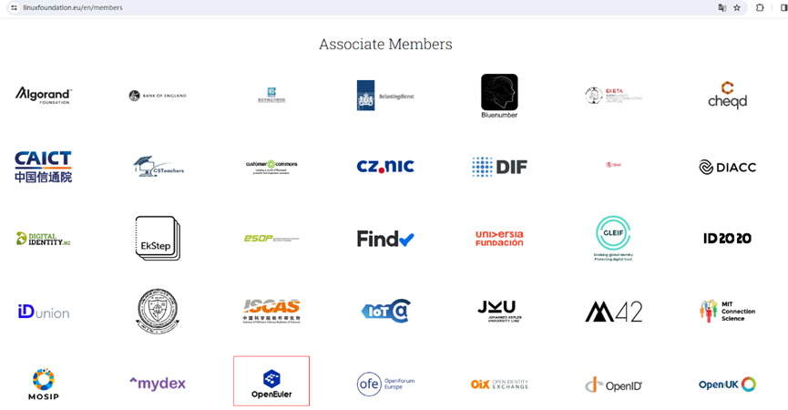
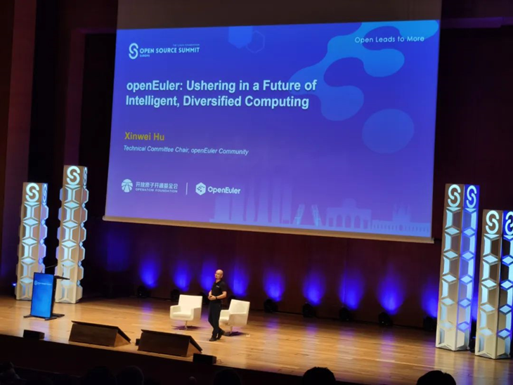

近期，openEuler以Associate Member的身份加入Linux Foundation Europe。

点击链接即可查看：<https://linuxfoundation.eu/en/members>

此次加入Linux Foundation Europe，意味着openEuler在技术及生态影响力方面得到了LFEU的认可。未来，openEuler将与Linux Foundation展开进一步合作，共同促进Linux技术发展。

**openEuler技术委员会主席胡欣蔚在 OSSEU2023 发表主题演讲**

**全球基金会代表出席操作系统大会2023**
