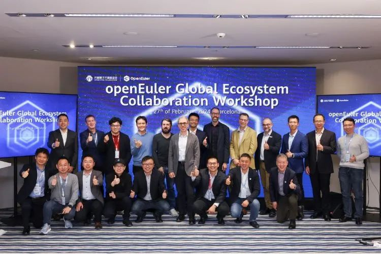
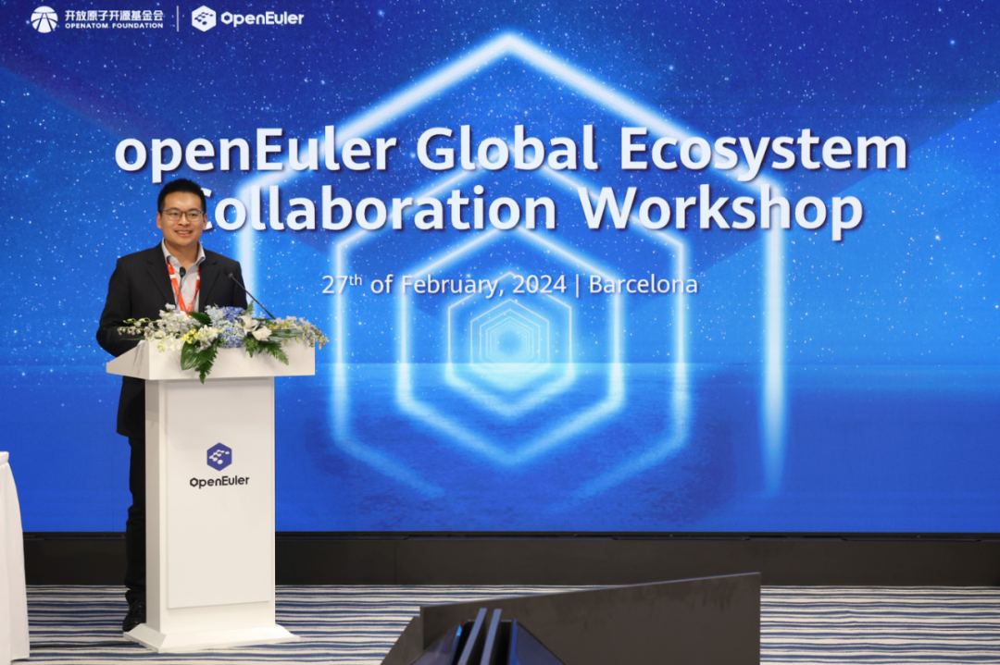
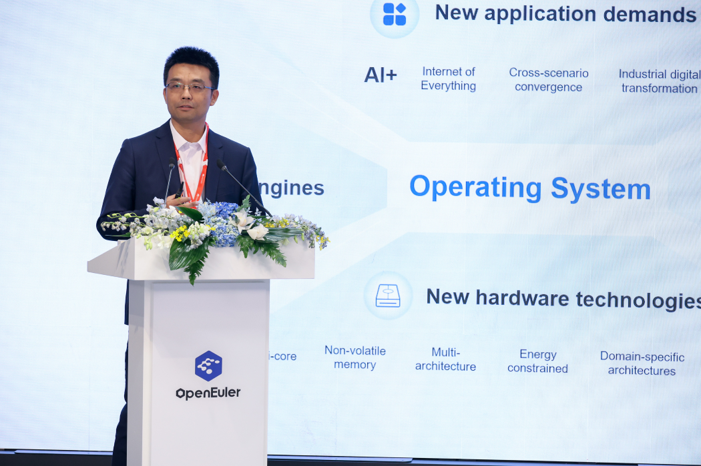
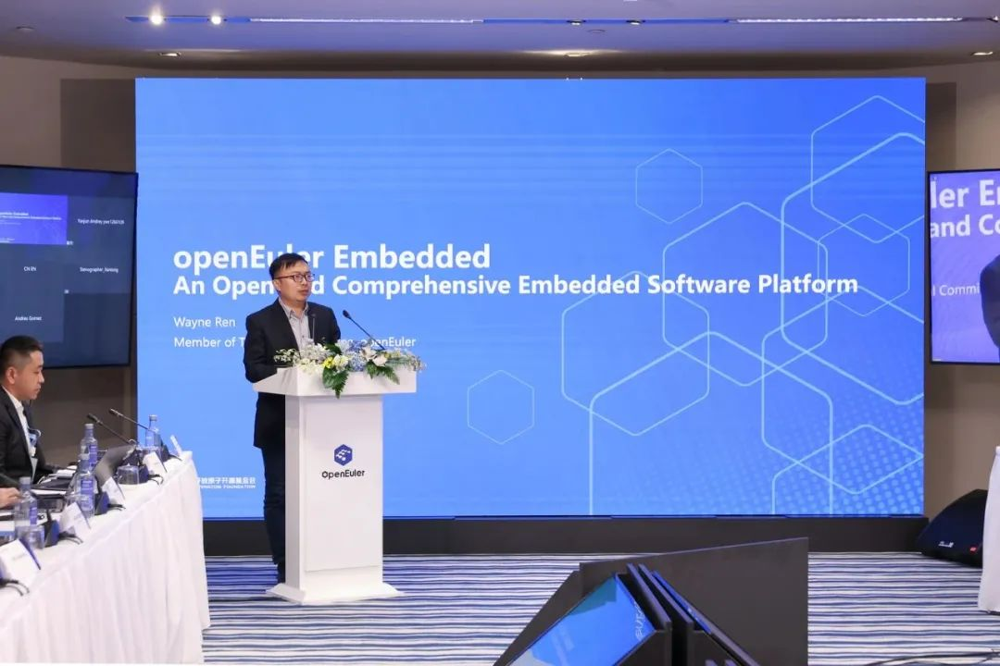
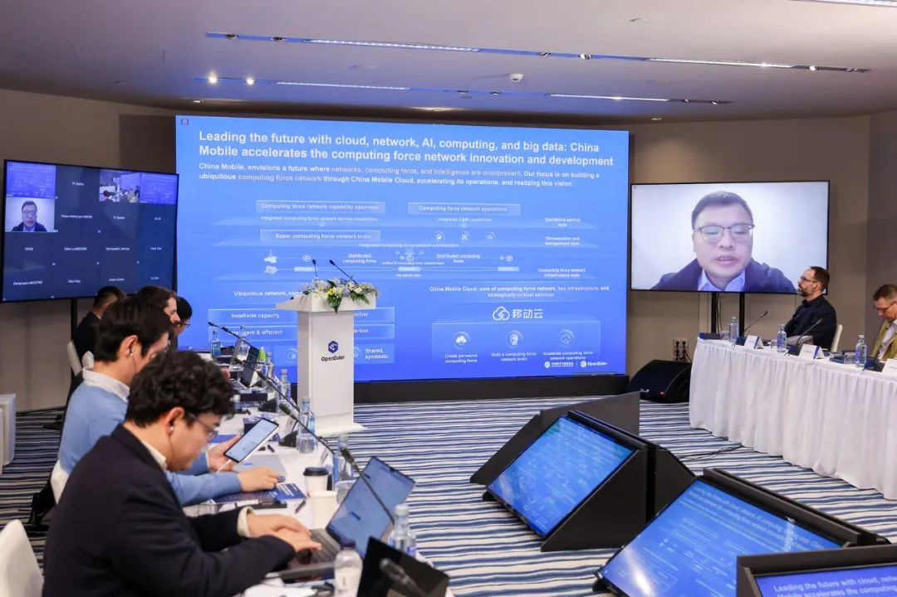
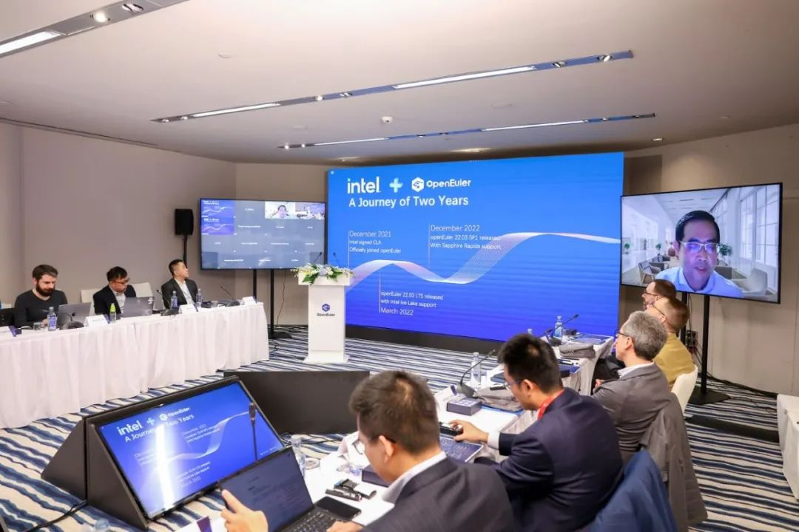
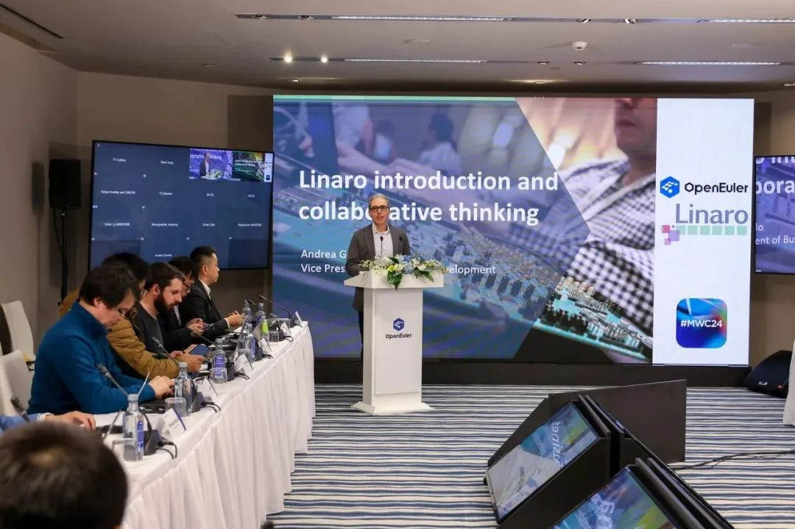
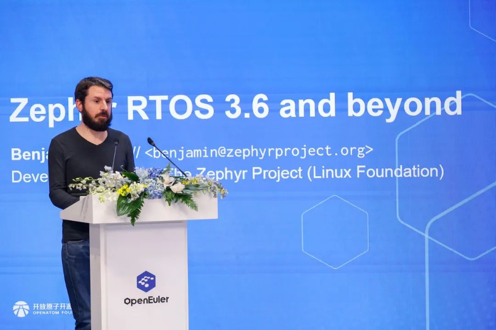
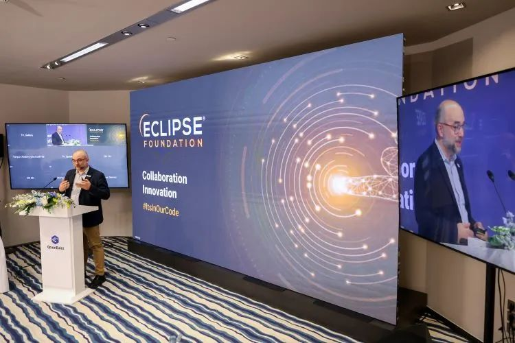
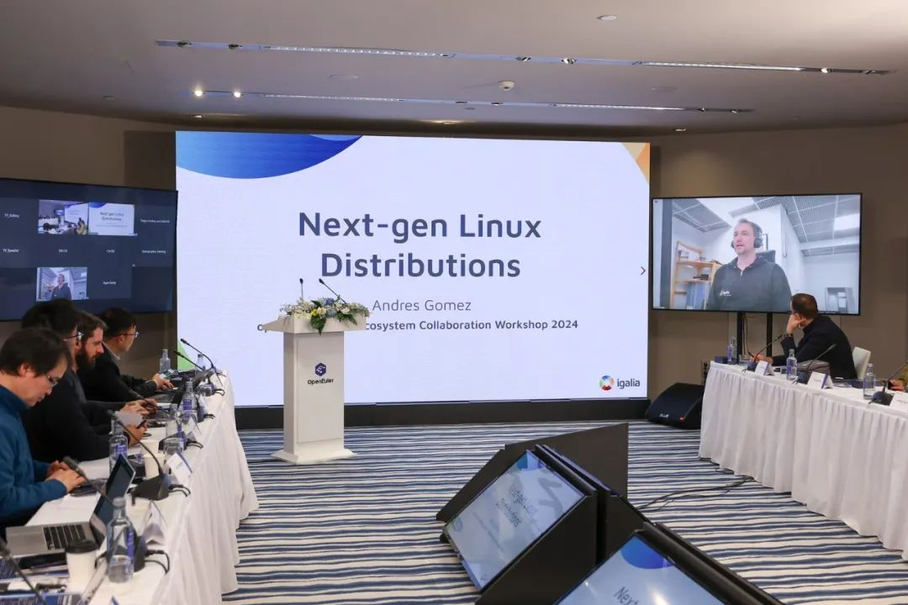

2024年2月27日，OpenAtom
openEuler（简称"openEuler"）全球生态合作研讨会在西班牙巴塞罗那成功举办。开放原子开源基金会副秘书长辛晓华先生，开放原子开源基金会开源安全委员会副主席任旭东先生，Eclipse基金会首席会员官Gaël
Blondelle，Linaro基金会的商务拓展副总裁Andrea Gallo，Igalia合伙人Andres
Gomez，Linux基金会Zephyr项目布道师Benjamin
Cabé，以及来自中国移动云能力中心、openEuler委员会委员张胜举，英特尔开源技术中心总监、openEuler委员会委员
Elton
Yang(杨继国)，openEuler委员会执行总监熊伟博士，openEuler技术委员会委员任慰博士等嘉宾参加了本次会议。

会上，辛晓华先生介绍了openEuler社区当前的发展情况。他提到，在生态拓展、技术创新、软件安全与治理方面，openEuler社区与生态伙伴、国际开源与标准组织进行广泛合作，均取得了显著成果。他表示，目前openEuler已创造了显著的经济和社会效益，希望未来大家共同携手，共同推动openEuler成长，共同为世界贡献一个一流的服务器操作系统。

openEuler委员会执行总监熊伟博士强调了openEuler的定位和创新。他提到openEuler不仅仅是一个操作系统平台，还是一个创新的技术平台。openEuler在算力多样性上支持包括ARM64、x86、RISC-V、Power、SW64和LoongArch等多种架构，覆盖从嵌入式，边缘计算到服务器和云等场，孵化了KubeOS、MICA混合关键性架构、GMEM异构通用内存管理框架等超过400项创新项目，覆盖了云原生，异构计算等多种业务场景。在AI方面，openEuler倡导AI
For OS和OS For
AI的理念，未来几个月openEuler会有激动人心的关于AI方面的新软件问世，一定能为大家带来不一样的操作系统操作新体验。

熊伟博士期待借助国际研讨会这样的舞台，能够再度推动openEuler的创新和突破，为全球的开发者和用户提供更多的可能性，也鼓励更多的人参与到openEuler社区中，共同推动生态与产业发展。

openEuler技术委员会委员任慰博士带来了嵌入式软件平台openEuler
Embedded以及混合关键性部署框架MICA的介绍。他从软件技术、基础框架、功能、场景应用以及技术演示等，全方位展示嵌入式软件平台的高效性能。同时，他通过openEuler与其他开源项目的合作成果，进一步为现场嘉宾展示
openEuler 生态系统的活力和潜力。

来自中国移动云能力中心、openEuler委员会委员张胜举先生详细介绍了openEuler在中国移动的应用。他表示，移动云自加入
openEuler
社区以来，积极参与社区共建，先后参与虚拟化、内核、云原生和兼容性等多项技术领域的建设。未来，也将继续携手
openEuler 社区，共同推动开源软件生态的繁荣发展。

英特尔开源技术中心总监、openEuler委员会委员 Elton Yang (杨继国)
回顾了英特尔与openEuler过去两年在开源方向的实践与合作，细数自2022年起，openEuler对英特尔在上游的长期支持，同时向业界呼吁共建一个开源、开放的加速计算框架，期待未来与openEuler
进行更紧密的合作。

Linaro业务发展副总裁Andrea
Gallo讲述了Linaro作为Arm生态系统的软件引擎，如何通过协作工程、服务和解决方案加速基于Arm的创新开发、测试和部署，并将这一模式运用到与openEuler的合作中。

Linux基金会Zephyr项目布道师Benjamin
Cabé则概述了Zephyr在实时操作系统和开源实时操作系统格局中的定位，并表达了与openEuler合作的愿望。

Eclipse基金会首席会员官Gaël
Blondelle阐述了Eclipse基金会的价值理念和愿景，并表达了与openEuler进一步合作的意愿。

Igalia合伙人Andres
Gomez通过阐述下一代Linux发行版的两大趋势------不变性与可重复性，为我们应该如何思考操作系统的未来，如何管理和部署操作系统的问题提供了方向。

在分享环节结束之后，参会嘉宾就openEuler全球化、技术创新、与未来生态合作的方向和可能性进行了探讨，为openEuler社区的国际化和未来发展提供新视角。

未来，openEuler将持续推动国际化进程，借助更多国际会议等交流平台，与全球开源组织，合作伙伴及用户一起，共同推动开源创新，将openEuler打造成为全球领先的操作系统社区。
