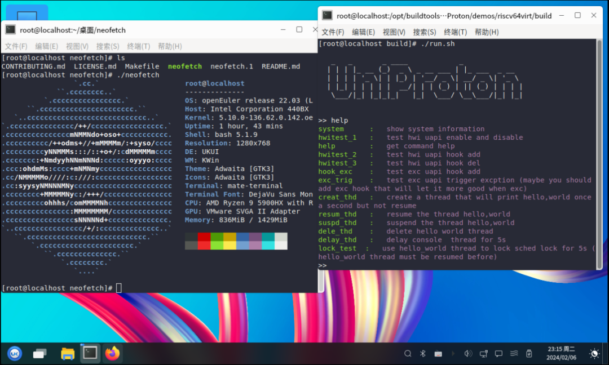
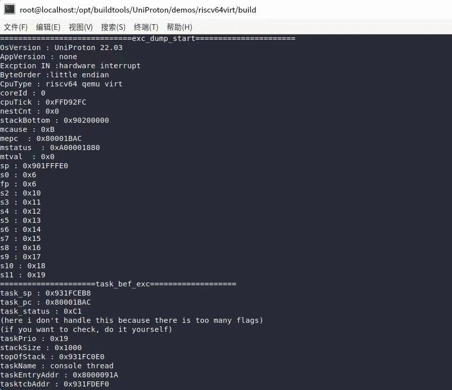

近日，RISC-V SIG 的罗君同学@Jer6y 在 RISC-V 架构上完成了对 UniProton
进行的初步适配工作，目前项目已经可以在 QEMU 上启动运行 Demo 程序。

UniProton 是一款由 openEuler
社区推出的实时操作系统，具备极致的低时延和灵活的混合关键性部署特性，可以适用于工业控制场景，既支持微控制器
MCU，也支持算力强的多核 CPU。

RISC-V SIG 在持续完善 openEuler RISC-V
生态系统能力的同时，不断深入探索嵌入式领域的广泛应用场景。这些应用场景覆盖了实时操作系统（RTOS）、异构多核系统以及
BSP（Board Support Package）支持等关键技术领域。

**RISC-V 架构的适配工作**
-------------------------

为了补足 UniProton 在 RISC-V
架构下的能力，罗同学在以下几个方面进行了深入的适配：

1.  中断框架方面，添加了 RISC-V
PLIC（外设中断控制器）和本地中断控制器的对应驱动代码，添加了板载配置，用于指定
PLIC 和 CLINT 的基地址以及适配 UniProton 实时操作系统的硬件中断 API
框架，包括初始化相关 API 、优先级相关 API 、中断操作相关 API
以及添加外部中断处理函数分发入口 API。

2.  异常框架方面，添加了异常 DUMP 的上下文结构体，并实现了异常函数分发入口
API，以及与软件异常相关的 API，以确保 UniProton
能够有效地处理各种异常情况。

3.  进程框架方面，添加了 RISC-V 下的进程上下文结构体，并适配了进程初始化 API
和进程上下文切换 API，实现了 RISC-V 下的进程 CPU 信息的屏蔽。

4.  IPC 框架方面，进行了一些调度 API 的适配工作，利用 RISCV ecall
硬件特性实现 tasktrap 接口，屏蔽了 RISC-V
底层的硬件异常机制，以支持利用如信号量、信号和消息队列等 IPC 的 API
进行线程同步。

5.  用户 API 框架方面，添加了用户使用的 trap 入口
API，并适配了用户使用的临界区 API，CPU 占用率 API，内核钩子模块 API。

在上述能力的支持下，开发者可以利用中断系列的 API 开发 RISC-V
芯片的设备驱动程序；利用异常系列的 API 开发 RISC-V 下的 Dump
工具作为内核开发的辅助调试工具，如打印出异常相关的 RISC-V
寄存器值和异常原因，利用回调处理特殊的 RISC-V 异常，并且结合 RISC-V MMU
实现 lazy\_brk, cow 等类似的特性；利用进程 API 结合其他系列的 API 开发
RISC-V 架构设备驱动，开发基础组件如自定义
shell，自定义协议栈等；利用其他用户 API 如 CPU 占用率 API，钩子模块 API
等开发性能测试工具

为了帮助用户更好地理解和在 RISC-V 上探索
UniProton，罗同学还提供了相关文档、示例 Demo 以及基于 uapi 开发的应用：

-   UniProton RISC-V
    文档：https://gitee.com/Jer6y/uniproton-documentation

-   RISCV64\_QEMU\_HelloWorld
    工程：https://gitee.com/openeuler/UniProton/blob/master/doc/demoUsageGuide/riscv64\_demo\_usage\_guide.md

**未来规划**
------------

项目目前仅仅对 UniProton 在 RISC-V64
进行了初步的架构适配，后续还有大量完善适配的空间，罗同学计划 RISC-V SIG
一起在以下几个方面进行进一步的完善：

1.  添加 S 态的适配，包括适配构建框架、添加 S 态编译可选项，并在 arch
    侧添加支持 S 态的代码。这将进一步提升 UniProton 在 RISC-V
    架构上的兼容性和可扩展性。

2.  适配 MCS 仓库，并添加 openamp 示例 APP，在 RISC-V64 VIRT
    上进行混合部署。这将帮助用户更好地理解和应用 UniProton
    在实际场景中的能力。

3.  添加 LicheeRV Nano 的 BSP 适配 Demo，并适配 Nano 在 openEuler
    embedded 的 BSP 驱动，以实现在 Nano 上的混合部署。这将进一步扩展
    UniProton 的应用范围和适配能力。

4.  添加 UniProton RISC-V 的门禁测试，以验证 UniProton
    在实际环境中的可靠性和安全性。

**开发者说**
------------

项目的主要贡献者罗同学分享了自己的开发感想：

"作为一个内核开发者兼内核爱好者，我在使用 UniProton
开发之前已经体验过一些常见的 RTOS 如 TencentOS Tiny、uCOS-III
等的内核开发。在我看来，UniProton 除了像其他 RTOS 一样提供了丰富的 API
，同时还对硬件中断管理进行了一层抽象，支持在不同芯片上使用相同的中断管理
API
对中断进行管理，例如中断回调函数注册，中断优先级设置等，这使得内核开发者非常容易管理各个中断。"

"不仅如此，UniProton
在异常错误管理方面也十分具有特色，为每个任务设置了对应的异常错误码，当任务运行过程产生异常时，会根据优先级进行记录，优先级高的异常还会主动的调用异常接口
API
进入硬件异常，执行用户的回调函数，这极大的方便了开发者的调试。更重要的是，UniProton
可以与 openEuler MCS 混合部署，在多核异构上实现 Linux + RTOS。"

"不过，虽然 UniProton
在性能和对内核开发者的使用体验方面都十分卓越，但是仍然存在一些不足，即软件基础组件较少，芯片架构支持也需要进一步的完善。相信在
openEuler 社区的各位朋友的支持下，UniProton
会逐渐有更多的软件支持，适配在更多的芯片上。"

**加入我们**
------------

目前 RISC-V SIG 正在筹备 24.03 LTS 完全官方架构支持工作，这是 23.09
最小官方支持工作的延续。在本次发版中我们会研究丰富多样的官方原生应用软件对
RISC-V 架构的支持，完全对标 x86 和 ARM 的官方支持范围，让 RISC-V 成为
openEuler 主流的架构选择。与此同时我们还在进行 LLVM 平行宇宙计划，探索
RISC-V 在嵌入式场景的有趣玩法和试验一切与 RISC-V
生态相关的各种好玩的事情。

我们希望在不久的将来能有更多的社区朋友参与到类似 UniProton 支持 RISC-V
架构的工作中，鼓励大家积极参与开放 openEuler 社区的 RISC-V SIG，共同推动
openEuler 社区在 RISC-V 生态方面的发展。我们相信 RISC-V
架构将成为未来的趋势，并希望通过社区的共同努力，助力 openEuler 社区在
RISC-V 领域的蓬勃发展。

目前中科院软件所在长期招募相关实习生，如果您对 RISC-V
生态感兴趣，欢迎联系下面的微信号加入 RISC-V SIG 交流群，一起讨论更多关于
RISC-V 的内容，为推动 openEuler & RISC-V 生态贡献力量！

**中科院软件所 王经纬**

