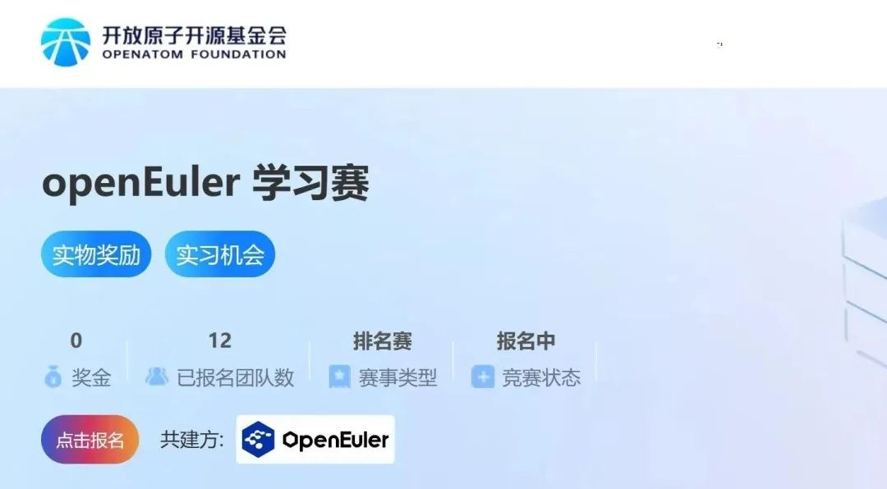
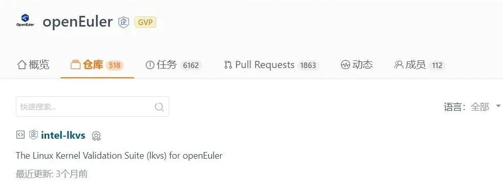
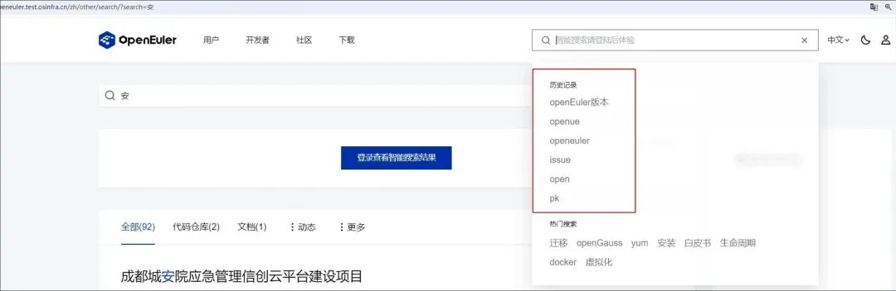
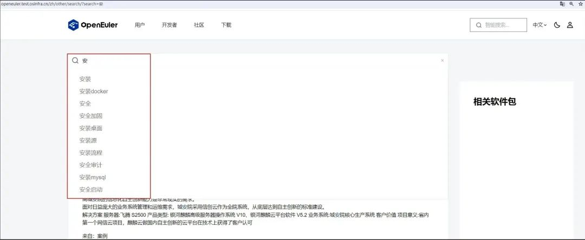
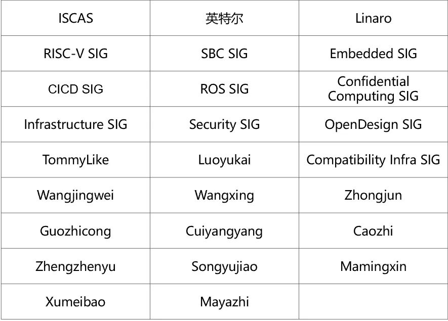

**概述**
===================================
2024年2月中旬，OpenAtom openEuler（简称\"openEuler\"）2023
社区年报发布。这是社区开源四年来，在生态构建、技术创新、产业聚集、人才培养等方面发展的成果展示，也是社区1400多家成员单位、1.7万多名开源贡献者共同努力的成果，感谢大家的支持和贡献。

2024年2月，经 openEuler 技术委员会（TC）同意，SBC SIG 在社区成立。该 SIG
组致力于进一步促进和推广 openEuler 针对各种单板计算机（Single-board
computer）的适配。

在本月的技术发展方面，openEuler UniProton 实时操作系统成功适配 RISC-V
架构。由英特尔开发的Linux内核验证套件(LKVS)、openEuler 联合 Linaro
创建的 ARM CCA 项目以及 devkit-pipeline 项目相继在社区建仓。ROS
SIG持续进行ROS软件包以及第三方软件包的移植适配工作。

开放原子开源大赛-openEuler学习赛报名通道已开启，欢迎感兴趣的朋友报名参加。openEuler社区活动逐步启动中，欢迎通过"Call
for
X"计划(https://www.openeuler.org/zh/community/program/)参与组织社区活动。openEuler城市用户组招募也在同步进行，欢迎报名参加。

本月报阅读时长预计10分钟。

**社区规模**
===================================
截至2024年2月29日，openEuler社区用户累计超过226万。超过17,700名开发者在社区持续贡献。社区累计产生
155.7K个PRs、85.8K条Issues。截至目前，加入 openEuler
社区的单位成员1463家，本月新增25家。

社区贡献看板（截至2024/02/29）

**社区事件**
===================================
**openEuler 2023 社区年报发布**

       2024年2月18日，openEuler 2023 社区年报发布。开源四年来，openEuler
实现跨越式发展，累计部署610万套，2023年中国服务器操作系统新增市场份额第一。仅用4年时间，就在全球最大的单一市场成为第一，创造了基础软件领域的纪录。我们将继续坚持技术为根的宗旨，在最佳支持多样性计算、使能数字全场景的基础上，增强openEuler和AI的融合，从数字
openEuler，向智慧 openEuler 演进。

感谢成员单位以及开发者们的贡献与支持，让我们携手同行，共建更好的openEuler，引领数智未来！

原文阅读：openEuler 2023社区年报

**开放原子开源大赛openEuler学习赛报名启动中**

开放原子开源大赛openEuler学习赛是基于对操作系统感兴趣但零基础的开发者而设计的赛道，我们将提供多种类不同的获取与使用方式，用户和开发者可以根据自身诉求灵活选择使用，进而加深对于
openEuler
的认识。本赛道每月循环开赛。同时我们为大家精心准备了开放原子开源基金会与
openEuler 社区周边礼品！欢迎体验 openEuler，开启你的开源之旅。

报名链接：https://competition.atomgit.com/competitionInfo?id=fae5e8d86a01fb6dfdd153a0e5e5e314

**"openEuler Call for X"计划启动**

秉承开源开放的原则，openEuler希望汇聚更多力量推动社区共建。自2023年6月推出"openEuler
Call for X
计划"以来，社区资源得到进一步整合，为开发者提供更好的分享、交流和展示的平台。武汉、成都、南京Meetup将在3月份陆续举办，感兴趣的朋友可以关注。

openEuler Call for X：

https://www.openeuler.org/zh/community/program/

**openEuler 城市用户组招募中**

为更好地连接用户，发展各区域用户生态，openEuler社区在各区域设立城市用户组组织，为各区域用户打造一个学习、分享、交流的本地化圈子，同时也作为用户诉求反馈的一个渠道，实现用户与社区的互动。openEuler城市用户组2024年招募启动，如果您想申请加入用户组、参与用户组活动，欢迎点此报名！

**社区治理**
===================================
**openEuler 技术委员会2月会议摘要**

在2024年2月的例会中，经 openEuler 技术委员会（TC）讨论决定，SBC SIG
在社区成立并运作。

SBC SIG 前身是中国科学院软件研究所（ISCAS）在社区成立之初发起的
RasbperryPi SIG，该 SIG 在过去几年里持续贡献和完善 openEuler
在树莓派、瑞芯微、全志等主流开发板上的适配运行工作，为 openEuler
的推广起了很重要的作用。新的 SBC SIG 将由原 RasbperryPi SIG 与 Embedded
SIG 的 Maintainer 共同建设，致力于进一步促进和推广 openEuler
针对各种单板计算机（Single-board computer）的适配。  

SBC SIG 的职责包括 openEuler
在不同类型的单板计算机上适配运行工作，负责维护构建内测镜像和基础适配的内核源码，维护支持运行
openEuler 的 SBC
设备的列表和适配状态，推动稳定并符合内核组要求的内核补丁改进完善，合入到社区主线内核代码中，推动符合社区发布要求的镜像成为社区正式发布的镜像。  

SBC SIG:

https://gitee.com/openeuler/community/tree/master/sig/sig-SBC

**技术进展**
===================================
**Linux内核验证套件(LKVS)加入社区**

Linux 内核验证套件(LKVS) 是英特尔内核组开发的一款面向 Linux
内核测试的综合测试工具集。它汇聚了英特尔内核开发和验证团队多年积累的专业知识，具有专业性轻量级、低耦合、高覆盖三大特点，可广泛应用于
Linux 系统开发和验证的多个场景。本项目已加入 openEuler
社区，并已经集成到 EulerPipeLine 系统中，后续将计划开发：

支持将要发布的新平台的新功能。

支持新的内核特性。

进一步完善框架本身，提高测试用例的可扩展性和可移植性。

完善虚拟机测试场景，多虚拟机测试场景。

欢迎访问和使用：https://gitee.com/openeuler/intel-lkvs

**openEuler UniProton 实时操作系统成功适配 RISC-V 架构**

近日，RISC-V SIG Contributor 罗君 (Gitee ID：@Jer6y)在 RISC-V
架构上完成了对 UniProton 进行的初步适配工作，目前该项目已经可以在 QEMU
上启动运行 Demo 程序（原文阅读）。

UniProton 是一款由 openEuler
社区推出的实时操作系统，具备极致的低时延和灵活的混合关键性部署特性，可以适用于工业控制场景，既支持微控制器
MCU，也支持算力强的多核 CPU。

RISC-V SIG 在持续完善 openEuler RISC-V
生态系统能力的同时，不断深入探索嵌入式领域的广泛应用场景，逐步覆盖了实时操作系统（RTOS）、异构多核系统以及
BSP（Board Support Package）支持等关键技术领域。

**devkit-pipeline 项目在社区建仓**

鲲鹏DevKit流水线解决方案（devkit-pipeline）能够帮助用户快速搭建软件工程流水线，帮助用户持续发布鲲鹏商用版本。同时，能够支持X86及鲲鹏的多样性算力版本的构建及测试，提升用户研发效率。当前，本项目已在openEuler
建仓，由 CICD SIG 维护管理。

项目地址：https://gitee.com/openeuler/devkit-pipeline

**openEuler 联合 Linaro 建立 ARM CCA 创新项目**

ARM CCA（ARM Confidential Computing
Architecture）是下一代ARM机密计算架构，本创新项目旨在提供一个使能机密计算解决方案所需软件（包括固件、操作系统、虚拟化管理、机密虚机以及远程证明等）和仿真硬件的全局视角，提供集成上述组件的完整参考模型，帮助用户集成使能机密计算解决方案，同时可在ARM仿真硬件之上，验证自己的机密计算解决方案，提前布局ARM
CCA软件生态。当前，本项目已在openEuler建仓，由 Confidential Computing
SIG 维护管理。

项目地址：https://gitee.com/openeuler/CCA

**ROS SIG 工作进展**

ROS
SIG本月持续进行ROS软件包以及第三方软件包的移植适配工作。针对ROS1和ROS2，SIG组规划了两个长期维护版本：
  

ROS1的长期维护版本为Noetic，目前已在OBS上成功构建了300+个软件包。本月，我们专注于移植可视化软件和上层算法软件包，并计划在openEuler
24.03 LTS发布时一同发布。

ROS2的长期维护版本为Humble，于2023年正式发布。基于该版本，SIG组持续进行其他复杂且重要的ROS包和第三方包的移植适配工作。同样地，我们计划在openEuler
24.03 LTS发布时进行增量式发布，目前已成功构建了1055个ROS软件包。

欢迎关注ROS
SIG获取更多详细信息，SIG组期待更多贡献者的交流和参与。访问https://etherpad.openeuler.org/p/sig-ROS-meetings了解更多。

**Infrastructure SIG 工作进展**

本月，社区基础设施团队就开发者的搜索体验，在官网搜索上增加了自动补全功能以及历史搜索信息记录，以便开发者能更好地获取相关资料。

**软硬件兼容性认证**

2024年2月，兼容性方案1506个，北向984个，南向457个，OS 131个，2月新增
北向10个，南向8个，OS 2个。

社区兼容性列表：

https://www.openeuler.org/zh/compatibility/

**安全公告**
===================================
2024年2月，社区共发布安全公告 25个，修复漏洞 49个（其中 Critical
5个，High 30个，其它 14个）。

**重点漏洞提醒**

如下漏洞评估影响较大，请重点关注：

**postgresql-jdbc软件存在SQL注入风险（CVE-2024-1597）**

**CVSS评分为10.0分**

影响范围：

openEuler-20.03-LTS-SP1

openEuler-20.03-LTS-SP4

openEuler-22.03-LTS

openEuler-22.03-LTS-Next

openEuler-22.03-LTS-SP1

openEuler-22.03-LTS-SP2

openEuler-22.03-LTS-SP3

**libuv软件存在受到SSRF攻击的威胁风险（CVE-2024-24806）**

**CVSS评分为9.8分**

公告链接：

https://www.openeuler.org/zh/security/safety-bulletin/detail/?id=openEuler-SA-2024-1200

影响范围：

openEuler-20.03-LTS-SP1

openEuler-20.03-LTS-SP4

openEuler-22.03-LTS

openEuler-22.03-LTS-Next

openEuler-22.03-LTS-SP1

openEuler-22.03-LTS-SP2

openEuler-22.03-LTS-SP3

**rust软件存在使用
libgit2可能会导致任意代码执行的风险（CVE-2024-24577）**

**CVSS评分为9.8分**

公告链接： 

https://www.openeuler.org/zh/security/safety-bulletin/detail/?id=openEuler-SA-2024-1206

影响范围：

openEuler-20.03-LTS-SP1

openEuler-20.03-LTS-SP4

openEuler-22.03-LTS

openEuler-22.03-LTS-Next

openEuler-22.03-LTS-SP1

openEuler-22.03-LTS-SP2

openEuler-22.03-LTS-SP3

**qt5-qtbase软件存在整数overflow检查错误风险（CVE-2023-51714）**

**CVSS评分为9.8分**

公告链接：

https://www.openeuler.org/zh/security/safety-bulletin/detail/?id=openEuler-SA-2024-1161

影响范围：

openEuler-20.03-LTS-SP1

openEuler-20.03-LTS-SP4

openEuler-22.03-LTS

openEuler-22.03-LTS-Next

openEuler-22.03-LTS-SP1

openEuler-22.03-LTS-SP2

openEuler-22.03-LTS-SP3

**OpenEXR软件存在Heap-based 缓冲区溢出漏洞的攻击风险（CVE-2023-5841）**

**CVSS评分为9.1分**

影响范围：

openEuler-22.03-LTS

openEuler-22.03-LTS-Next

openEuler-22.03-LTS-SP1

openEuler-22.03-LTS-SP2

openEuler-22.03-LTS-SP3

openEuler-20.03-LTS-SP1(2.2.0)

openEuler-20.03-LTS-SP4 

**漏洞防护**

openEuler社区针对在维版本例行修复漏洞，发布安全补丁。建议用户关注openEuler官网安全公告，及时安装漏洞补丁进行防护。

openEuler安全公告：

https://www.openeuler.org/zh/security/security-bulletins/

**感谢每一位朋友、开发者的支持**
===================================
因为大家的辛勤贡献，openEuler的每一天都发生着好的事情。小编限于视野和能力，难免有所遗漏，在此表示歉意。同时，衷心感谢社区朋友、开发者们以及openEuler
SIG组成员的贡献：

\* 以上不分先后顺序

如果您希望在月报中增加您的工作内容，或对内容有任何改进建议，请联系wengqiaozhen@openeuler.sh。
