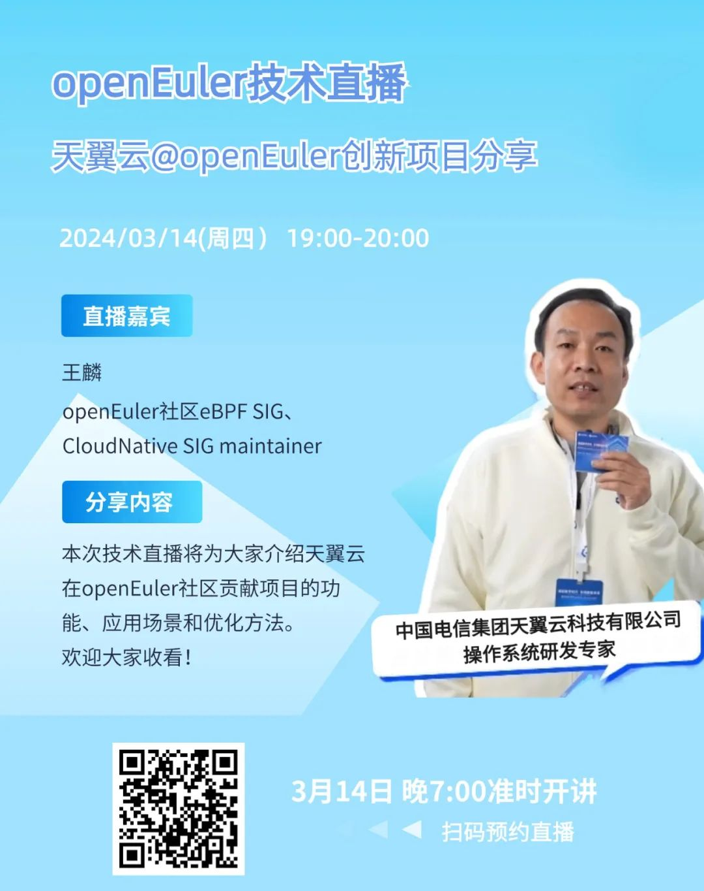
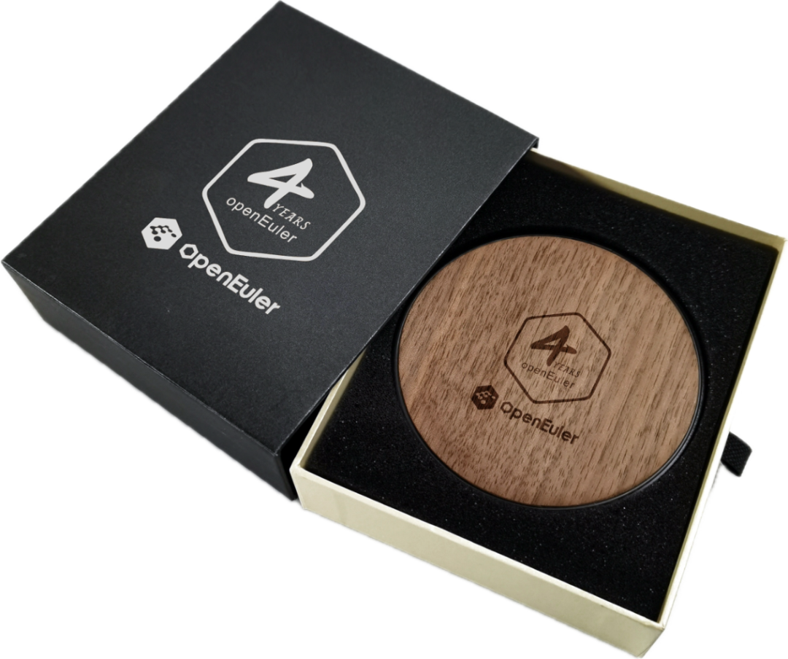

在2023年操作系统大会上，天翼云操作系统团队斩获CTinspector、CVE-ease、NestOS三项2023年度优秀项目奖。

自加入社区以来，天翼云团队在openEuler社区贡献不少项目。本次技术直播将介绍天翼云在openEuler社区贡献的几个重点项目的功能、应用场景和优化方法。赶快预约直播，一探究竟吧！

**直播主题**：天翼云@openEuler创新项目分享

**直播时间**：2024年3月14日 19:00-20:00

**内容简介**：本次技术直播将为大家介绍天翼云在openEuler社区贡献项目的功能、应用场景和优化方法。欢迎大家收看！

**项目介绍：**

k8s-install：可以在多个发行版、多个架构上生成云原生基础设施的离线安装包和在线安装包，这些包上传到指定的yum源上，做到集中管理，方便维护；支持多维度地一键安装部署云原生基础设施套件，极大地节省部署和适配的时间，并使得该流程标准化，可追踪可迭代；在生产环境中大规模替代旧有的Ansible静态脚本部署方式，一方面提高Ansible脚本的可维护性以及安装的标准化，另一方面获得了云底座软件包和镜像的安全更新能力。

CVE-ease：是一个专注于公共漏洞和暴露（CVE）信息的平台，通过实时监控操作系统开源社区和漏洞披露网站发布的各种CVE信息，并以多种渠道及时通知用户。用户可以通过CVE-ease平台查看CVE信息的详细内容，包括漏洞描述、影响范围、修复建议等，并根据自己的系统情况选择合适的修复方案。

CTinspector：是基于eBPF指令集自主创新研发的语言虚拟机运行框架。基于CTinspector运行框架可以快速拓展其应用实例运行eBPF应用程序，用于诊断网络性能瓶颈点，诊断存储I/O处理的热点和负载均衡等，提高系统多结点运行时诊断的稳定性和时效性。

**彩蛋：**观看技术直播，在议题结束后提问且被老师抽中回答的用户，即可获得openEuler社区定制无线充电器一个，共有5个名额，快冲！

**【申请通道】**：https://shimo.im/forms/8Nk6eEY9zysEQyqL/fill 

扫码申请

「技术直播」是知识的传播，更是思维的碰撞。让我们携手共探，一起见证OS发展与变革。

联系方式：

微信号：openeuler123

邮箱：mamingxin@openeuler.sh
