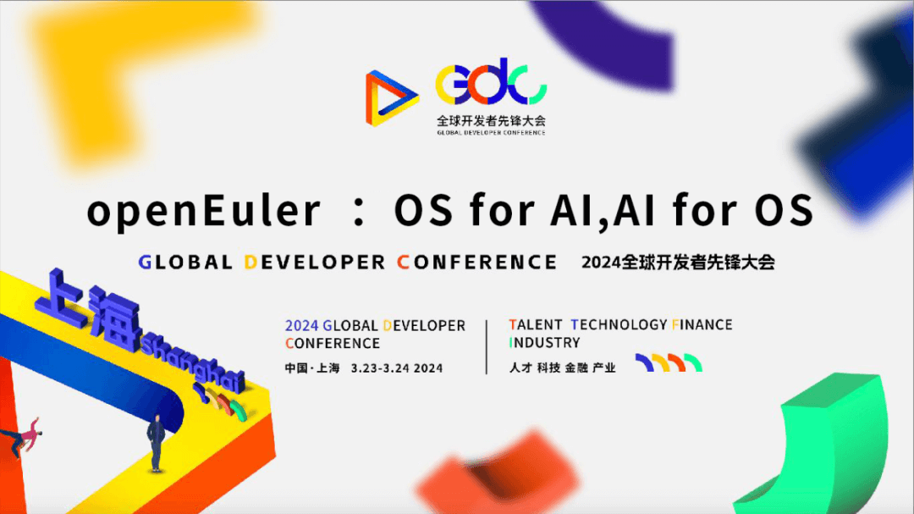
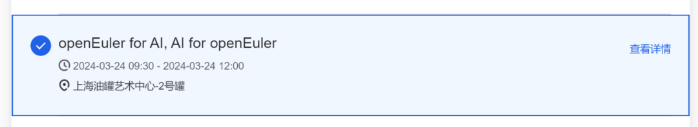
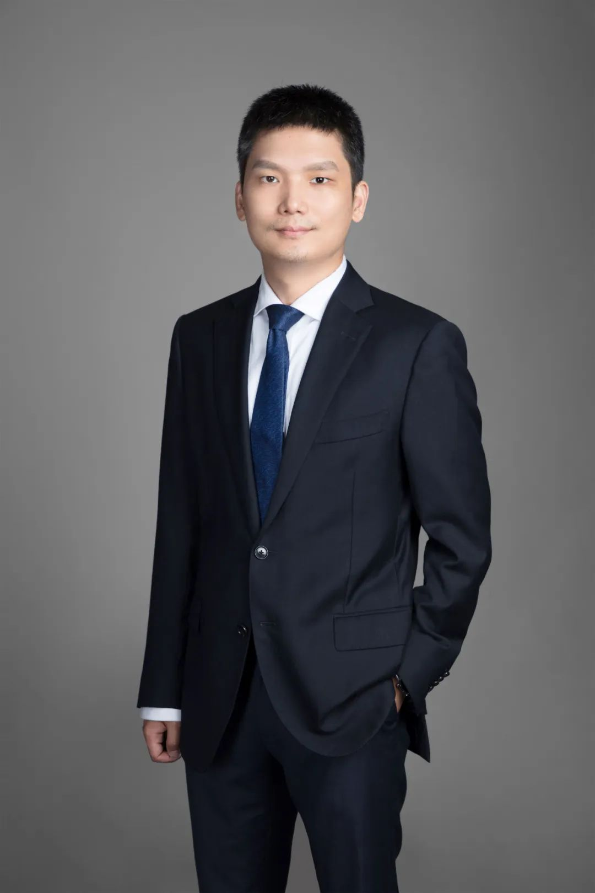
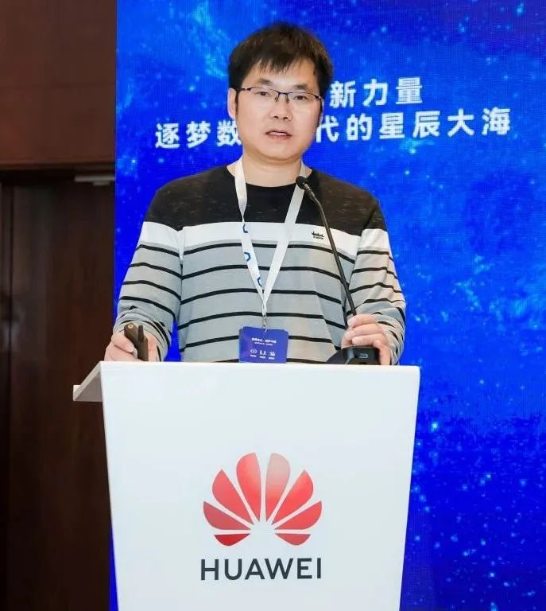
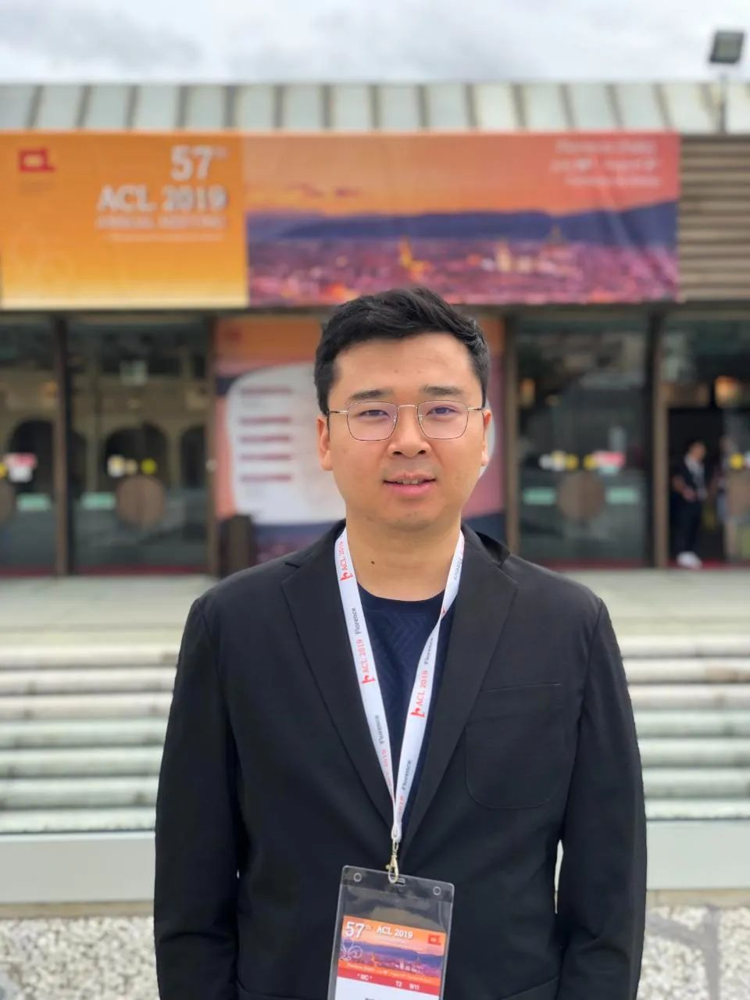
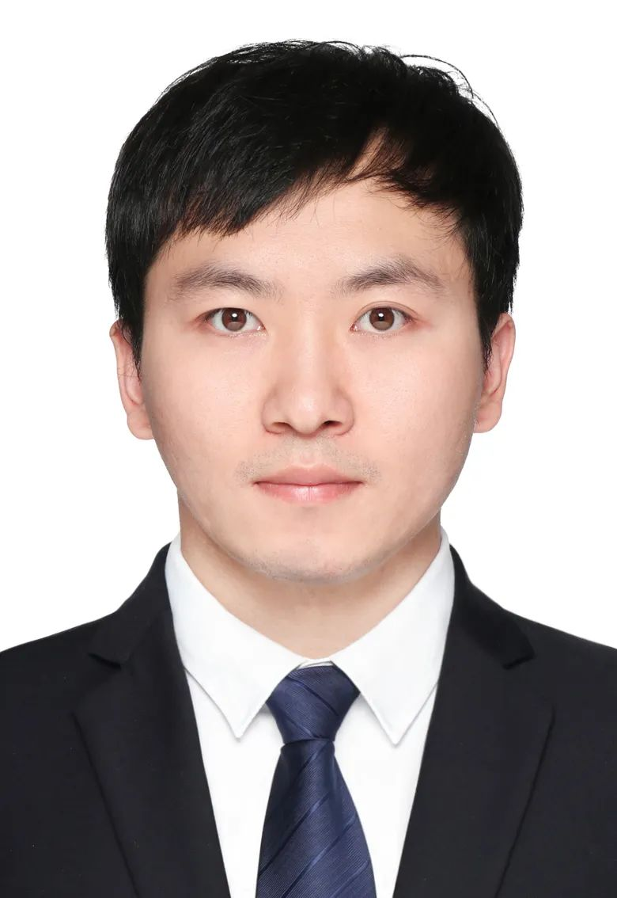
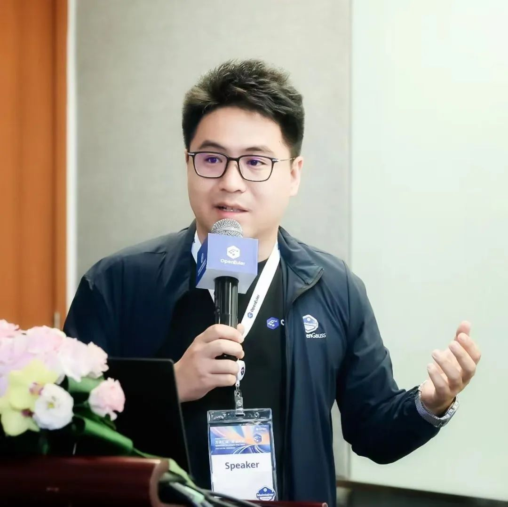
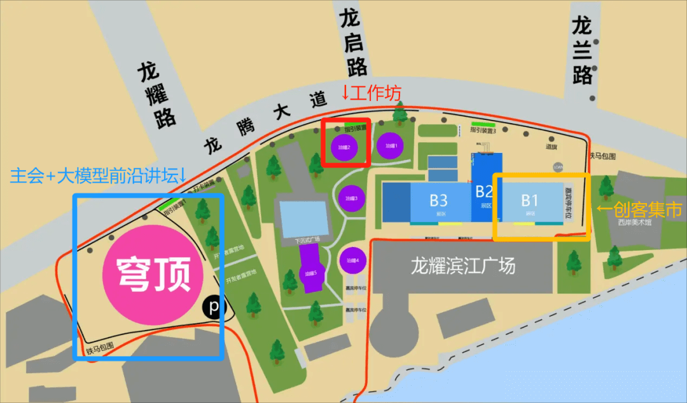

2024全球开发者先锋大会（简称GDC），将于3月23日-3月24日在上海召开，本次大会聚集国内外开源社区和开发者，创造涵盖人工智能、5G、机器人、边缘计算等热门新一代信息技术的交流盛宴。\
在本次大会上，OpenAtom openEuler（简称\"openEuler\"）开设"OS for AI, AI
for
OS"主题工作坊，openEuler致力于成为支持多样性算力的全场景智能操作系统，将人工智能融入操作系统的方方面面，在本次工作坊上将为开发者、用户呈现openEuler在AI工具、AI生态、智能运维的探索与成果！\
**立即扫描下方二维码报名吧～**

tips：报名时参与会场请选择openEuler for AI,AI for openEuler 分会场

**GDC 上海**

**[openEuler参会指南]**

**01 openEuler for AI, AI for openEuler工作坊**
====================================================

**时间**：2024-03-23 10:00-12:00

**地点**：上海油罐中心-2号罐

**议题亮点**

**主题：openEuler整体特性&智能运维介绍**

**胡峰**

**openEuler 社区技术委员会委员**

**题简介：**

IT基础设施和应用产生的数据量每年以2
\~3倍速率增长，机器和人类产生的数据类型也越来越多，导致系统运维复杂度越来越高。本次和大家分享openEuler技术特性以及openEuler
Ops-sig当前的挑战和在智能运维方面的思考。

**主题：EulerCopilot-赋能开发者及系统管理员**

**杜开田\
openEuler 兼容性SIG 组Maintainer**

**议题简介：**

本议题将介绍EulerCopilot结合大模型和openEuler领域知识库,致力于赋能万千开发者和行业客户更高效的使用openEuler；分享探索agent在OS
调优、诊断方面实践。\

**主题：PilotGo运维平台系统架构感知可视化插件**

**王钧琪**

**麒麟软件有限公司运维研发工程师**

**议题简介：**

PilotGo是openEuler上的运维平台，本议题将分享运用PilotGo-Topo架构感知插件自身的数据采集模块以及第三方监控、观测工具对业务集群运行场景进行拓扑可视化，以更直观的形式对跨主机、跨网络业务的运行情况进行多指标、多维度观测，更快实现运维工作中问题的定位、故障链的生成及故障排查。\

**主题：OS for AI: openEuler在AI开源社区的贡献与实践**

**张思博**\
**开源开发高级工程师**

**王帅**\
**开源开发高级工程师**

**议题简介：**

openEuler的开发者们秉持着Upstream
first的原则，积极参与上游社区实践，积极推动上游支持多样性算力支持。本议题将介绍openEulerAI领域的开发者在上游社区的实践，通过原生支持pytorch、OpenCV、deepspeed等主流工具，进一步融入Huggingface大模型生态，最终帮助openEuler社区用户轻松释放多样性算力。

**主题：openEuler上海用户组介绍 & 成立仪式**

本次活动上将成立openEuler上海用户组，打造上海地域用户交流圈，点击此处报名加入！欢迎扫描以下二维码入群交流！

**自由交流环节**

对于openEuler感兴趣、有更多问题想了解的朋友可进一步在现场与社区专家进行交流。

**02 开放原子大模型前沿讲坛**
====================================================

**时间**：2024-03-23 13:30-18:00

**地点**：上海西岸穹顶艺术中心

**议题亮点**

**主题：大模型时代OS面临的挑战与机遇**

**郑振宇**

**openEuler 社区Maintainer**

**议题简介：**

openEuler社区从23年H2开始推动AI for OS, OS for
AI的技术路线，秉承"以AI赋能openEuler更智能，以openEuler使能AI更高效"的理念，尝试通过自然语言和操作系统进行交互沟通，打通领域知识，不仅支持GLM、LlaMA、Baichuan等大模型，还支持辅助运维、辅助编程等，通过AI赋能开发者，即"AI
for
openEuler"。本议题将为听众带来openEuler在大模型领域的最新生态进展以及落地案例分享，以及下一步计划。

**03 openEuler 创客集市**
====================================================

**时间**：3月23-24日 9:00-18:00

**地点**：B1体验馆

**展区介绍**：展示openEuler最新介绍与社区动态，参与现场互动更能获得社区周边好礼！

**大会区域指引路线**：大会区域指引路线（请注意以上三部分在不同区域，请按指示下图指示找到对应位置）

**2023年3月23-24日，上海GDC见！**
