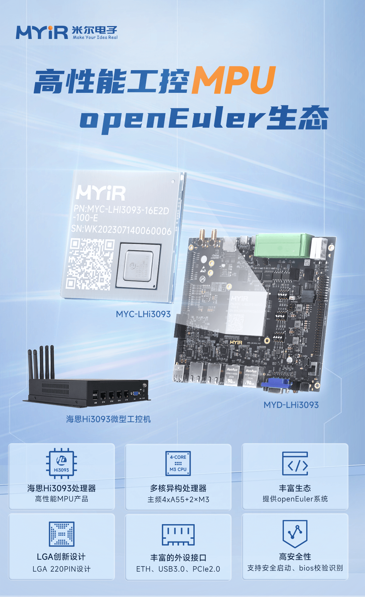
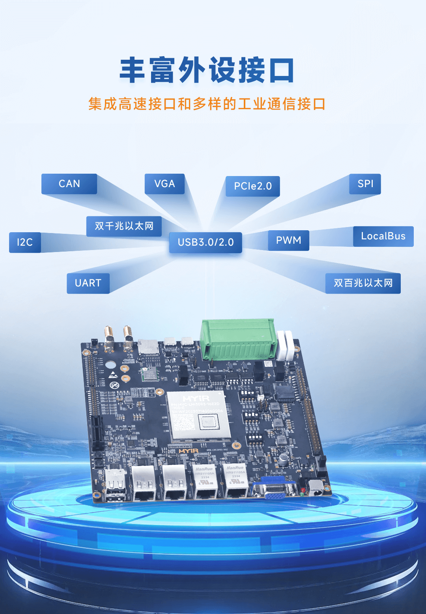
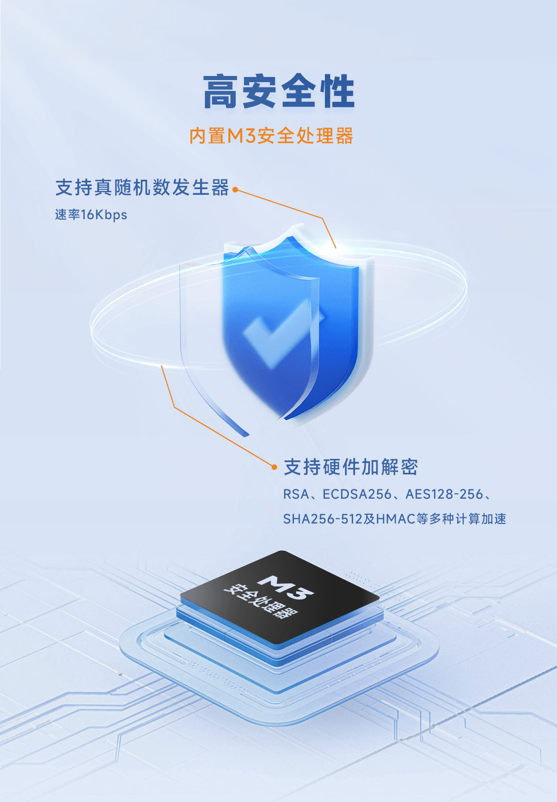
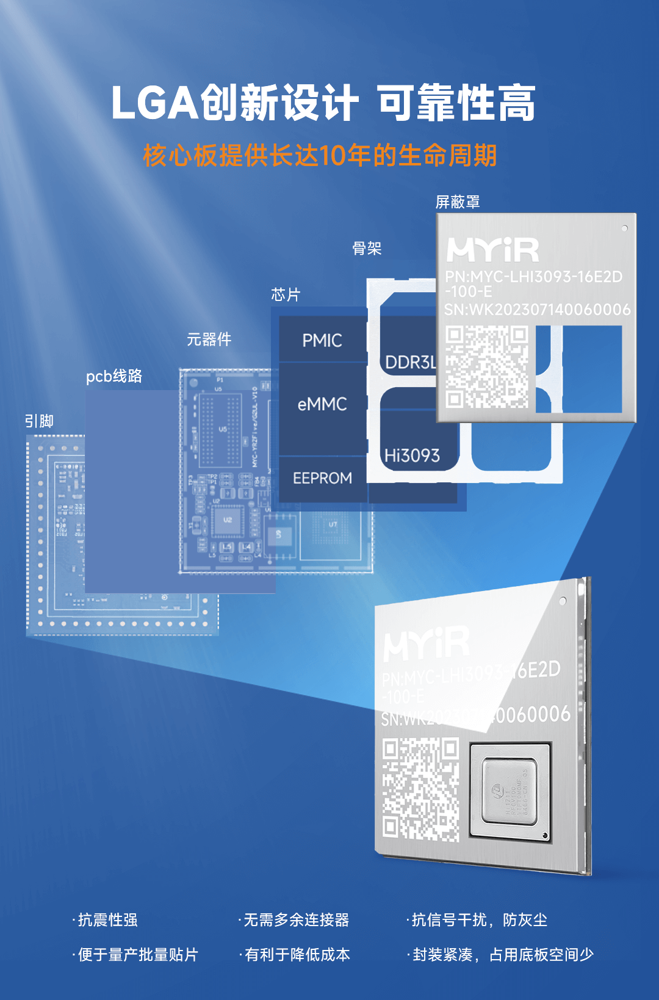
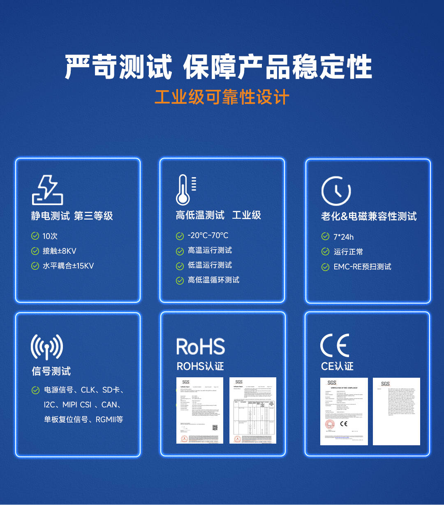
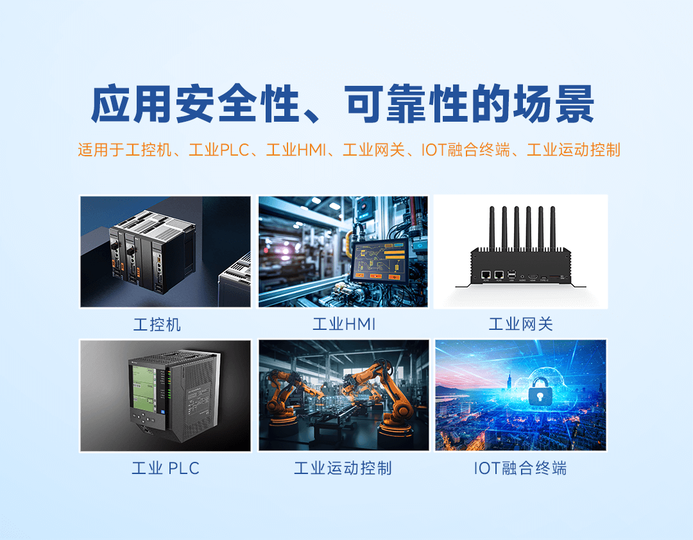
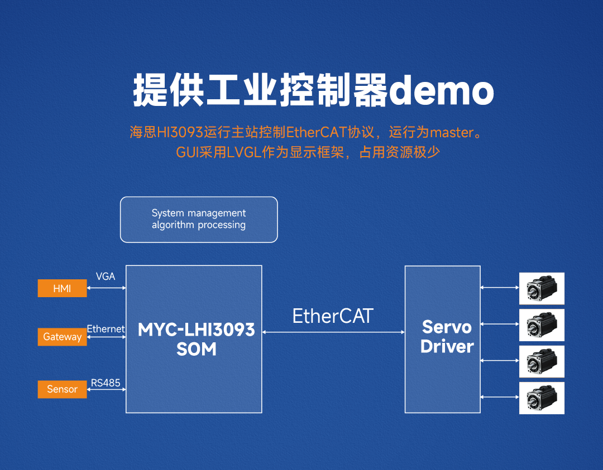
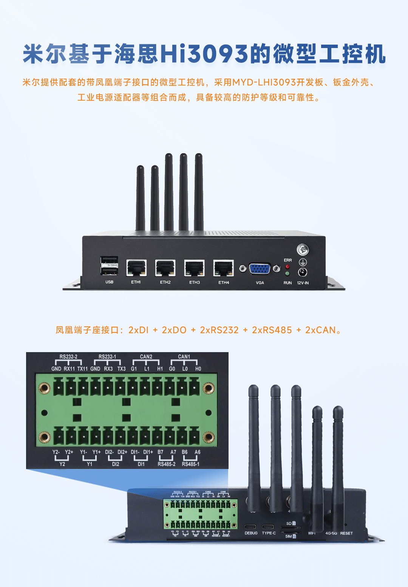
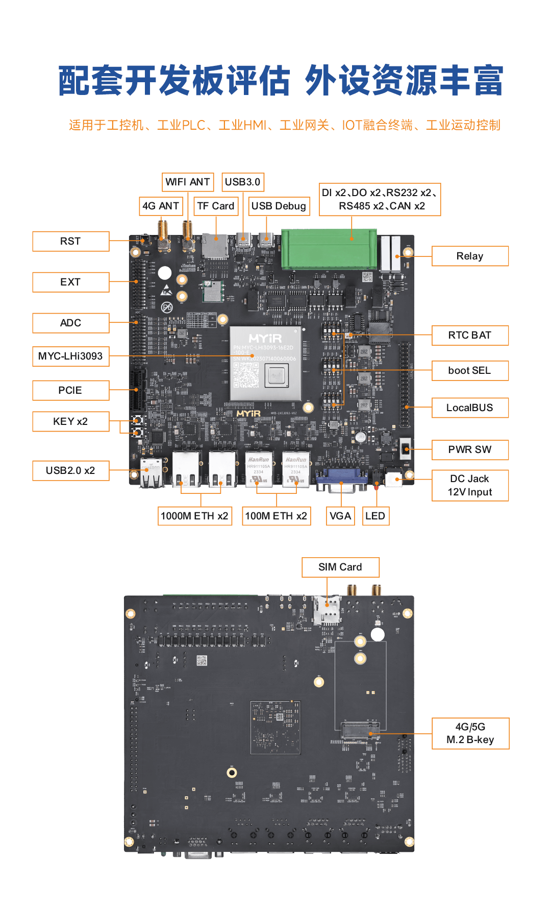

近日，米尔电子发布了基于海思Hi3093高性能MPU的MYC-LHi3093核心板和开发板,
支持**openEuler Embedded操作系统**。MYC-LHi3093核心板及开发板，配套提供工业控制demo，方便客户评估PLC等应用场景实时控制性能，为追求实时性能的工控产品开发提供参考。此次适配不仅为
openEuler 提供了更多的硬件生态，同时也体现了
MYC-LHi3093核心板及开发板对操作系统生态的支持，为行业应用发展注入了新的活力。

**\* openEuler社区发布本文仅为阐明企业产品搭载openEuler
Embedded，不提供任何关于企业信誉和产品质量等方面的担保。**
