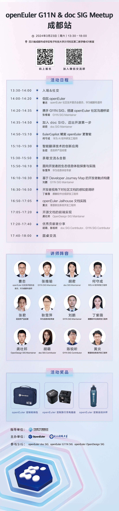

想参与社区贡献但不知道如何开始？

不是计算机专业的学生就不能参与社区贡献？

No，no，no\~

社区支持用户以多种形式参加贡献，文档与英文化贡献也是社区贡献的重要部分。

**3 月 23 日， OpenAtom openEuler（简称\"openEuler\"） doc SIG 和 G11N SIG 将在成都联合举办一场文档与英文化贡献交流的 Meetup**。本次交流邀请了多位业内专家，分享他们在生态信息体验方面的实践，以及社区文档与翻译的贡献秘籍。无论您是社区开发者、文档贡献者、语言爱好者、大模型从业者，这都是一个极好的学习、分享和交流机会，欢迎您参加本次的Meetup活动！

doc SIG 旨在为用户提供 openEuler
相关的文档和知识，建立软件和用户之间的联系，以获得更好的社区体验。

G11N SIG 旨在推动 openEuler
社区的全球化进程，为全球开发者提供流畅的语言文化体验。

**活动信息**

**时间**：3月23日（周六） 13:30 - 18:00

**地点**：四川省成都市成华区电子科技大学沙河校区第二教学楼401教室 

**扫码报名**

进入学校参会需要提前报备，请扫码**填写报名表**登记，活动开始前将会有短信提示\~也欢迎大家扫码加入
Meetup 交流群。

