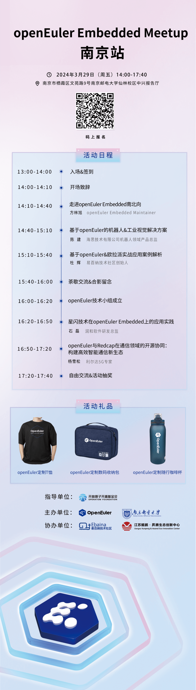

如果您对嵌入式感兴趣

如果您想了解前沿技术知识

如果您想与技术大咖们近距离交流来场酣畅淋漓的思想碰撞

那就来这里吧

3月29日南京Meetup静待您的到来\
本次交流活动将邀请多位业内专家围绕嵌入式前沿技术、应用案例、创新方向、芯片开发板优秀实践几个方面进行分享，在活动上还将成立南京邮电大学OpenAtom
openEuler（简称\"openEuler\"）技术小组，该小组不仅涵盖技术方向的合作，同时融入了多样化的高校人才项目，促进开源文化的传播和发展。报名约起，我们线下见！ 

**活动信息**

**时间**：2024-03-29（周五） 14:00-17:40

**地点**：南京市南京邮电大学中兴报告厅

**立即扫描海报中的二维码报名吧～**

