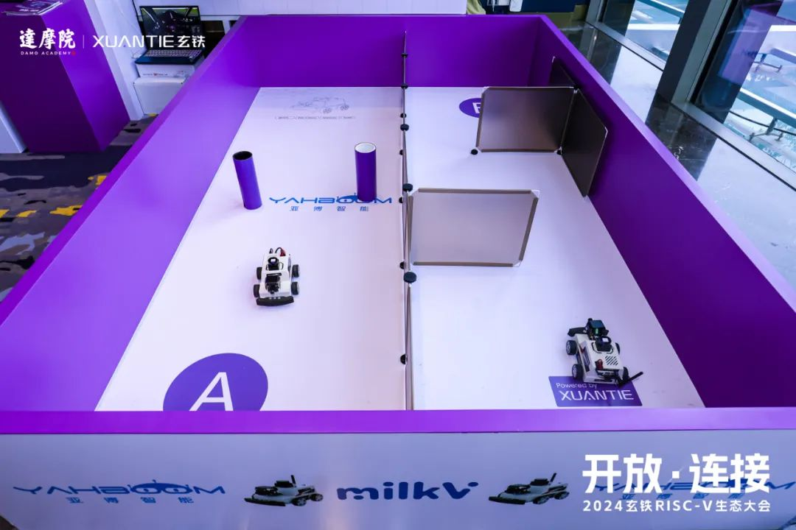
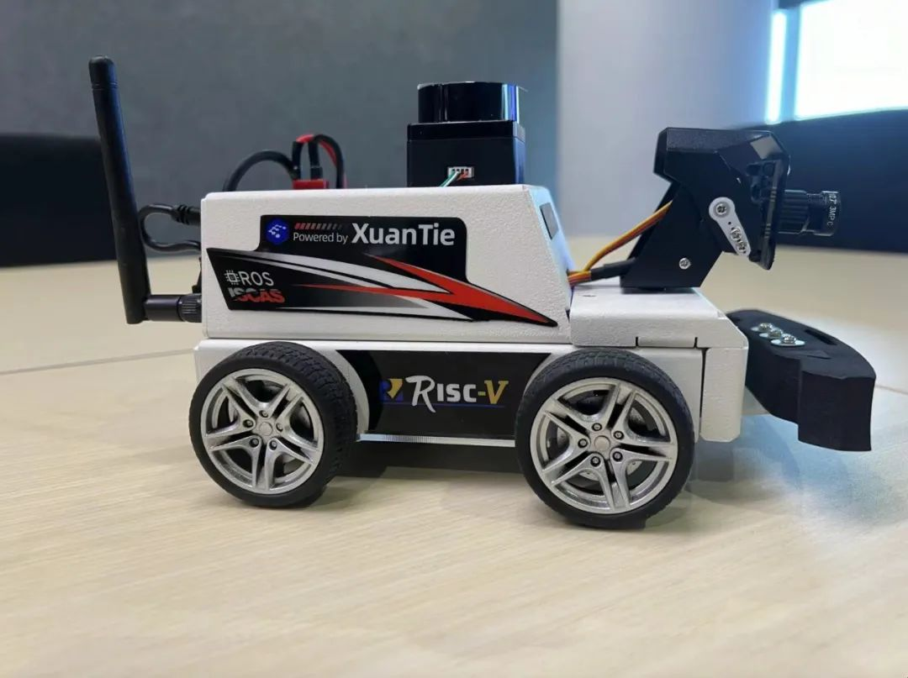
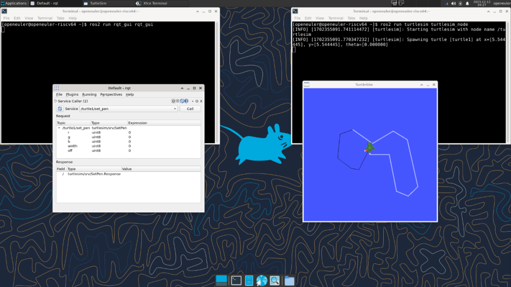
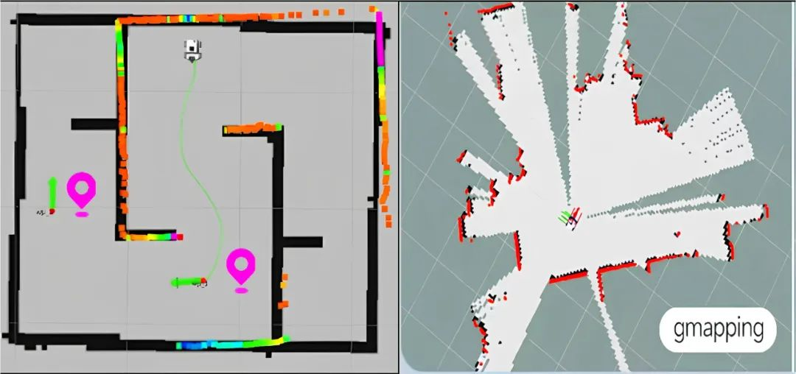

**RISC-V 机器人小车亮相玄铁大会**
---------------------------------

3 月 14 日，由达摩院举办的 2024 玄铁 RISC-V
生态大会在深圳举行，来自中国科学院软件研究所、亚博智能和玄铁的 ROS
机器人小车解决方案在会上亮相。据悉，这款产品名为 RISC-V
MicroROS，预计将在四月份由亚博智能公开发售。RISC-V MicroROS 是一款基于
Milk-V Meles 开发的 ROS2 智能机器人，搭载了玄铁 C910
处理器、openEuler（OpenAtom openEuler简称"openEuler"） RISC-V
操作系统和亚博公司提供的外设解决方案。可以实现机器人运动控制、AI
视觉交互、SLAM
建图导航、多机同步控制等多项功能。中国科学院软件研究所主导的 RISC-V SIG
大力支持了 RISC-V MicroROS 智能小车的系统环境建设，提供了适配 TH1520 的
openEuler RISC-V 硬件镜像和硬件驱动，完善了 ROS2 在 RISC-V
硬件环境的软硬件生态适配。小车的成功落地也反向验证了 RISC-V SIG
在社区软件生态建设的成果。

**ROS + RISC-V 的 openEuler 方案**
----------------------------------

openEuler 的 ROS2 humble 工程由中国科学院软件研究所主导的 ROS SIG 引入
openEuler 社区，并且由 RISC-V SIG 进行移植和优化，成功为 openEuler
RISC-V 系统赋能 ROS2 功能。此外，RISC-V SIG 与 ROS SIG 共同制定在 RISC-V
架构下的测试策略，充分进行了功能测试，保证了相关软硬件生态可以稳定运行。RISC-V
SIG 的工程师从软件的角度，提供了一份基于 openEuler RISC-V 利用 ROS2
系统进行双机通信的 Demo 文档，为 ROS2 在 RISC-V
架构上的应用提供了实践指南。

-   测试文档：https://gitee.com/zhtianyu/ros-humble-work/tree/master/ros-humble-test/ROS-humble-oerv23.09-lpi4a

-   Demo
    文档：https://gitee.com/zhtianyu/ros-humble-work/tree/master/ros-humble-demo

**硬件优化工作**
----------------

除了在上层软件层面，RISC-V SIG 也基于 TH1520
的外设驱动进行了一定的优化，包括利用 GPU、 NPU
和多媒体解码等多种硬件驱动加速图像采集解析，SLAM
建图渲染和多机同步网络响应。同时，RISC-V SIG 为 TH1520 的 openEuler
内核修复和开启了蓝牙和 Wi-Fi 等相应外设功能支持，使得 ROS2
系统拥有了一个功能齐全，稳定高效的运行环境。作为集成工作的一个重要成果，基于
TH1520 的 Meles 镜像专为 ROS 机器人开发和应用设计，提供了一个专用的
openEuler 系统镜像底座。这标志着国内首个基于 RISC-V 芯片与 openEuler
系统，并针对教育机器人开发厂商的生产解决方案形成。

**未来规划**
------------

为了进一步推动 openEuler RISC-V 生态建设发展，稳固 openEuler RISC-V
作为全栈应用的系统底座，RISC-V SIG 计划将在下面几个方向继续投入：

1.  基于 openEuler 24.03
    版本的适配工作，为各种软件栈提供可靠的流水线测试，与手工验证。

2.  探索openEuler 在 RISC-V 上的最优应用生态，进一步拓展 openEuler
    RISC-V 的落地场景。

3.  基于系统的维度，RISC-V SIG 对 openEuler RISC-V
    不断进行软件优化与硬件优化，打造可靠的全栈场景 RISC-V 系统基座。

**加入我们**
------------

我们相信 RISC-V 已经是趋势，RISC-V 将无处不在，无论是如意 Book
笔记本电脑还是 RISC-V MicroROS 机器人，都证明了 RISC-V
在高性能领域的应用生态已经迈开脚步。如果您对 RISC-V
感兴趣，欢迎联系下方的微信加入 RISC-V SIG 交流群，讨论更多关于 RISC-V
的更多内容，为推动 openEuler & RISC-V 生态贡献力量！

**中科院软件所王经纬**

