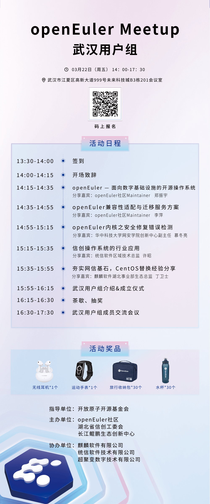

2024年openEuler社区首场用户组Meetup来到武汉站啦！就在3月22日！**本次活动上将正式成立武汉用户组，打造武汉及周边地域的用户、开发者交流圈子**，欢迎大家来线下认识交流\~

本次活动邀请openEuler社区Maintainer来分享openEuler的技术特性、生态发展状况、迁移方案，以及高校网络安全专家分享openEuler内核安全的内容。同时，为了进一步与用户深入交流，活动还安排了用户圆桌交流环节，解答更多关于openEuler社区中大家所关心的问题，听取社区用户的意见和诉求。欢迎扫码报名活动！

活动信息
========

**主办单位**：openEuler社区、湖北省信创工委会、长江鲲鹏生态创新中心

**时间**：2024年3月22日 13:30-17:30

**地点**：武汉市东湖高新区未来科技城B3栋二楼

扫码报名
========

