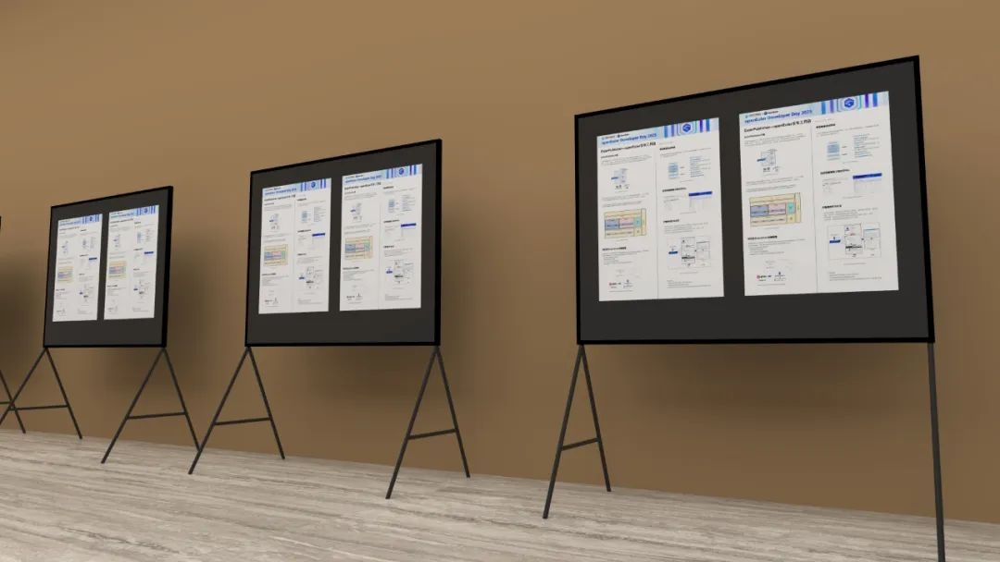

openEuler Developer Day 2025 （简称 ODD
2025）是开放原子开源基金会孵化及运营的 openEuler
社区发起的开发者大会。旨在持续推动操作系统乃至基础软件的创新和突破。

本次
ODD 2025
将全面展示全新发布的25.03创新版本特性、内核开发、多样性计算和全场景协同的技术成果、分享各行各业基于
openEuler 的商业实践。

邀请您参与openEuler社区Post
Session活动！在这里展示您在社区中的创新技术、项目亮点或关键技术突破，无论您是社区的开发者还是SIG组的Maintainer，都欢迎您展示个人或团队的技术成果，向大家分享您的专业经验，被选中的Poster将在大会期间在展区现场全天展示。

**Poster提交指南**

**重要日期**

**招募时间：**

2025年3月14日\--3月20日
17:00Tips：海报印刷截止日期为3月30日，如果您的海报之后有任何更改，则需要自行打印海报并带到活动现场。** 主题要求**海报应集中展示您的技术亮点、创新项目、工具开发、问题解决方法或独特的实现案例等，具体内容可以涵盖但不限于：社区新功能的开发、基础设施改进、CI/CD工具创新、软件包维护、镜像下载、安全漏洞（如CVE）的处理等。

**海报格式**

-   海报尺寸：(120cm\*90cm)，竖向呈现，单面打印

-   文件类型：提交PDF，包括0.3cm（3mm）出血和裁切标记

-   单个文件大小小于100MB

-   显示方式：Poster将通过纸质形式呈现在大会展区。可在此下载PPT模板：

https://gitee.com/openeuler/presentations/tree/master/ODD2025

**提交方式**在此表单内填写Poster相关信息，可先提交PDF文件。待大会审核后将有邮件通知。https://shimo.im/forms/57Y0wFVHF1DPp7Eu/fill

**评审标准**

-   展示与openEuler相关的技术亮点或与社区相关的项目创新

-   清晰的展示技术问题、解决方案或创新点

-   技术对于开源生态系统的影响力或潜在贡献

-   所属SIG组想要呈现的清晰传达技术内容

被选中的Poster将在大会期间全天展示，我们鼓励作者到场，与观众交流并解答相关问题，或在海报展示区域留下您可交流的时间与地点。受欢迎度高的海报将在活动结束后在社区官方公众号等平台宣传。我们期待您的精彩作品！
