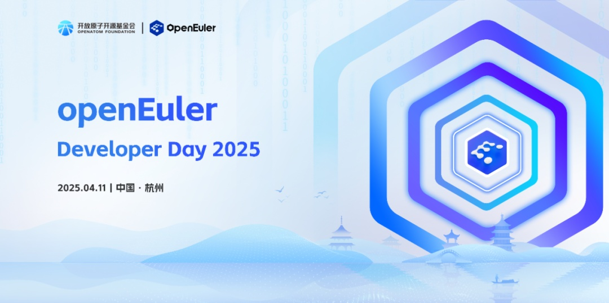
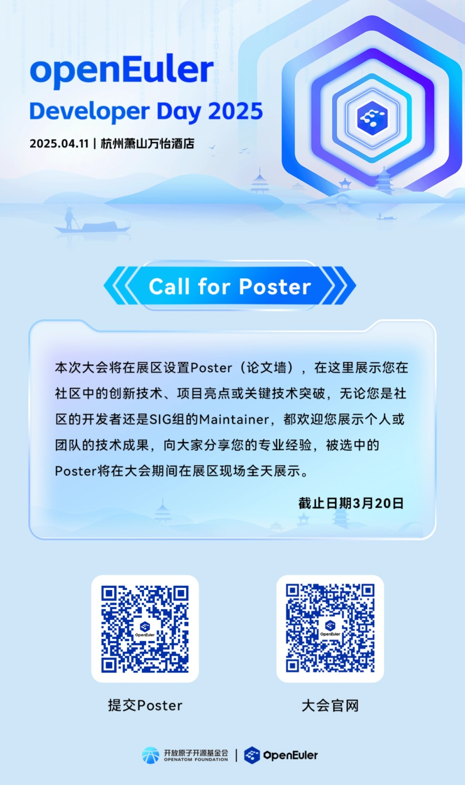
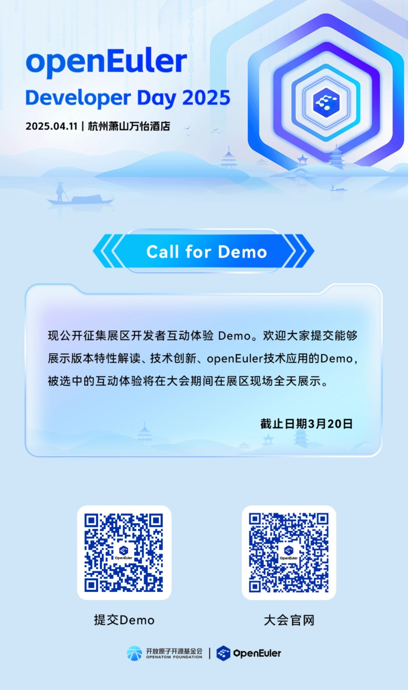

**openEuler Developer Day
2025**将于**2025年4月11日**在杭州萧山万怡酒店举办！

openEuler Developer Day 2025 （简称 ODD
2025）是开放原子开源基金会孵化及运营的 openEuler
社区发起的开发者大会。旨在持续推动操作系统乃至基础软件的创新和突破。本次
ODD 2025
将全面展示全新发布的25.03创新版本特性、内核开发、多样性计算和全场景协同的技术成果、分享各行各业基于
openEuler 的商业实践。同时 ODD
2025也是社区的年度大型工作会议，协同讨论版本路线以及联合创新。openEuler
始终与开发者在一起，用 openEuler
构筑坚实的软件根基，成就属于每位开发者的 openEuler 时代。

**我参与，我做主。开源是一种态度，分享是一种精神。Call for
Poster、Call for Demo、SIG Gathering 现已全面开放报名。**

**展区征集**

**SIG Gathering**

本次大会的SIG
Gathering环节将设立八大专题研讨，方向为：内核开发、全场景应用、AI原生支持、openEuler原生开发、上游原生支持、用户体验设计、RISC-V、云&云原生。欢迎选择您感兴趣的的专题链接，申报议题，一起线下共同探讨，寻求解决方案。

***专题一：内核开发***

○ 专题简介：

本专题将与开发者一起探讨openEuler内核那些事儿：如何提升openEuler内核竞争力、给上游社区做贡献、内核CVE感知和修复、以及多样性算力平台支持等，提升openEuler内核竞争力和健壮性。

○ 链接：

*https://etherpad.openeuler.org/p/%E5%86%85%E6%A0%B8%E5%BC%80%E5%8F%91*

***专题二：全场景应用***

○ 专题简介：

本专题将与开发者一起探讨openEuler在多场景的应用及未来发展方向，一套架构搞定服务器、云计算、边缘计算和嵌入式等全场景应用。

○ 链接：

*https://etherpad.openeuler.org/p/%E5%85%A8%E5%9C%BA%E6%99%AF%E5%BA%94%E7%94%A82025*

***专题三：AI原生支持***

○ 专题简介：

本专题将与开发者一起探讨openEuler的多样化三层AI使能架构：

1、基于LLM的智能交互平台，颠覆传统shell命令交付的模式，改进传统学习，开发，调优，运维体验，智能新语义支持应用智能化升级，共建AI生态。2、CPU/GPU/NPU算力融合，面向训练高可用/推理低成本方向，降本增效。3、AI
主流软件栈4层栈全栈兼容及封装，主流推理框架加速，开箱即用。

○ 链接：

*https://etherpad.openeuler.org/p/AI%E5%8E%9F%E7%94%9F%E6%94%AF%E6%8C%81%EF%BC%882025%EF%BC%89*

***专题四：openEuler原生开发***

○ 专题简介：

本专题将与开发者一起聊聊怎么在openEuler上开发。从openEuler本地开发环境、加包与更新维护、社区开发与协作基础设施、到社区构建测试服务，全方位搞定，打造更便利的"基于openEuler做开发"的开发者体验。

○ 链接：

*https://etherpad.openeuler.org/p/%E5%8E%9F%E7%94%9F%E5%BC%80%E5%8F%91*

📝 ***专题五：上游原生支持*** 

○ 专题简介：

本专题将与开发者一起聊聊openEuler上游原生支持，讨论openEuler上游原生支持技术讨论及进展同步，讨论如何做好从上游原生支持到openEuler原生发布的关键环节，包含上游协同，监测，维护管理等。

○ 链接：

*https://etherpad.openeuler.org/p/%E4%B8%8A%E6%B8%B8%E5%8E%9F%E7%94%9F%E6%94%AF%E6%8C%81%EF%BC%882025%EF%BC%89*

***专题六：用户体验设计***

○ 专题简介：

本专题将与开发者一起聊聊openEuler用户体验设计的"大动作"：1.深化知识共享：提供高质量的中英文文档，与协作机制，作为知识共享的基石。2.推动技术融合：通过软硬件兼容性测试与认证，促进openEuler生态的健康发展。3.人才培养与发展：通过设计和实施有效的人才认证和培养计划，为人才提供成长和发展的机会；4.设计语言的统一与创新：通过构建一致性的设计语言，定义社区视觉规范。

○ 链接：

*https://etherpad.openeuler.org/p/%E7%94%A8%E6%88%B7%E4%BD%93%E9%AA%8C%E8%AE%BE%E8%AE%A1*

***专题七：RISC-V***

○ 专题简介：

探讨openEuler在RISC-V架构上的最新进展、应用案例和发展方向，提升openEuler多样性算力支持的能力。

○ 链接：

*https://etherpad.openeuler.org/p/RISC\_V*

***专题八：云&云原生***

○ 专题简介：

探讨openEuler在云计算与云原生领域的技术生态满足度提升、技术创新、领域Top开源社区集成和联合创新等相关内容，为云与云原生领域开发者和用户提供极致体验。

○ 链接：

*https://etherpad.openeuler.org/p/%E4%BA%91%E4%B8%8E%E4%BA%91%E5%8E%9F%E7%94%9F*

**如有问题可以咨询openEuler小助手。**

**欢迎申报议题\~**
