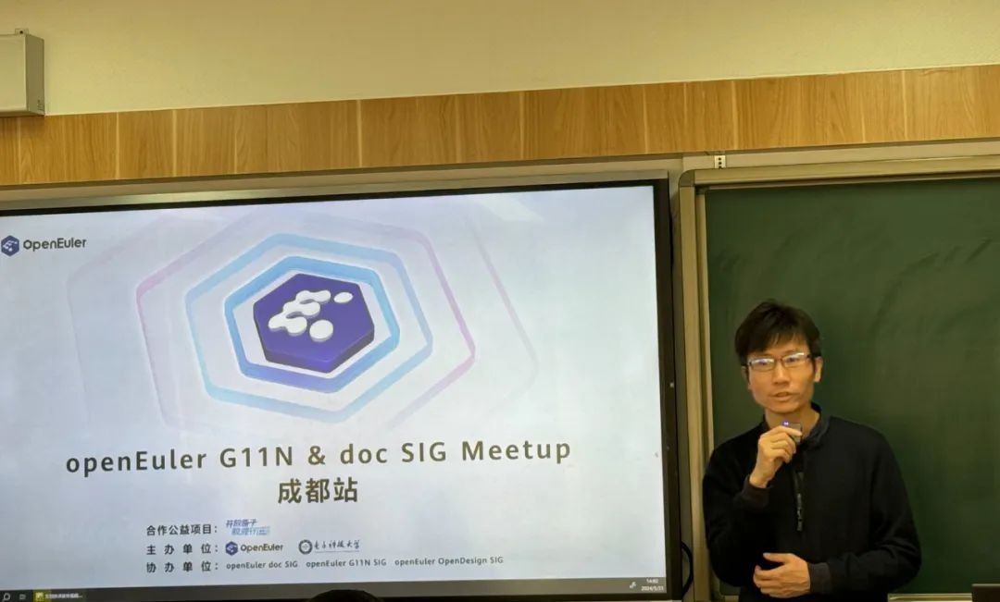

2024年3月23日， OpenAtom openEuler（简称\"openEuler\"） G11N SIG 和 doc
SIG 在成都联合举办了一次线下 Meetup。活动现场，**来自 openEuler
社区、电子科技大学、麒麟软件、语言桥、菁蓉联创、软通动力、成都理工大学**等企业、组织及院校的
50
多名专家及参会者面对面交流，分享他们在社区文档和英文化各领域的见解，以及在生态信息体验方面的实践。

下面就让我们来回顾本次
Meetup的精彩内容吧\~

**开场致辞**
------------
电子科技大学沙河科技园双创导师唐佐林为本次活动带来了精彩的开场致辞，介绍了电子科技大学在
openEuler 领域所做的教学性研究，鼓励同学可以通过 doc SIG 和 G11N SIG
积极参与到 openEuler 社区的贡献中。

**侃侃openEuleropenEuler**
------------

社区技术委员会委员、华为鲲鹏布道师曹志介绍了
openEuler 的基本情况，从一位 openEuler
社区深度参与者的视角，描述他所听到的、看到的、感受到的
openEuler。他向我们介绍到 openEuler
既是全场景的操作系统，提供开发者工作平台，也是一个国际化交流，与高校深度合作，提供学习、实习的平台。

**携手 G11N SIG，搭建 openEuler 社区沟通桥梁**
------------
G11N 是
Globalization（全球化）的缩写。G11N SIG
的愿景是跨越语言和文化障碍，和所有社区贡献者一起共建繁荣的 openEuler
生态。**来自 openEuler 社区 G11N SIG Maintainer
张维瑜**为我们分享了从社区开发者手册翻译、仓库 Readme
文档优化、技术博客创译、视频课程制作等方面介绍 G11N SIG
在社区英文化方面所做的探索，以及为社区影响力传播所做的贡献。

**加入 doc SIG，迈出开源第一步**
------------

来自 doc SIG 的 Maintainer
胡君为我们介绍 doc SIG 是提供 openEuler
产品文档和技术知识的兴趣小组，并详细分享了参与 doc SIG
贡献的三种方式。doc SIG 根据写作实际情况，发布了文档 markdownlint
写作规则与文档的写作规范，帮助文档贡献者更高质量地开发技术文档。最后，胡君还向我们展示了
doc SIG 其他方面的文档探索，例如 openEuler 技术白皮书、Man Pages 等。

**智能翻译技术的创新应用**
------------

来自语言桥信息技术有限公司的产品经理张君为我们带来智能翻译技术的创新应用分享。通过利用机器翻译、光学字符识别（OCR）、大型语言模型（LLM）等
AI
技术来突破传统语言的界限，实现无缝的全球交流。针对语音、多语言及视频配音和字幕等场景，提供一站式翻译解决方案。通过"智能技术+数据服务"的教学方式，结合
"MT+PE" 人机共译模型，助力高校学科教研和外语人才培养。

**面向开发者的生态信息体验探索与实践**
------------
在万物互联的时代背景下，如何满足多元化生态业务诉求，信息体验如何高效切入并匹配生态建设，助力生态繁荣。**来自华为的信息体验专家耿雪萍老师**，基于这在生态信息体验领域的探索和实践，总结了一套端到端的实践经验，包括如何根据生态业务场景和用户画像构建生态信息体系，围绕开发者社区规划设计信息中心架构，借力生态运营活动开展内容运营助力开发者生态指标达成，通过开发者
VOC 反向推动信息内容质量提升等。

**基于 Developer Journey Map 的开发者触点构建**
------------
来自 openEuler 社区的 doc
SIG Maintainer 刘鹏**分享了基于对主流开源社区的洞察而总结 openEuler
Developer Journey Map 画像，并介绍了 openEuler
社区内外部可触达开发者的信息传播点分析。最分享的最后，刘鹏老师向我们展示了当前
openEuler
开发者信息建设的众多成果，例如视频教程、技术博客、开发者访谈等。

**开发者视角下对社区文档的感知度调研**
------------
来自麒麟软件的合规研发工程师丁紫薇为我们带来了开发者视角下对社区文档的感知度调研分享。文档是开发者获取知识的途径，为更好让广大开发者通过文档得到所需知识，搭建起开发者与开源软件之间的桥梁，丁紫薇老师以开发者视角，对开源社区内的文档提出一些需求方面的思考，并向我们展示了文档感知度调研的结果分析。结果发现，有
85.6% 的开发者使用过社区文档，其中使用频率最高就是用来查看代码其次是阅读文档首页。

**openEuler Jailhouse 文档实践**
------------
菁蓉联创系统开发工程师黄炎为我们带来了
openEuler Jailhouse 文档实践的分享。首先，他向我们介绍了 Jailhouse
的基本情况以及使用场景。Jailhouse 在 openEuler
也有相关的社区实践以及适配的软件架构。在分享的最后，黄炎老师提出了文档代码化的思考，通过借鉴代码开发的方式来开发文档，具有易于版本管理、轻量化、良好的可迁移性的优点。

**开源文档的前端**
------------

实现来自 openEuler OpenDesign SIG 的 Maintainer
龚壮邦分享了开源文档的前端实现经验。为了提升社区用户的文档体验，openEuler
社区的前端工程师将 gitee 仓库的 markdown
渲染生成社区官网文档，从视觉与交互需求分析及实现、到测试环境构建、测试、线上环境构建、上线，完整的流程保证了文档内容的呈现效果。

**优秀贡献者分享**
------------

最后一项议题，是来自 openEuler doc SIG 和 G11N SIG
优秀贡献者的分享。首先是 doc SIG
的贡献者胡萌，为我们分享了贡献者角度下的内容开发流程与文档维护流程，以及个人的社区贡献心得。

随后是G11N SIG的贡献者陈锐昕，带来了 Markdown 开源精神的分享，以及
openEuler 社区 Markdown 文档国际化贡献历程。

**自由交流&茶歇**\
------

"开放原子校源行"项目自启动以来，已经引起巨大反响。它覆盖了全国超过134所高校，建立了67个开源社团，编制了超过100学时的开源课程，并培育了400余名开源大使。此次"2024开源春耕计划"的启动，标志着openEuler社区将进一步提升社区高校开源生态，培养更多具备创新精神和实践能力的优秀人才。openEuler社区将充分利用这一平台，推动开源技术在校园内的普及与实践。

**彩蛋！！**
------------

本次 Meetup 现场嘉宾分享材料已上传至
openEuler社区。如果您对分享材料感兴趣，可以通过链接直接获取。

PPT获取链接：

<https://gitee.com/openeuler/presentations/tree/master/meetup/20240323-G11N&doc%20Meetup>

本次 Meetup 直播回放已上传至 B站 openEuler
官方账号。如果您错过了本次线下活动，可前往 B
站关注查看，期待您的下次参与！

回放链接：

<https://space.bilibili.com/527064077/channel/collectiondetail?sid=2579411>

我们欢迎与 openEuler
一起组织开发者活动，共同探讨前沿技术和开源发展趋势，分享创新成果和实践经验，与
openEuler 社区共同成长！点击文末阅读原文即可申请。
