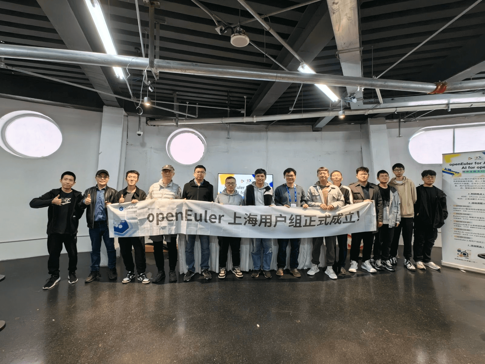

2024年3月23-24日，"2024全球开发者先锋大会"（GDC）在上海徐汇盛大召开，本次大会以"模速空间------开发者的模力之源"为主题，以促进开源开放为引领，汇聚全球范围内尖端技术、热门议题和先锋人才，其中AI与大模型是本次大会最聚焦展示和探讨的方向。

OpenAtom openEuler（简称\"openEuler\"）在本次大会上以"openEuler for AI,AI for openEuler"为主要方向进行了内容分享和展示，向开发者们分享了 "AI赋能openEuler更智能，以openEuler使能AI更高效"路线下，AI与操作系统融合的创新成果与探索。

**开放原子大模型前沿讲坛：大模型时代OS面临的挑战与机遇**
---------
在主会场开放原子大模型前沿讲坛，openEuler社区Maintainer郑振宇分享了在大模型掀起新一轮技术变革的背景下，openEuler面向AI的持续创新，形成全流程AI交互式开发、融合异构算力使能应用高效运行、打造AI专家系统辅助式运维的技术优势。

**openEuler 工作坊：openEuler智能运维、智能服务与AI生态**
---------
在openEuler 工作坊上，五位社区专家、开发者进行了议题分享，现场人员爆满，大家对openEuler的智能化和AI生态的支持非常关心。

openEuler技术委员会委员胡峰在《openEuler整体特性&智能运维介绍》议题分享了在IT基础设施和应用产生的数据量快速增长、系统运维复杂度越来越高的背景下， openEuler针对通用/异构算力场景、集群化业务场景，逐层构建全栈可观测、系统诊断工具、智能化运维平台等能力，实现智能巡检、智能诊断、智能运维、智能调优一体的解决方案。

openEuler兼容性SIG 组Maintainer 杜开田在《EulerCopilot-赋能开发者及系统管理员》议题分享了当前EulerCopilot当前在智能问答服务和智能体框架两个方面的进展，智能问答服
务已实现openEuler领域知识智能交互和问答，另一方面EulerCopilot将构筑基于1+1+N智能体架构的AI全栈解决方案，以openEuler为底座，使能ISV应用更智能，致力于赋能万千开发者和行业客户更高效的使用openEuler。

麒麟软件运维工程师、openEuler sig-ops的contributor王钧琪在《PilotGo运维平台系统架构感知可视化插件》议题中为大家介绍了PilotGo运维平台，运用PilotGo-Topo架构感知插件自身的数据采集模块以及第三方监控、观测工具对业务集群运行场景进行拓扑可视化，以更直观的形式对跨主机、跨网络业务的运行情况进行多指标、多维度观测，更快实现运维工作中问题的定位、故障链的生成及故障排查。

开源开发高级工程师、openEuler社区Contributor张思博、王帅在《openEuler在AI开源社区的贡献与实践》议题中介绍了当前openEuler+Ascend 对主流AI框架、加速库及三方社区生态的支持情况及开发流程的CI构建。同时，通过DeepSpeed/Stable diffusion webui/diffuser 三个社区的适配实践过程，讲解了如何进行上游开源贡献。

同时，借此次聚集上海地区用户的机会，openEuler上海用户组正式成立！欢迎更多用户加入，一起构建上海地域用户线上线下交流圈。（点击了解、申请加入openEuler用户组）

**彩蛋**
---------

本次活动的嘉宾分享材料已上传至 openEuler社区。如果您对分享材料感兴趣，可以通过链接直接获取。

PPT获取链接：

<https://gitee.com/openeuler/presentations/tree/master/meetup/20240324-GDC>
