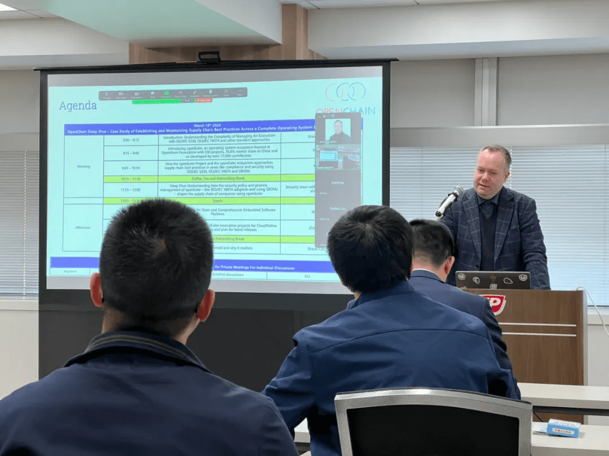

2024年3月18日，OpenChain基金会与OpenAtom
openEuler联合主办的研讨会在日本东京市品川区举行。来自OpenChain和openEuler的行业专家，来自日立、松下、SONY、东芝等的公司代表，以及OS爱好者齐聚品川，参加本次研讨会。本次研讨会从上游到商业生态的ISO标准探索和讨论，深入探讨openEuler在软件供应链安全方面的优秀实践，探讨如何推动开源软件安全与合规标准落地，以及openEuler在AI、云原生、嵌入式领域的创新与应用案例，促进日本用户和开发者对openEuler的了解与合作。

**精彩回顾**
---

**OpenChain General Manager，Shane
Coughlan**代表OpenChain做开场演讲，他指出软件供应链安全对于当前基础软件的重要性。对于操作系统这类复杂软件实现软件供应链安全，尤其是在开源社区中实现符合ISO标准的全流程供应链安全，十分具有挑战性。openEuler的最佳实践为其他同类社区和项目提供了很好的参考与指导。

**openEuler社区执行总监&技术委员会委员熊伟**为大家介绍了openEuler社区当前的发展情况。他提到，在生态拓展、技术创新、软件安全与治理方面，openEuler社区与生态伙伴、国际开源与标准组织进行广泛合作，均取得了显著成果。如今，openEuler占据了中国服务器操作系统市场36%以上的份额。这一成功可以归因于系统的高质量、商业模式，以及对计算的创新和多样化的关注。

**openEuler社区Compliance SIG Maintainer高琨**概述了openEuler的供应链安全框架以及openEuler如何使用ISO标准在合规性和安全性等领域接近供应链最佳实践。openEuler开发了一个全面的供应链框架，包括安全合规、元数据管理和许可证合规。此框架与ISO标准保持一致，例如ISO
5230用于许可证合规性，ISO 18974用于安全保证。

**openEuler社区Maintainer郑振宇**代表openEuler Security Committee
做了关于openEuler社区安全治理的演讲，
openEuler的供应链管理、合规性和安全性方法是全面的，以行业为中心。openEuler通过与ISO标准保持一致并实施强大的治理规则和工具，确保为包括AI在内的各种计算场景提供高质量、安全和合规的软件。openEuler的商业模式、协作生态系统和对创新的重视促成了它的快速成长和成功。

**openEuler Embedded SIG
Miantainer任慰**重点介绍了openEuler嵌入式。openEuler为嵌入式系统提供了一个全面的、开放的软件平台。它涵盖了物联网、汽车、消费电子等各种场景。该平台注重定制化和灵活性，以满足嵌入式技术中的不同需求。openEuler通过提供可持续的嵌入式平台来解决嵌入式系统的挑战。任博认为嵌入式系统未来趋势是混合临界系统和混合临界部署框架(MICA)。openEuler对混合临界系统（MCS）的关注使得嵌入式系统中的实时和非实时任务集成成为可能，它提供了一个用于调度、隔离和资源分配的框架，允许开发人员优化硬件资源的利用率和性能。

在开放讨论环节，来自openEuler社区以及日立、松下、SONY、东芝、Juniper等企业的技术专家们围绕着开源技术的未来展开了热烈的讨论。openEuler社区将继续致力于推动开源技术的发展，为开源软件供应链的安全以及生态繁荣和创新贡献我们的力量。

如果您错过了本次研讨会，可以在openEuler
B站上观看重播，体验本次演示。回看链接：

<https://space.bilibili.com/527064077/channel/collectiondetail?sid=2557185>
