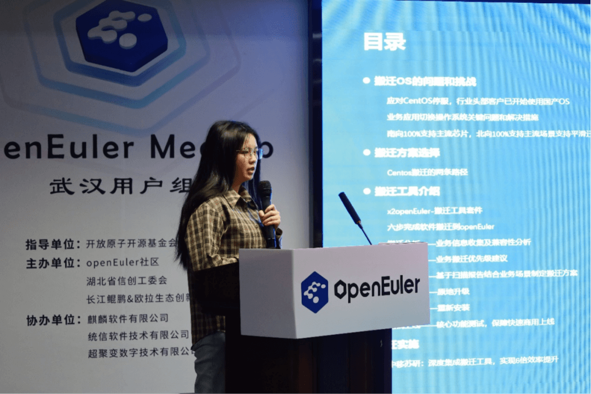

3月22日，OpenAtom
openEuler（简称\"openEuler\"）2024首场用户组Meetup在武汉未来科技城成功举办。本次Meetup由openEuler社区、湖北省信创工委会、长江鲲鹏&欧拉生态创新中心联合主办，统信软件、麒麟软件、超聚变协办，武汉地域60+开发者、企业用户、高校师生参会。本次活动围绕操作系统迁移和操作系统内核安全进行分享，同时借此次相聚之机，正式成立了openEuler武汉用户组。

**湖北省信创工委会秘书长温晖**莅临活动并进行了开场致词，他表示《湖北省数字经济发展"十四五"规划》指出重点发展高可信服务器操作系统、中间件、办公软件等基础软件产品及解决方案，构建安全可控的信息技术体系，**工委会将大力支持并推动openEuler在武汉地域的落地应用，助力武汉市优势产业转型升级。**

**openEuler社区Maintainer郑振宇**从多方位给大家介绍了openEuler的最新进展、最新技术亮点、生态建设状况和社区亮点，让现场参会者对openEuler有了进一步的认识。

为响应用户想要更多了解关于openEuler迁移方案和经验的诉求，本次活动安排了迁移相关议题，**来自openEuler社区兼容性SIG
Maintainer李萍**为从搬迁操作系统的问题与挑战切入，为大家细致分享了openEuler搬迁方案的选择、搬迁工具的使用、搬迁实施过程。

内核程序是操作系统的"大脑"，内核安全无疑是重中之重，专注于网络安全研究的**华中科技大学网安学院创新中心副主任慕冬亮**为大家分享了如何设计模糊测试技术来测试openEuler内核中的安全修复，保障内核程序的安全性。

针对CentOS停服问题，openEuler社区的成员单位建立起成熟的迁移方案，并有着丰富的落地实施经验。此次邀请了统信软件和麒麟软件两家社区成员单位来分享基于openEuler的商业发行版在迁移上的方案和经验。**统信软件区域技术总监许昭**分享了统信服务器操作系统的迁移能力、迁移实施方案、完备的服务器产品支撑体系，以及如何解决企业面临CentOS带来的一系列业务和数据安全啊的多重风险和危害，为各行业数字化建设提供了可靠的实践样板。

**麒麟软件湖北事业部生态总监丁卫士**从银河麒麟操作系统可靠性和安全性、生态与服务四个方面介绍了麒麟软件替换方案，并针对CentOS停服推出了银河麒麟服务器操作系统和服务器迁移运维管理平台二者相结合的迁移方案，方案包括原机迁移、扩容迁移，系统接管。最后分享了国（央）企、金融、教育、医疗、交通等行业的众多成功案例和落地经验。

在本次活动上正式了openEuler武汉用户组，后续将作为武汉及周边地域的用户、开发者持续交流的线下阵地，欢迎更多伙伴加入共同建设openEuler用户生态。

