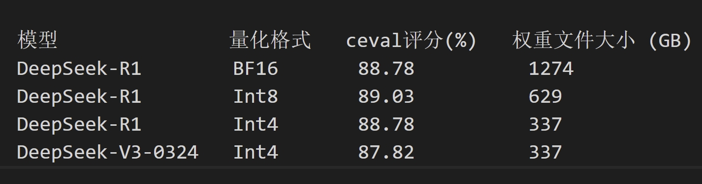
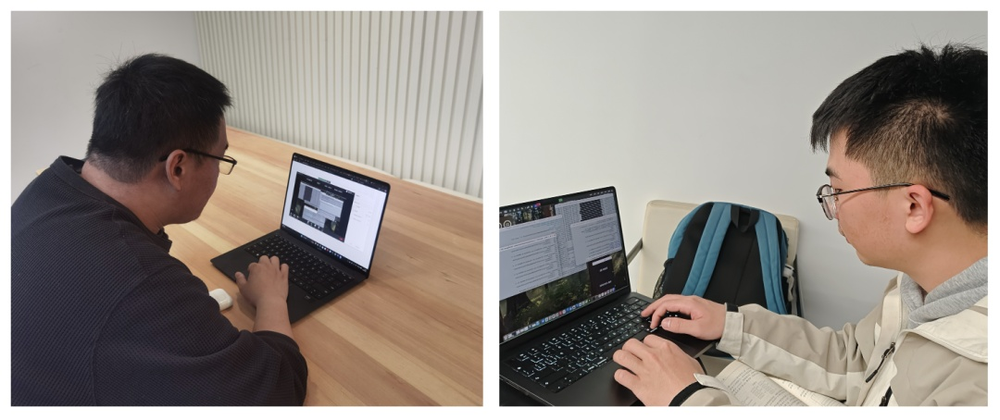

2025年1月DeepSeek-R1发布以来，已触发了AI大模型产业的一系列进化与变革。一方面，DeepSeek-V3/R1以其卓越的交互体验，7天即揽获过亿用户。3月24日发布的DeepSeek-V3-0324更在代码生成、技术写作等多项任务能力上有了质的飞跃，使得AI大模型加速成为新一代生产力工具。

另一方面，DeepSeek-V3/R1依托MoE网络结构、动态冗余专家等一系列巧妙设计，显著提升了训推性价比，使得中小企业有能力定制训练和部署专有模型，有望加速AI+产业赋能。

然而，伴随着DeepSeek-V3/R1的持续火爆，其大规模产业落地，仍面临诸多挑战：

部署门槛高：在裸金属服务器或云主机上部署DeepSeek-V3/R1推理服务，涉及AI框架、推理加速库、推理服务框架等10+个开源软件的安装调测，学习成本高，探索路径曲折；

算力成本高：DeepSeek-V3/R1参数量6840亿，采用BFloat16浮点格式的权重文件部署，需4台Atlas
800T A2服务器（64GB\*32片昇腾NPU），月租赁成本约十余万人民币；

性能优化难：此前在非NVidia平台，缺乏全栈开源的DeepSeek-V3/R1推理解决方案，阻碍了行业化定制调优。

**3月26日，由上海交通大学网络信息中心支持，上海交通大学并行与分布式系统研究所（IPADS）联合OpenAtom
openEuler（简称"openEuler"）社区、昇思MindSpore社区，共同开发验证了基于openEuler+vLLM+MindSpore、全栈开源的DeepSeek推理解决方案。**双方研发人员协同完成DeepSeek-R1/V3-0324权重参数的Int4量化，在精度几乎无损的条件下，实现单台Atlas
800T
A2服务器（64GB\*8片昇腾NPU）部署运行DeepSeek大模型推理服务。同时，验证了DeepSeek-R1/V3-0324
Int8量化推理，其系统总吞吐性能较前序版本提升幅度达15%。

值得关注的是，该解决方案的DeepSeek-V3/R1
Int8量化推理版本，此前已与北京大学联合进行了技术验证，并参展华为计算合作伙伴大会，支持RAG、智能运维、智能调优Agent等应用。相关技术细节可参阅《北京大学联合openEuler与MindSpore发布DeepSeek全栈开源解决方案》、《openEuler全栈开源推理方案亮相华为伙伴大会》。

**1 技术亮点解析**

**1.1 昇思MindSpore Int4权重量化推理**

DeepSeek是首个使用FP8浮点格式进行全流程训练和推理的大模型，但其千亿级的庞大参数量仍对硬件部署环境提出了极高的要求。借助昇思MindSpore金箍棒套件，成功实现了对DeepSeek-R1/V3-0324权重参数的W4A16
Int4权重量化，将部署的硬件部署成本的进一步减半。

昇思MindSpore金箍棒套件使用GPTQ算法，通过分层配置DeepSeek-R1/V3-0324网络的量化策略，有效平衡了量化模型精度和显存占用。面向DeepSeek
MoE结构，使用Hessian矩阵的二阶信息约束权重量化前后的模型输出差异，实现高精度的Int4量化。同时，采用逐块量化策略，降低量化校准耗时，在完成一批参数的量化完后，使用逆Hessian矩阵信息对后一批参数的权重进行补偿。如表1所示，Int4权重量化后的DeepSeek-R1推理模型ceval评分，较BFloat16浮点格式几乎无退化，但权重文件和显存占用减少约75%。

表1 DeepSeek-R1/V3-0324 Int4量化推理测试结果

注：表中为zero-shot
CEval评测结果，限定模型输出最多5个token，匹配正确答案来计分。

借助昇思MindSpore的图编译功能，DeepSeek量化模型推理过程中自动进行Vector-Vector、Cube-Vector算子融合优化，同时结合vLLM的Multi-Step
Scheduling/Prefix Cache以及Chunked
Prefill等功能，有效地提升了模型的推理吞吐率。

**1.2 openEuler异构融合内存按需预取&offload**

openEuler提供了操作系统层面细粒度的L2Cache按需控制和预取技术，支持计算任务和通信任务多线程并发执行，在通信任务流执行的同时按需预取MoE层的权重参数，实现通算的进一步融合和流水并行时延掩盖，提升推理吞吐。

openEuler引入了KVCache
Offload机制，大幅降低了DeepSeek模型的NPU显存开销，进一步提升显存利用率与整体吞吐性能：该机制可自动识别冷热的KV
Cache数据，将不常用的KV
Blocks动态交换到内存中；当用户请求激活或者匹配到共享前缀时，再将KV
Blocks交换到NPU中继续推理。同时，使用异步传输进一步将KV
Blocks的传输和计算交叠掩盖，降低了上述过程对于Prefill时延的影响。

**1.3 毕昇编译优化**

毕昇编译器针对NPU后端使能融合编译技术，使能架构亲和指令，分析多级流水线之间数据依赖关系，自动插入最优同步，实现最优性能Vector-Vector融合算子与Cube-Vector融合算子，并优化PagedAttention算子等关键算子的执行速率，加速NPU设备运行速度，减少算子数量，降低下发执行压力。

在openEuler、MindSpore与 DeepSeek全栈开源推理方案中，毕昇编译器针对Host
CPU侧算子下发阶段的性能瓶颈，通过架构亲和优化、循环优化、多级并行优化、指令优化、智能编译选项和链接时优化等编译技术优化Python、Mindspore和Ray框架，使代码布局更优，有效提高程序IPC，降低访存开销，进而降低时延，提高吞吐率。

**2 部署验证结果**

3月26日，上海交通大学并行与分布式系统研究所和openEuler社区的研发人员通过线上协同，在上海交通大学的Atlas
800T
A2服务器集群上，使用openEuler+MindSpore全栈开源推理解决方案镜像，验证了DeepSeek-R1和DeepSeek-V3-0324的Int8/In4量化推理。

双方研发人员首先使用2台Atlas 800T
A2服务器（64GB\*16片昇腾NPU），部署了基于vLLM+MindSpore+openEuler的DeepSeek-R1
Int8量化推理，其单Batch吞吐率19token/s，192
Batch总吞吐率1400token/s，较该解决方案首版本提升了超过15%。

双方研发人员然后使用昇思MindSpore金箍棒套件，对DeepSeek-R1和DeepSeek-V3-0324 1274GB的BFloat16浮点格式权重文件，进行了GPTQ权重量化，经历约6小时的量化寻优，获得了体积仅337GB的Int4格式权重文件，可在单台Atlas
800T A2服务器（64GB\*8片昇腾NPU）上进行服务部署，192
Batch总吞吐率420token/s。

上述开发验证过程的容器镜像和权重文件，已分别上传至openEuler社区和天翼云魔乐社区（modelers.cn），可供开发者下载使用。

图1
openEuler社区朱睿（左）与上海交通大学并行与分布式系统研究所陈启炜（右）远程协同完成DeepSeek
Int8/Int4推理部署开发与验证

相关资源链接：

1. openEuler+MindSpore全栈开源解决方案镜像：

hub.oepkgs.net/oedeploy/openeuler/aarch64/mindspore:20250331

2. DeepSeek-R1 Int8量化模型权重：

https://modelers.cn/models/MindSpore-Lab/DeepSeek-R1-W8A8

3. DeepSeek-V3-0324 Int4量化模型权重：

https://modelers.cn/models/IPADS/DeepSeek-V3-0324-A16W4

4. DeepSeek-R1 Int4量化模型权重：

https://modelers.cn/models/IPADS/DeepSeek-R1-A16W4

**3 演进路标披露**

结合AI产业发展趋势和开源软件客户应用需求，openEuler社区和MindSpore社区已联合多家机构与产业伙伴，规划出DeepSeek全栈开源推理解决方案的技术演进路标。如下图所示，通过垂直整合和持续演进MindSpore、openEuler、毕昇编译器在异构资源调度、图编译、异构编译优化等领域的技术长板，该解决方案将陆续支持多模态RAG、AI Agent等应用功能，并将所支持的系统形态由单机/双机逐步拓展至32卡/64卡PD分离集群，以期提供鲲鹏+昇腾智算平台的开源最优推理部署方案。

图2 openEuler+MindSpore开源推理解决方案路标

**4 产业生态共建**

openEuler社区已面向开发者开源核心技术方案，诚邀行业伙伴、高校与个人开发者交流合作方案，通过联合创新实验室加速场景落地。可添加小助手微信加入 SIG-Long微信交流群，或访问Gitee平台了解相关材料、提交issue
(https://gitee.com/openeuler/llm\_solution)，与openEuler社区、MindSpore社区专家共筑智能未来。

