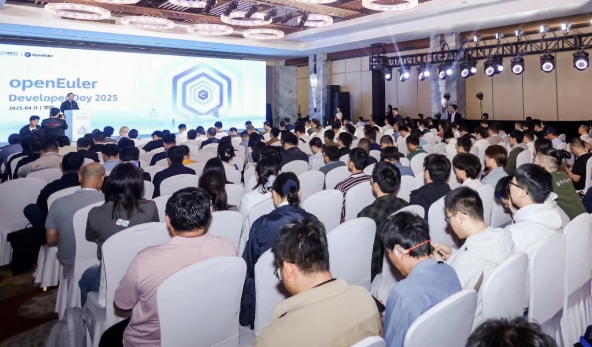
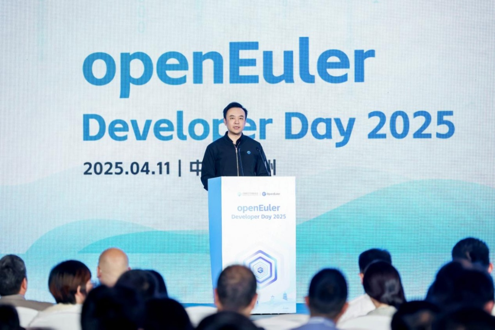
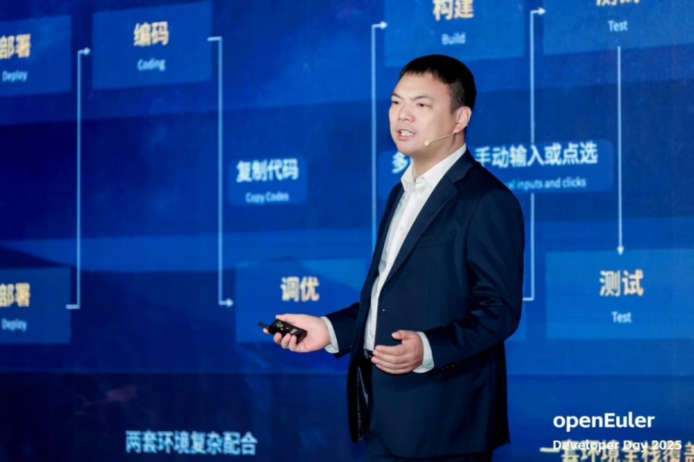
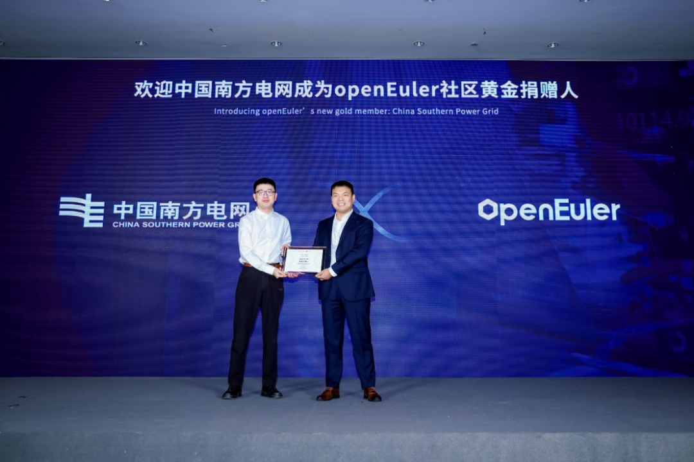

> openEuler Developer Day
> 2025（以下简称本次大会）于2025年4月11日在杭州萧山万怡酒店成功举办。本次大会由开放原子开源基金会孵化及运营的openEuler 社区发起，旨在推动操作系统及基础软件的创新与突破。活动吸引了众多技术专家、开发者和企业代表共同探讨 openEuler 的技术发展与生态建设。

> 开放原子开源基金会秘书长助理李博在致辞中表示，作为开源生态建设的重要推动者，基金会始终致力于为开源项目搭建广阔的发展平台。openEuler 自2021年11月贡献到基金会以来，全球用户已超过400万，覆盖155个国家和地区、2000多个城市，累计装机量突破1000万套。这一成就离不开社区2000多家企业生态共建和21000多名开发者的贡献。未来，基金会将聚焦项目培育、技术创新和生态拓展，加大对关键领域开源项目的孵化支持，持续完善开源基础设施建设，进一步提升 openEuler 的国际影响力。

> 开放原子开源基金会秘书长助理李博
>
> 今年3月31日，**openEuler
> 25.03创新版正式发布，这个版本是由社区37个成员单位、1817名开发者共同参与研发。OpenAtom
> openEuler 社区委员会执行总监胡正策表示，该版本是面向AI和开发者特性的一个里程碑版本**，聚焦全场景能力提升、开发提效与智能升级三大维度，为千行百业打造面向未来的数字基座。在全场景方面，openEuler 推出了机密容器与内核虚拟化新架构 vKernel；在开发者体验方面，社区推出了一站式开发者工作站 DevStation，使开发效率提升5倍；在智能化方面，升级了智能助手，降低AI应用开发门槛。

OpenAtom openEuler 社区委员会执行总监胡正策

> 除了技术方面持续创新突破，社区生态方面也有很大进展。相比去年同期，组织成员新增了33.2%，开发者数量增加了21%，社区原创项目增加了23.7%，用户数提升了70.8%，兼容硬件数提升了26.7%。**本次大会上，特别致谢了openEuler社区新增的黄金捐赠人中国南方电网，以及百度智能云、中国电子云、浪潮云和神州数码4家白银捐赠人。**

   
  来自108个SIG小组的300多名开发者聚焦openEuler社区重要规划，以及各SIG小组2025年下半年重要技术方案、开发计划进行了深入探讨，共同见证了openEuler社区的开放、包容、深度和远见。大会期间，openEuler 社区的 SIG
Gathering 环节围绕八大技术方向展开深入讨论，包括内核开发、全场景应用、AI生态支持、openEuler高效开发、上游生态支持、用户体验设计、RISC-V 和云与云原生。这些专题研讨旨在解决技术难题，推动 openEuler 在更多领域的应用。

> 在**内核开发专题**中，来自Kernel、Compiler、ARM、RISC-V等SIG开发者们围绕Kernel上游贡献、安全、内核CVE感知和修复、多样性算力平台支持等内容展开了充分研讨，并制定了对应领域的工作计划。同时还针对HAOC3、Trlo、vKernel、Valkey
> over MPTCP等创新项目的技术细节和未来规划进行了细节讨论。
>
> 在**全场景应用专题**中，Embedded、Compiler、DB、Industrial
> Control等SIG讨论了openEuler在多场景的应用及未来发展方向，包括工控、嵌入式、虚拟化混部等方向的技术规划和方向，为提升"一套架构适配全场景应用"的能力提供了保障。
>
> 在**AI生态支持专题**中，来自AI、Intelligence、CloudNative、Compiler等SIG的开发者们围绕openEuler社区AI创新技术以及AI创新技术在openEuler的应用两个方向开展了深入的探讨，规划了未来版本openEuler在软件和工具生态、编译器、硬件支持等相关方向对AI的应用和支持计划。
>
> 在**openEuler高效开发专题**中，来自Compatibility、CloudNative、Intelligence等SIG的开发者围绕从搭建openEuler本地开发环境、软件包引入与维护、社区开发与协作基础设施等多个角度，打造更便利的"openEuler高效开发"的开发者体验。
>
> 在**上游生态支持专题**中，来自CloudNative、Kernel、HPC、RISC-V等SIG的社区开发者围绕GenAI时代上游软件支持所面临的挑战及对操作系统在构建、测试、分发、更新等环节对开发者和工具的需求，包括如何在上游协同、监测、维护管理等维度上，确保从上游支持到openEuler的关键环节顺利展开。规划了25年Q2、Q3的对于大数据、AI等重点领域的上游软件适配计划。
>
> 在**用户设计体验专题**中，Doc、人才、兼容性、G11N、和openDesign等SIG讨论建议应提高社区协作机制，深化知识共享，通过软硬件兼容性测试与认证，推动技术融合，构建一致性设计语言，定义社区视觉规范。
>
> 在**RISC-V专题**中，来自RISC-V、ROS、Compiler、Kernel、QA等SIG的开发者们充分探讨了openEuler在RISC-V架构上的最新进展和发展方向，包括openEuler
> on
> RISC-V基于服务器方向25-26年的版本演进计划，RVA23扩展支持计划，RVCK开发树开发计划、ROS在openEuler
> on RISC-V的发展计划等相关规划。
>
> 在**云与云原生专题**中，来自CloudNative、Arm、Virt、eBPF等SIG以及Volcano、Kata、openFuyao等周边社区的开发者深度探讨了openEuler在云计算与云原生领域的技术生态满足度提升、技术创新、领域Top开源社区集成和联合创新等相关内容和未来规划，涵盖从构建到分发再到应用的整个开发流程。
>
> openEuler Developer Day
> 2025 不仅是一次技术盛会，更是 openEuler 社区生态建设的重要里程碑。通过展示最新技术成果、分享行业实践经验和推动社区协作，openEuler 正在为全球开发者和企业提供更加坚实的技术基础和创新动力。未来，openEuler 将继续与开发者携手，共同构建更加开放、创新的开源生态。
