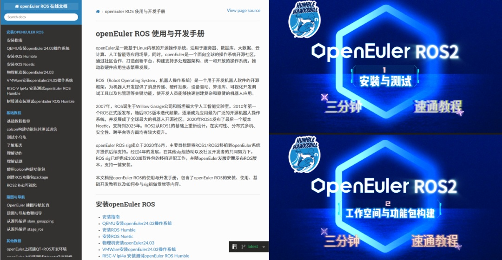
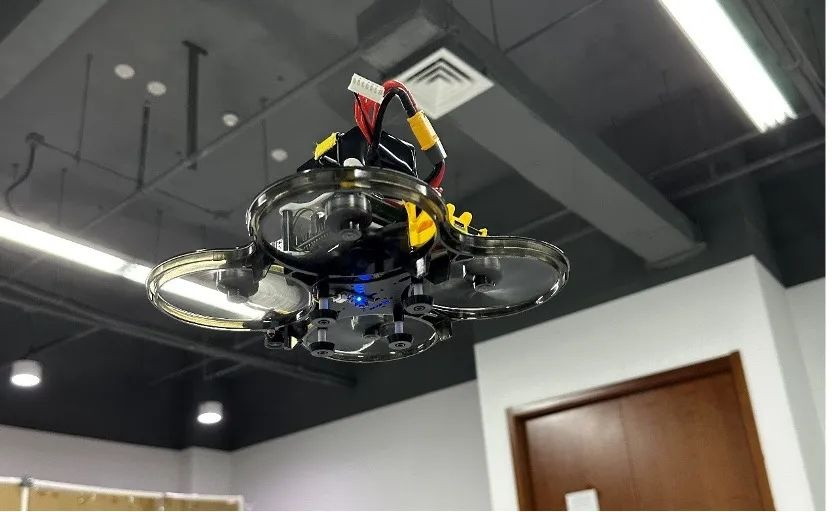
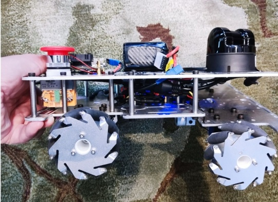

2025年4月11日，openEuler Developer Day 2025
在杭州萧山万怡酒店圆满落幕。这场聚焦于基础软件创新的年度盛会，集中展示了OpenAtom
openEuler（简称"openEuler"）
25.03创新版本特性，呈现内核开发、多样性计算、全场景协同等关键技术突破，并围绕商业实践与社区协作展开了深度探讨。

作为大会核心议题之一, 由openEuler技术委员会（TC）委员王经纬主持的RISC-V专题分会场，汇聚了来自RISC-V
SIG、Compiler SIG、QA
SIG、ROS-SIG组的开发者以及诸多社区伙伴，共同探讨openEuler在RISC-V架构的最新进展和发展方向。ROS
SIG Maintainer&中国科学院软件研究所工程师
王晓云与甲辰计划ROS乘风小队实习生
顾嘉琪首次参与RISC-V专项议题，分别从生态建设与场景验证的视角，呈现了ROS机器人在openEuler
on RISC-V领域的实践成果。

##### **王晓云：于openEuler构建ROS生态基石**

作为openEuler社区ROS
SIG的核心维护者，王晓云代表ROS-SIG系统梳理了ROS在openEuler操作系统上的移植适配和生态建设进展，以及将RISC-V架构处理器应用于真实机器人控制层级的实践探索。

**ROS生态搭建**

自2020年ROS SIG成立以来，团队相继打通了ROS1 Noetic、ROS2 Humble以及ROS2
Jazzy通用软件包在openEuler系统上的一键部署，大幅降低了开发者的安装部署门槛。同时产出了ros-porting-tools、ros-openEuler-tools等用于批量移植适配ROS功能包的工具。

2024年开始上线的在线文档和视频教程，系统化的介绍了在openEuler上安装使用ROS的全过程，同时涵盖了导航建图、仿真、目标识别等案例教程，为用户和开发者使用ROS降低了门槛。

**RISC-V架构落地实践**

2024是推动ROS在openEuler on
RISC-V上落地应用的关键时间点，从24年初到25年4月，这一年完成了4个重要项目：

在RISC-V SIG以及社区开发者的协助下，openEuler
24.03版本实现了X86/ARM/RISC-V三架构全覆盖，集成1000余个ROS软件包及常用算法包和工具包；

RISC-V
SIG联合达摩院玄铁推出RISC-V无人车解决方案，基于玄铁C910处理器实现了视觉交互与建图导航功能；

ROS-SIG推出的在线文档和教程详细介绍了虚拟机/物理机安装测试openEuler系统(RISC-V架构)以及安装测试ROS的过程，降低了开发者入门门槛；

   

ROS-SIG支持乘风小队完成自改装无人机的设计和实验，验证了使用RISC-V架构的处理器实现ROS2在无人机控制中的可行性。同时使用RISC-V处理器作为主控单元的"琪迹"小型无人车正在设计开发中，并于25年正式开源软硬件。

"RISC-V在ROS机器人领域的潜力需要更多真实机器人场景验证，我们期待与开发者共同拓展边界。"王晓云介绍道。通过甲辰计划已建立高校-企业-开源社区联动的培养体系，120余个ROS机器人开发岗位向高校开放。未来，ROS-SIG期待更多开发者加入openEuler
ROS生态建设，期待与更多团队合作，实现机器人算法包在RISC-V架构上的性能优化、扩展嵌入式开发板支持，并在更多类型的机器人本体上进行应用。

培养详情：[https://mp.weixin.qq.com/s/\_0ZvFOyWzW-8-NQ9vULn6g]

##### **顾嘉琪：从爆改穿越机到自研移动平台**

来自甲辰计划ROS-RV乘风小队的顾嘉琪，以其自研/改装的RISC-V无人机与MiracRV智能小车，诠释了ROS与RISC-V在开源生态的创造力。

**穿越机的RISC-V改装**

在2024年爆改穿越机的实践中，顾嘉琪构建了RISC-V自主导航体系：

处理单元：加装Milk-V Meles RISC-V开发板作为\"第二大脑\"

视觉识别：基于RISC-V平台运行ROS2实现地面目标识别

控制闭环：通过MAVLink协议将决策指令传输至飞控系统

 

这套RISC-V架构为竞速穿越机赋予了自主导航潜力，目前已完成OpenCV识别地面目标点、使用视觉PID控制无人机定点飞行以及ROS
2
Humble软件包的部署。后续将优化目标检测功能，尝试在玄铁TH1520芯片上运行yolo目标检测，并添加TF坐标变换以及航点飞行的功能。

无人机详情请参考：

[https://mp.weixin.qq.com/s/jP3bLM-UV0b3wP54NIIXUg]

**从0开始的MiracRV智能小车**

为验证RISC-V架构在机器人领域的落地能力，顾嘉琪选择移动平台作为突破口：

核心硬件：搭载玄铁TH1520芯片的LicheePi 4A开发板

定制套件：为了更好地集成RISC-V开发板，顾嘉琪自主设计了双层铝板结构，可适配市场上常见的RISC-V开发板和激光雷达孔位，有效解决了底盘兼容性问题。

操作系统：运行openEuler 24.03操作系统，ROS 2 Humble软件包

 

目前，MiracRV已具备基础运动控制能力，为后续SLAM导航开发奠定基础。未来顾嘉琪将会在MiracRV上充分测试ROS2在RISC-V架构上的功能，并且使用激光雷达在ROS2上实现建图导航等功能。

小车详情请参考：

[https://mp.weixin.qq.com/s/BiKxwDWAcHO4OZW620h\_Tw]

从基础工具链到创新应用场景，ROS在openEuler
RISC-V生态中形成了\"技术研发-场景验证-反馈优化\"的完整闭环。ROS-SIG构建的ros-porting-tools工具与多架构支持，为实现MiracRV智能小车与无人机改造提供了技术底座；而顾嘉琪的开源实践，又为ROS
SIG优化RISC-V适配提供了真实场景反馈。从实验室到产业界，从操作系统到智能硬件，中国开发者正在RISC-V架构上书写新的可能。
