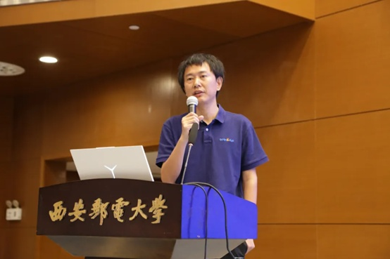
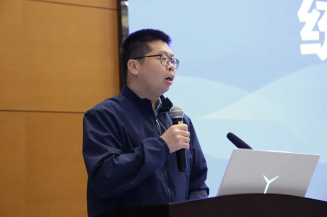
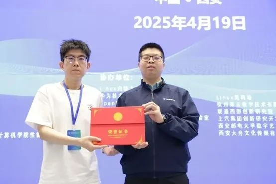
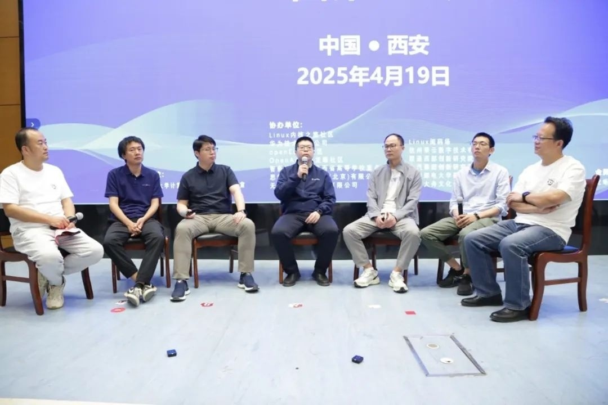

2025年4月19日，第三届eBPF开发者大会在西安邮电大学举办。大会以"eBPF深度赋能，引领系统性能与安全新时代"为主题，通过主论坛和四个分论坛的形式，呈现30余场高质量的报告，来自华为、阿里、上海交通大学、麒麟软件、荣耀等知名企业和高校的技术领袖齐聚，围绕eBPF在可观测性、网络优化、安全增强等前沿领域展开深度探讨，线上线下参会规模近万人次。

作为本次大会的重要参与方，OpenAtom
openEuler（简称 openEuler）社区多名技术专家在现场进行了专题分享和交流。其中，openEuler
TC 委员会委员唐葛亮老师带来了题为《BPF on
MPTCP》的主题演讲，深入探讨BPF技术在多路径传输控制协议中的创新应用与实践经验。openEuler
Valuable
Professional任玉鑫博士带来了题为《基于 eBPF 的全系统 PGO 优化方案》的主题演讲，其分享的相关成果已入选**CCF
A类存储顶会FAST\'25。**

图为：openEuler TC
委员会委员唐葛亮老师

图为：openEuler Valuable
Professional任玉鑫博士

**主题介绍：基于eBPF的全系统PGO优化方案**

由任玉鑫博士分享的《**基于eBPF的全系统PGO优化方案**》，深入探讨了eBPF技术如何推动操作系统优化的两个理念革新：**从行为观测向数据分析转变**，**从短接下沉向指导重构转变**，并基于该理念介绍了**在系统PGO（Profile-Guided
Optimization）优化**的研究实践。

**PGO**通过采集分析应用运行时行为特性指导编译优化，虽然显著提升应用性能，却因缺乏系统级跨层交互（如系统调用、IO行为），难以优化整体系统性能。本报告介绍了一种全系统PGO优化方案，利用eBPF技术突破这一瓶颈：

1）**全局采样，精准感知：**突破传统PGO的应用内采样局限，利用eBPF低开销（\<2%
CPU）精准捕获分析应用与系统交互特点；

2）**系统反馈优化：**基于eBPF捕获的交互特征，动态指导操作系统能力优化，实现性能提升

实践部署表明，该方案在容器I/O栈优化中成效显著：

**容器启动时延降低4.6倍**

 

**机器学习训练性能提升1.7倍**

相关成果已入选**CCF
A类存储顶会FAST\'25**，为系统级性能优化提供了新方法。

https://www.usenix.org/conference/fast25/presentation/liu-yubo

**圆桌讨论：eBPF的技术进展及发展趋势**

在圆桌讨论环节，openEuler TC 委员会委员唐葛亮老师、openEuler Valuable
Professional任玉鑫博士与阅码场社区负责人张国强、西安邮电大学舒新峰教授、阿里云毛文安老师等嘉宾齐聚一堂，结合各自丰富的实践经验与技术积累，从多个维度为 eBPF 爱好者系统解读了可观测性技术的发展方向与 eBPF 在实际场景中的应用示范。在讨论过程中，
专家们认为eBPF最大的优势在于打破应用与操作系统的信息边界，使能全系统垂直整合。同时，操作系统社区需更进一步开放协作，从应用视角优化改进操作系统的架构设计。这与openEuler一直秉承的开发包容、协同创新的发展路径高度契合。

 

**未来展望：eBPF技术是操作系统的必要能力，未来将呈现更加多样性的演进**

未来，操作系统会将在架构、形态、设计等多个维度呈现多样性、异构性的发展趋势，形成多代际、多配置、多架构的异构操作系统协调共存的新业态。而eBPF凭借其可编程性、可验证性，仍是异构操作系统生态中必不可少的核心能力。尽管可能在不同的操作系统中以不同的方式实现，但其技术本质是相通的。

欢迎对感兴趣的朋友加入社区，与我们一起交流。

欢迎扫码加小助手好友，备注"eBPF"可进入专属技术交流群。

欢迎搜索链接，查看第三届eBPF开发者大会整体回顾:：

https://mp.weixin.qq.com/s/d3-rqC1tqj4MwfcnIN1Ftw
