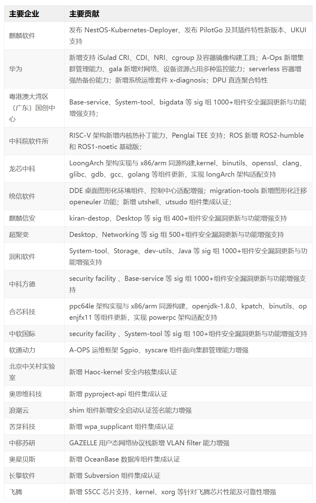

经过两年的准备，三个创新版本的积累，凝聚全球创新开发力量的 openEuler
24.03 LTS
正式发布。**在整个开发过程中，国内外十多家芯片厂商，二十多家操作系统厂商，一百多家行业头部软件供应商启动原生开发，两年内共有
5136
名社区开发者参与到了版本的开发工作中**。作为里程碑式的版本，openEuler
社区也和行业内的其它社区一起定义了内核等组件的版本基线。汇聚了产业链上下游软硬件厂商技术共识的
openEuler 24.03 LTS 版本将成为未来几年中国 IT
基础设施的坚实基础，同时也会对全球操作系统生态产生深远影响。

openEuler 24.03 LTS 的 4 个版本上线社区官网的同时，全球 37
个镜像站同步更新，全球云平台同步上线，12 个 OSV
的商业发行版和企业自用版也将陆续上线。openEuler 24.03 LTS
在发布伊始就得到了产业界的大力支持和积极反响。

openEuler 社区通过汇聚产业的创新力量，集合众多开发者的智慧，实现了
openEuler 24.03 LTS 版本四大技术升级，成为首个 AI 原生的开源操作系统。

## 智能解决方案升级

openEuler 24.03 LTS 实现了对 AI 的原生支持，并提出了 AI for OS 和 OS for
AI 的全新操作系统设计理念。

AI for OS 是使用 AI
技术改造操作系统，彻底改变操作系统的交互方式和运行模式，使其变得更智能。openEuler
24.03 LTS 推出大模型自然语言的智能交互平台，
用户可以使用自然语言与操作系统进行交互，通过 agent
机制对接到不同的应用系统上，从而实现智能
shell，操作系统知识问答，智能诊断和调优等 AI
加持的系统能力。主要特性如下：

-   **智能 shell**：AI 加持的全新 shell
    命令行，支持自然语言输入和意图理解，自动完成问答，操作任务执行，shell
    脚本生成等功能。彻底改变 Shell 的历史面貌。

-   **智能问答**：支持使用者使用自然语言进行 linux
    通用基础知识问答、openEuler 技术知识问答、openEuler 上下游兼容性问答
    、openEuler 技术应用案例、shell
    命令智能查询和脚本智能生成等服务，在这些领域知识问答准确率可以达到
    90%以上。

-   **智能诊断&调优**：支持使用自然语言进行运维、调优等工作，通过该交互平台的
    agent 对接 A-Ops 和 A-tune
    等系统，实现运维调优智能化升级，实现自然语言进行健康状态巡检报告、定界报告、调优报告、调优建议生成。

openEuler 将围绕该交互平台打造完整的智能化平台体系，逐步增加 agent
的规模，对接更多的系统，实现操作系统的全面智能化改造。

对于 OS for AI，openEuler 24.03 LTS 全面支持各种 AI 平台，实现 AI
软件栈全栈兼容，开箱即用：

-   **AI 软件全栈兼容**：支持 CUDA、CANN、oneAPI、OpenVINO 等 AI
    平台框架，支持 PyTorch、TensorFlow 等训推框架，支持
    Numpy、XGBoost、Faiss 等搜推框架。构建完整的 AI 开发者生态。

-   **开箱即用**：对于 chatglm/llama2
    等模型，PyTorch、TensorFlow 等训推环境进行容器化封装，便于自然语言大模型推理环境及模型开发环境搭建，便于开发和部署，大幅降低开发和部署成本。

在 openEuler 24.03 LTS 的后续迭代版本中，openEuler
将在异构内存融合，异构计算框架等领域持续发布新技术和新平台，让操作系统加速
AI 时代的更快到来。

## 内核全新升级

openEuler 24.03 LTS 的内核基于 Linux 6.6
内核版本持续创新，并不断向上游社区贡献特性，社区开发者在内核社区的贡献始终名列前茅，这些贡献涵盖了调度器、内存管理、文件系统、安全等核心子系统，关键特性包括：

-   **Cluster 调度域**：目前多种主流处理器硬件均已经支持 Cluster
    架构，操作系统内核支持 Cluster
    调度域能提升这类处理器的调度效率，进而提升整体性能。

-   **Dynamic software I/O TLB**：该特性可根据需要动态调整 I/O TLB
    大小，提升嵌入式/终端等场景的访存效率。

-   **KSM 故障页恢复**：支持 KSM(Kernel Shared
    Memory)故障页的自动恢复，延长系统可用时间，提升系统可用性。

-   **文件系统性能和可靠性提升**：

    -   IO 调度器 bfq 支持多并发，IO 性能倍增。

    -   IO(buffer/direct)并发能力提升，全闪存类高速存储设备在大压力场景下性能提升
        20%以上。

    -   文件系统可靠性增强：引入 ubi
        故障注入框架，提升故障场景测试覆盖率；支持 ubi
        磨损均衡，提升闪存存储器件寿命 2\~10 倍；支持 ext4
        日志循环，提升文件系统损坏故障定位效率。

-   **安全加固**：针对内存分配，进行了堆混淆加固方案，防护堆喷漏洞攻击。

openEuler 24.03 LTS 在上游 6.6
内核的基础上开发了很多创新特性，社区会依照 Upstream First
原则，逐步将这些创新特性贡献上游社区。目前 openEuler
内核中的创新特性包括：

-   **内存动态复合页**：兼容 4K
    页生态的同时具备大页的高性能。如匿名页、文件页可自适应选择页面大小，提升访存性能；ext4
    等文件系统支持 large folio，批量化预留、映射文件块，大 IO
    写场景性能最大提升 2
    倍；提供系统/容器/进程级别控制接口，业务可灵活按需使用。

-   **负载算力协同**：支持轻量级的任务搜索算法，实现多核间快速负载均衡，最大化
    CPU
    资源利用率；支持按优先级对业务进行分级管控，保障关键任务的算力供给。

-   **混部多优先级**：允许 cgroup 支持多个优先级，按照 CPU
    的使用比例进行资源的划分，并提供唤醒抢占能力从而支持容器 QoS
    细粒度隔离，降低业务间干扰，提升不同类型业务的混部能力。

-   **潮汐调度：**

    -   CPU 潮汐：内核提供标准化接口，使能容器 CPU 资源弹性扩缩容。

    -   内存潮汐：通过内核标准化的实现，使能业务容器数据（JAVA
        堆内存），在存储和内存间快速交换，业务不感知。

    -   ARM64 vCPU
        热插拔：动态调整虚拟机的计算能力，提供安全可靠的虚拟机动态扩容。

## 全场景体验升级

openEuler
是面向数字基础设施的全场景开源操作系统，支持服务器、云计算、边缘、嵌入式四大场景，持续致力于场景协同创新，消除操作系统生态割裂带来的软烟囱。

在服务器和云原生场景：

-   持续支持 ARM、x86、RISC-V、LoongArch 、PowerPC、SW-64 等体系架构。

-   openEuler
    内核支持广泛的硬件类型，包含国内外主流的硬件支持，也支持云芯智联、北中网芯、沐创、云脉芯联等新锐硬件公司的产品。

-   首次全面支持 Intel 下一代 Xeon 6 两个系列的处理器，包括基于 E-core
    能效核的 Sierra Forest 系列和基于 P-Core 性能核的 Granite Rapids
    系列。

-   集成了 Intel AMX FP16 数据类型支持、新的 AVX 系列加速指令集、DSA 和
    IAA 加速器 2.0 的增强特性以及新的电源管理框架 TPMI、Intel PMU 及
    PEBS 增强、Intel RDT、RAS 等众多硬件特性。

-   GCC 编译器版本升级到 12.3，LLVM 编译器版本升级到 17，毕昇 JDK
    新增支持了 JDK21，带来了更多特性和更新的硬件支持。

-   LLVM 平行宇宙计划持续推进，Compiler SIG 协同 RISC-V SIG
    发布了使用 LLVM 构建的 openEuler 24.03 preview 镜像，协同 Embedded
    SIG 发布了使用 LLVM  构建的QEMU 和树莓派镜像，openEuler+LLVM
    将获得更多的创新潜能。

-   oeAware 实现微架构信息采集，性能动态优化，在 ARM+Redis 中性能提升
    70%。

-   Gazelle 支持 UDP 协议栈，相比内核态协议栈性能提升 50%。

-   新增 eBPF
    全栈可观测能力：应用级全栈观测能力，提供应用协议性能、网络、I/O、CPU、MEM
    观测能力，底噪单核 CPU\<5%。

-   负载算力协同，ARM 云桌面虚机密度提升 15%-20%。

-   基于内核态的内存潮汐调度方案，使能在线业务启动时间降低 80%。

-   iSulad 支持 CRI v1.29、CDI、NRI 和 cgroup v2。

-   NestOS 发布 NestOS-Kubernetes-Deployer 部署运维工具。

-   支持 OpenStack Wallaby、Antelope 多版本。

在边缘和嵌入式场景，openEuler 24.03 LTS Embedded
构建了完整的综合系统软件平台：

-   支持 5.10 和 6.6 双内核，嵌入式弹性底座 Jailhouse、openAMP
    裸金属混合等部署方案。在嵌入式弹性底座之上打造了混合关键性部署框架
    MICA，对下屏蔽不同底座的差异，对上为不同运行时提供统一的接口。

-   openEuler 24.03 LTS 嵌入式版本已经支持 600+软件包，包括支持 ROS
    humble 版本，满足 ROS2 运行时要求；支持 BMC 生态，包括 openBMC 等。

-   硬件支持上新增飞腾、海思、瑞萨、德州仪器、全志等硬件的支持，提出了面向开发者的硬件开发板概念"Euler
    Pi"，并联合伙伴推出了一款 openEuler Embedded 原生开发板"HiEuler
    Pi"原型机系统。

-   基础设施层面，正式发布 openEuler Embedded 元工具 oebuild,新增支持
    LLVM 工具链构建 BSP 镜像，相对 GCC
    工具链，可以获得在性能、体积、安全性等诸多方面的改进。

## 基础设施升级

软件中心通过聚合 openEuler
软件生态，提供可获得、可信赖、可推荐的软件获取平台。面向用户，软件中心提供高效的信息检索，领域优选软件推荐能力。提供多种形式二进制和使用指导，基于场景和领域提供开箱即用的软件解决方案，帮助用户快速上手；面向开发者，软件中心可以动态感知对上游软件变化，通过自动化构建与测试，根据适配质量推送软件到对应仓库进行自动升级，实现分级自动引入
openEuler 生态。

openEuler
社区致力于助力企业简单、平稳、高效进行操作系统迁移。迁移工具在已经支持从
CentOS 6/7/8 迁移到 openEuler 的基础上。在 openEuler 24.03 LTS
版本上又有了新的增强。

-   新增从 Ubuntu 迁移到 openEuler 的能力，单物理机升级小于 1 小时。

-   首次具备 Windows 业务迁移能力，新增 Windows server IIS 应用迁移到
    openEuler 能力。助力行业平台迁移转换。

openEuler 24.03 LTS 中全场景统一构建平台 EulerMaker 进一步增强，
面向社区开发者开放，开发者可以按需定制各种系统镜像：

-   openEuler 24.03 LTS 所有镜像均基于 EulerMaker 构建，并提供对 ARM,
    X86, RISC-V、LoongArch、PowerPC 架构体系的支持。

-   除了云化服务部署以外，EulerMaker
    同时提供企业私有化部署能力，为企业提供全方位解决方案。

## 打造健康可持续发展的开源操作系统社区

openEuler
社区持续构建操作系统安全能力，基于社区可信根打造稳固的可信链，持续增强操作系统安全能力，在
openEuler 24.03 LTS 版本中，进一步增强了安全能力。

-   **建立以 PKI
    为基础的软件构建签名体系，支持"开箱即用"的安全启动能力**，在软件构建阶段，自动为目标文件添加数字签名，并在关键组件中预置公钥证书，在用户安装
    openEuler 镜像后，可直接开启相关签名校验机制，提升系统安全性。

-   **新增支持 CFCA 安全启动配置**，是首个支持国内 CA
    签名的操作系统安全启动；

-   **新增 openEuler Signatrust
    组件**，针对操作系统签名场景推出高效、便捷、安全的签名服务，可支持
    openPGP 及 X509 体系的密钥管理，同时对接了 EFI、RPM、KO、ISO
    等多种目标文件格式，支持大批量的软件包签名，提升社区密钥管理及软件包签名效率。

openEuler 在社区可持续发展上持续投入，openEuler 24.03 LTS
在供应链安全和可信方面又取得了长足的进展。

-   **全球首个通过 OpenChain ISO 18974
    供应链安全自认证的开源社区**，该标准旨在确保开源软件的供应链安全，构建安全可信的开源软件解决方案，openEuler
    24.03 LTS 的开发完全遵循 ISO
    标准，进一步增强了操作系统的安全合规能力。

-   基于 Linux 基金会 SPDX 2.2 SBOM 标准，openEuler 24.03 LTS 发布了
    SBOM 清单，是**业界首批发布 SBOM
    清单的操作系统平台**。后续会持续更新，确保供应链的完整性和可追溯性。

## 感谢

openEuler 24.03 LTS
的顺利发布离不开社区成员的共同努力。特别感谢麒麟软件、华为、粤港澳大湾区（广东）国创中心、中科院软件所、龙芯中科、统信软件、麒麟信安、超聚变、润和软件、中科方德、合芯科技、中软国际、软通动力、北京中关村实验室、奥思维科技、浪潮云、苦芽科技、中移云能、奥星贝斯、长擎软件、飞腾等公司和科研院所对
openEuler 24.03 LTS 的贡献。

