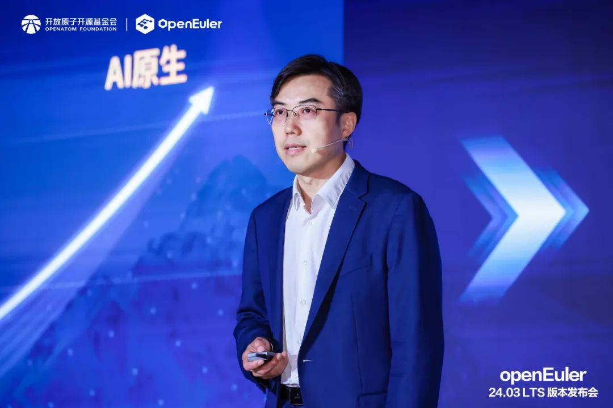

\[中国，北京，2024年6月6日\]由OpenAtom
openEuler（简称\"openEuler\"）社区 主办的openEuler 24.03
LTS版本发布会（以下简称"发布会"）在北京成功举办。本次发布会汇聚操作系统产业界顶尖力量，共探openEuler社区技术、生态、国际化发展，共建健康可持续发展的开源操作系统根社区。**会上，openEuler首个AI原生开源操作系统，openEuler
24.03 LTS版本正式发布。**

开放原子开源基金会理事长程晓明在致辞中表示，openEuler的快速发展证明，充分利用开源、参与开源、支持开源、回馈开源，是实现操作系统技术创新和产业繁荣的有效路径。未来，开放原子开源基金会将引导openEuler等开源项目与区域产业优势结合，实现产业合作落地；同时探索在海外的发展机遇，助力openEuler走向全球。

开放原子开源基金会理事长程晓明

openEuler社区开源四年，发展迅速，迈出了坚实的步伐，至今已吸引1577家企业成员，18800多名开发者加入贡献，下载量遍布全球153个国家的2037个城市，累计装机量超过680万套，据IDC调研报告显示，openEuler
系操作系统在 2023年新增服务器操作系统中市场份额已经达到
36.8%。技术方面，openEuler
创新项目代码仓已经达到552个，平均每个月产生10个创新项目。生态方面，openEuler社区充分发挥协同创新的优势，来自企业和高校的30多个项目贡献到社区孵化，激发了全产业链创新的活力。

openEuler
委员会主席江大勇表示，openEuler社区每两年发布一个长周期版本，每半年发布一个创新版本，通过创新版不断孵化和验证新的项目、新的特性，让openEuler成为一个稳定、安全并充满活力的开源操作系统社区。开源4年，openEuler技术委员会共召开了超过100次决策会议，107个SIG组共召开了2181次技术讨论会，完成17万次代码合入请求，openEuler社区共举办8次技术大会、自发举办近百场Meetup。在openEuler
24.03 LTS
版本的开发过程中，国内外十多家芯片厂商，二十多家操作系统厂商，一百多家行业头部软件供应商启动原生开发，两年内共有5136
名社区开发者参与到了版本的开发工作中。

openEuler委员会主席江大勇

**openEuler 24.03 LTS：\
四大升级， AI原生开源操作系统正式发布**

智能时代，AI无处不在，以大模型为代表的人工智能技术是当前技术发展的重要方向。openEuler积极拥抱智能时代，和AI深度结合，引领智能化创新，让操作系统使能AI更高效，AI使能操作系统更智能。

本次发布会上，开放原子开源基金会和中国科学院软件研究所、麒麟软件、麒麟信安、统信软件、中移云能、天翼云、联通数科、华为、英特尔（中国）、超聚变、软通动力、润和软件、龙芯中科、粤港澳大湾区国创中心、AMD、新华三、飞腾信息、浙江大华、联想、华鲲振宇、中关村实验室与中科院计算所、京东科技、中软国际、凝思软件、中科方德、Linaro等26位社区伙伴代表共同见证了openEuler首个AI原生开源操作系统------openEuler
24.03 LTS 的发布。

openEuler 24.03 LTS版本发布仪式

该版本在基础设施、Linux6.6内核、智能解决方案以及全场景体验四大方面实现了全面升级，为开发者和用户带来了高性能、高可靠、高灵活的开发体验。

会上，openEuler社区技术委员会主席胡欣蔚对新版本的四大升级进行了全面解读。

openEuler社区技术委员会主席胡欣蔚

在基础设施方面，首次发布了openEuler软件中心，帮助用户快速掌握openEuler社区各领域丰富的软件生态；帮助开发者实时监控上游软件的更新情况，保持特性与上游实时一致。

内核方面，升级到了Linux
6.6版本，CPU调度更均衡、内存管理更高效，虚拟机场景资源利用更灵活。同时，参与贡献了动态复合页等关键能力，写性能得到两倍提升。

智能解决方案方面，2023年操作系统大会上，openEuler基础AI能力发布，在本次发布的24.03
LTS版本中，openEuler正式升级智能解决方案，通过大模型自然语言交互平台接入oeAware、A-ops、A-Tune实现智能调度、智能运维、智能调优。同时，openEuler更广泛地支持了南向硬件，并覆盖了主流的大模型、框架以及工具链，使能全栈AI，支持Faiss、DCN等推理和检索算法，兼容OpenViNO、Pytorch等主流AI框架，使能Numpy、ACL等基础算法库。

全场景体验方面，openEuler持续从服务器、云、边缘到嵌入式夯实全场景能力。在服务器场景中，sysSentry可以将已知的CPU故障100%检出使系统更可靠；在云场景中，内存潮汐调度实现容器速度提升80%。

目前，openEuler 24.03 LTS 版本的ARM 、 x86 、 RISC-V 、 LoongArch
四个架构镜像在社区官网、全球37个镜像点及主流云厂商分发渠道同步上线。同时，麒麟软件、统信软件、麒麟信安、移动苏研、电信天翼云、联通数科、软通动力、润和软件、凝思、超聚变、中科方德、中软国际等共12家伙伴的商业发行版将陆续发布。

**汇聚产业力量，\
共探openEuler繁荣之路**

openEuler社区自成立以来，一直致力于打造一个健康、可持续发展的操作系统根社区。

安全方面，openEuler注重社区安全合规和供应链信息披露的能力，同时致力于构建一套全面的安全治理框架。目前，openEuler已通过由OpenChain发起的ISO
18974开源软件供应链安全标准（简称"ISO 18974"）的自认证，成为首个通过ISO
18974自认证的开源社区，这表明openEuler在开发流程、软件供应链、风险评估和管理、开发者安全能力等维度达到了国际领先水平。

可持续发展方面，openEuler社区自2022年12月成立openEuler项目群以来，实现了从贡献openEuler到向openEuler贡献的蜕变，在社区孵化的500多个创新项目里，有15家企业、高校和组织贡献的30多个项目。这些项目不仅丰富了openEuler的技术生态，也推动了openEuler社区的创新和发展。

会上，来自华为、中科院软件所、麒麟信安、麒麟软件、统信软件的5位重磅嘉宾以"汇聚产业力量，共建操作系统根社区"为主题开展圆桌论坛。嘉宾们从构筑核心竞争力、推进全球化进展、加速商业成功和行业落地、人才培养及社区健康运营等角度出发，共探openEuler根社区持续繁荣之路。

汇聚产业力量，共建操作系统根社区圆桌论坛

操作系统的成功，离不开南北向软硬件厂商的广泛支持，openEuler一直致力于打造面向全场景、多样性算力的操作系统，在驱动支持、多样性资源社区接入、构建系统等多方面不断优化。发布会现场，来自京东、中国移动、天翼云、联通数科、AMD、飞腾软件、龙芯中科、华为、英特尔、中科院软件所、龙芯中科、润和软件、超聚变、软通动力、OpenInfra
基金会的15位社区伙伴及专家，围绕"从通用算力多样化到智能算力多样化，使能智能时代全场景应用"展开讨论，为openEuler技术发展及全球开源生态的打造提供方向及建议。

从通用算力多样化到智能算力多样化，使能智能时代全场景应用圆桌论坛

智启新程，奔赴山海。未来，openEuler将持续携手全球伙伴、用户和开发者，将openEuler打造成国际化的开源协作平台，在中国汇聚全球开源力量，为世界开源贡献中国智慧。
