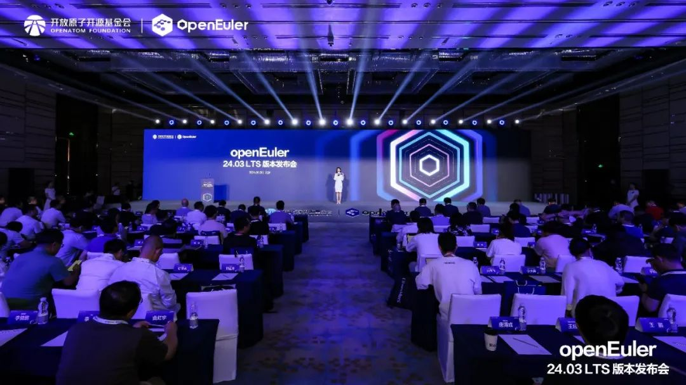
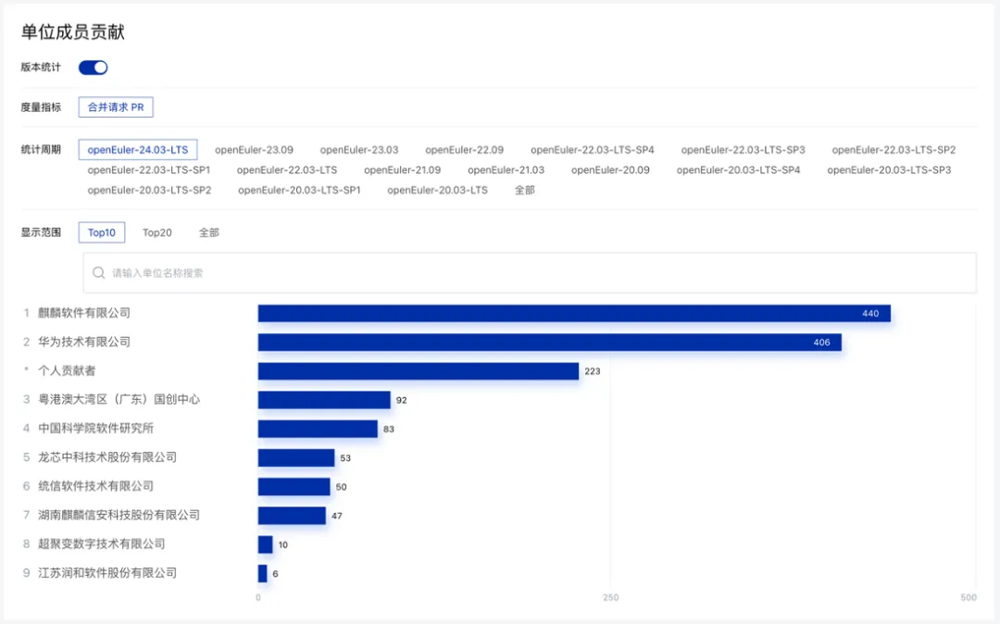

6月6日，openEuler首个AI原生开源操作系统openEuler 24.03
LTS版本发布会在京举行，麒麟软件作为openEuler社区白金捐赠人、常务委员会单位以及开放原子开源基金会理事单位，受邀出席发布会并见证发布。**麒麟软件全程参与了该版本的技术选型、特性回合和问题修复等，并以440个PR成为贡献PR数目最多的单位成员。**

数据来自社区官方统计（截至2024年6月3日）

**openEuler 24.03 LTS版本在基础设施、Linux6.6内核、智能解决方案以及全场景体验四大方面实现了全面升级**，为开发者和用户带来了高性能、高可靠、高灵活的开发体验。目前，openEuler
24.03 LTS
版本的ARM、x86、RISC-V、LoongArch四个架构镜像在社区官网、全球37个镜像点及主流云厂商分发渠道同步上线。

作为openEuler社区发起者之一，麒麟软件持续积极投入社区版本的研发。**麒麟软件参与openEuler
24.03 LTS社区版本开发共67人，修复CVE 60+、修复软件bug
200+，升级软件包60+，同时还包含大量软件包特性增强及架构适配等。**在openEuler
24.03
LTS社区版本当中，除了原有HA、UKUI、NestOS、PilotGo运维生态等版本特性的继承和升级外，麒麟软件还带来了全新生态特性。

**NKD**：NKD是NestOS团队面向容器云场景开发的集群部署运维工具，涵盖了基础设施和Kubernetes核心组件的部署、更新和配置管理等一系列功能。新版本新增支持容器运行时自定义（crio、isulad、docker等）、多种平台部署及集群自签名证书创建，支持多版本K8s部署API，覆盖了实际使用中可能涉及的大部分场景。

**PilotGo新插件**：PilotGo运维平台生态除了继承已有prometheus插件、grafana插件之外，还带来了Topo插件、A-tune插件两个新插件。Topo插件可以以自定义拓扑图的方式对业务集群进行可视化，同时辅以组件信息及状态展示、指标展示等功能，方便用户对业务集群进行直观把控；A-tune插件封装社区a-tune智能调优工具，提供了一键式的业务服务调优和任务管理，并对结果进行可视化展示，方便a-tune智能调优软件的使用和落地。

**UKUI**：除了集成已有的控制面板、任务栏、文件管理器等重要组件外，同时修复天气日期显示错误的问题以及部分CPU信息无法显示问题，优化麒麟影音的界面展示信息，提高UKUI组件的稳定性，提升用户的使用体验。

openEuler社区开源四年，发展迅速，迈出了坚实的步伐。openEuler
委员会主席江大勇表示，openEuler社区每两年发布一个长周期版本，每半年发布一个创新版本，通过创新版不断孵化和验证新的项目、新的特性，让openEuler成为一个稳定、安全并充满活力的开源操作系统社区。

麒麟软件为openEuler社区注入创新动力，推动社区快速成长。**目前，在社区签署CLA已达到311人，发起成立了6个SIG组，在社区中拥有37个Maintainer席位、41个Committer席位，累计提交14200多个PR、4600多个ISSUE，重点维护和贡献openEuler社区软件包数1700多个。**贡献领域涉及内核、安全、AI、智能运维、云原生、虚拟化、桌面、合规、分布式存储、数据库、大数据和高可用等。

此外，麒麟软件在openEuler项目群主导开源孵化项目NestOS Kubernetes
Deployer（简称NKD），坚持标准先行，上游优先，在不断完善功能特性，正式引入openEuler版本的同时，也于今年4月通过CNCF
K8s一致性认证，并加入CNCF Landscape。

开放原子开源基金会理事长程晓明表示，**openEuler的快速发展证明，充分利用开源、参与开源、支持开源、回馈开源，是实现操作系统技术创新和产业繁荣的有效路径**。未来，开放原子开源基金会将引导
openEuler
等开源项目与区域产业优势结合，实现产业合作落地；同时探索在海外的发展机遇，助力基金会孵化项目走向全球。

发布会上，麒麟软件副总经理李震宁参与以"汇聚产业力量，共建操作系统根社区"为主题的圆桌论坛。他提到，openEuler的成长，一方面离不开向国际先进的开源社区学习经验，一方面源于商业合作和用户的信任和支持，通过适配和行业应用不断推动商业发行版能力提升。期待更多来自全球开发者、个人、商业伙伴、客户加入，一起推动openEuler的成长和壮大。

智启新程，奔赴山海。开源已成为技术应用和行业数字化发展的基石。作为中国操作系统核心力量，麒麟软件将持续携手全球伙伴、用户和开发者，积极贡献开放原子开源基金会，助力将openEuler打造成国际化的开源协作平台，在中国汇聚全球开源力量，为世界开源贡献中国智慧。
