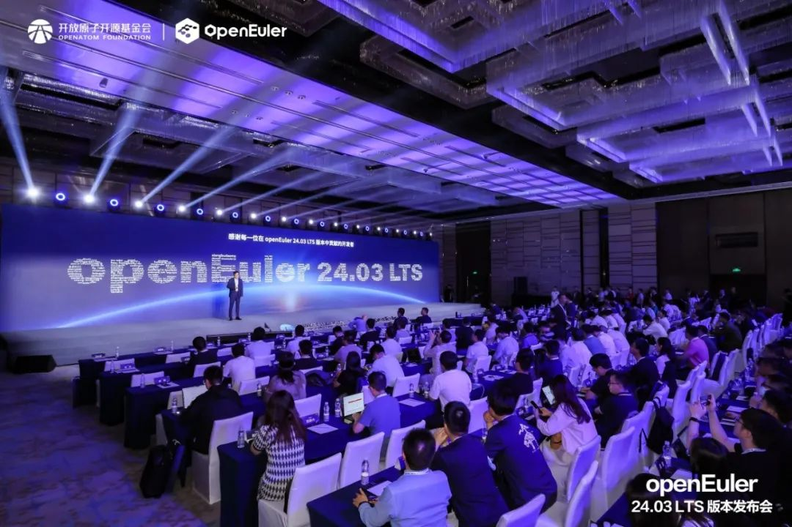
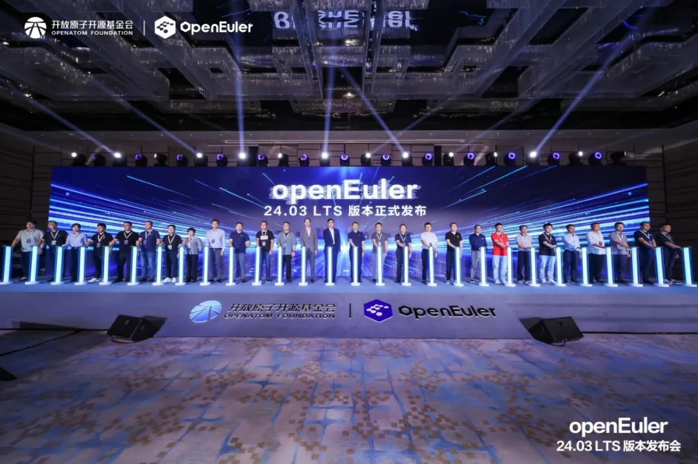
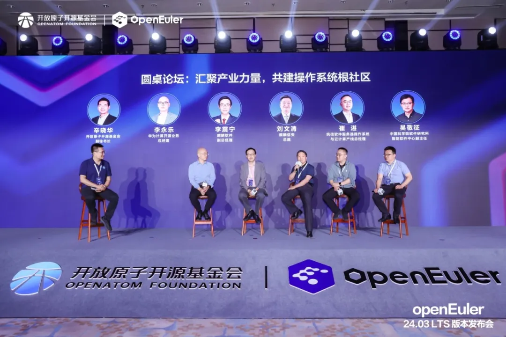

\[中国，北京，2024年6月6日\]由OpenAtom
openEuler（简称\"openEuler\"）社区主办的**openEuler 24.03
LTS版本发布会（以下简称"发布会"）在北京成功举办。**本次发布会汇聚操作系统产业界顶尖力量，共探openEuler社区技术、生态、国际化发展，共建健康可持续发展的开源操作系统根社区**。会上，开放原子开源基金会和麒麟信安及社区伙伴代表共同发布openEuler首个AI原生开源操作系统------openEuler 24.03
LTS，麒麟信安同步推出服务器操作系统V3.6.1，共启繁荣发展新篇章。**

openEuler社区开源四年，发展迅速，迈出了坚实的步伐，至今已吸引1577家企业成员，18800多名开发者加入贡献，下载量遍布全球153个国家的2037个城市，累计装机量超过680万套，据IDC调研报告显示，openEuler
系操作系统在
2023年新增服务器操作系统中市场份额已经达到36.8%。在技术上，openEuler
创新项目代码仓已经达到552
个，平均每个月产生10个创新项目。生态方面，openEuler社区充分发挥协同创新的优势，来自企业和高校的30多个项目贡献到社区孵化，激发了全产业链创新的活力。

**openEuler 24.03 LTS 正式发布**

**麒麟信安服务器操作系统V3.6.1同步推出**

智能时代，AI无处不在，以大模型为代表的人工智能技术是当前技术发展的重要方向。openEuler积极拥抱智能时代，和AI深度结合，引领智能化创新，让操作系统使能AI更高效，AI使能操作系统更智能。

**本次发布会上，开放原子开源基金会和麒麟信安及社区伙伴代表共同发布openEuler首个AI原生开源操作系统------openEuler
24.03
LTS，麒麟信安总裁、openEuler常务委员会委员刘文清受邀出席发布仪式。**

该版本在基础设施、Linux6.6内核、智能解决方案以及全场景体验四大方面实现了全面升级，为开发者和用户带来了高性能、高可靠、高灵活的开发体验。会上，openEuler社区技术委员会主席胡欣蔚对新版本的四大升级进行了全面解读。

**历经一年的研发创新，麒麟信安全新企业级Linux操作系统产品------基于openEuler
24.03
LTS的麒麟信安服务器操作系统V3.6.1同步推出。在此前版本之上，V3.6.1版本从安全、网络、生态、运维、性能与OS
for AI六大维度全面革新，为用户带来前所未有的计算体验。**

基于openEuler 24.03 LTS的麒麟信安服务器操作系统V3.6.1

**汇聚产业力量，共探openEuler繁荣之路**

**麒麟信安共建操作系统根社区**

**会上，麒麟信安与华为等伙伴以"汇聚产业力量，共建操作系统根社区"为主题开展圆桌论坛，**从构筑核心竞争力、推进全球化进展、加速商业成功和行业落地、人才培养及社区健康运营等角度出发，共探openEuler根社区持续繁荣之路。

刘文清总裁表示，**麒麟信安是openEuler技术路线的坚定支持者和践行者，麒麟信安操作系统商业发行版本跟随openEuler社区同步发展演进**。公司基于openEuler
24.03 LTS发布商业发行版，在自身优势行业进行应用验证，并牵头组建了湖南
openEuler 生态创新中心，积极开展基于 openEuler
社区的技术联创、适配迁移、产业拓展、行业创新、人才培养等工作，打造中部地区
openEuler
生态创新发展的集聚高地，大力推动基于操作系统根社区的"统一生态"建设和推广。

智启新程，奔赴山海。未来，麒麟信安将携手openEuler及全球伙伴、用户和开发者，共同将openEuler打造成国际化的开源协作平台，在中国汇聚全球开源力量，为世界开源贡献中国智慧。
