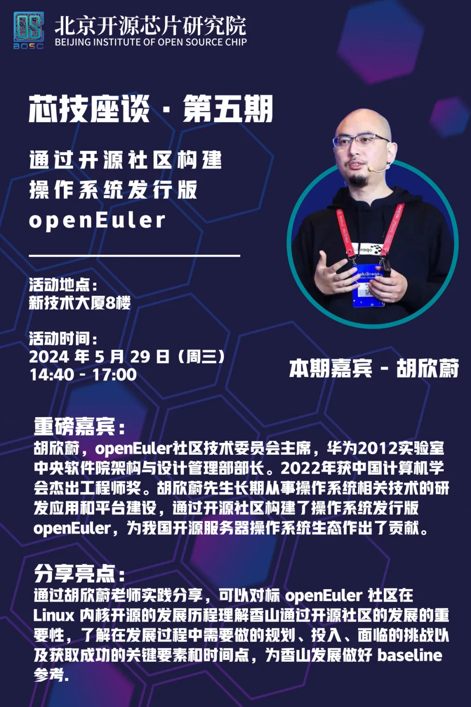
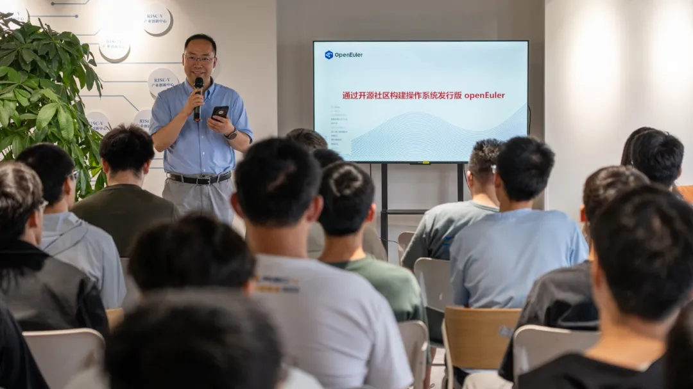
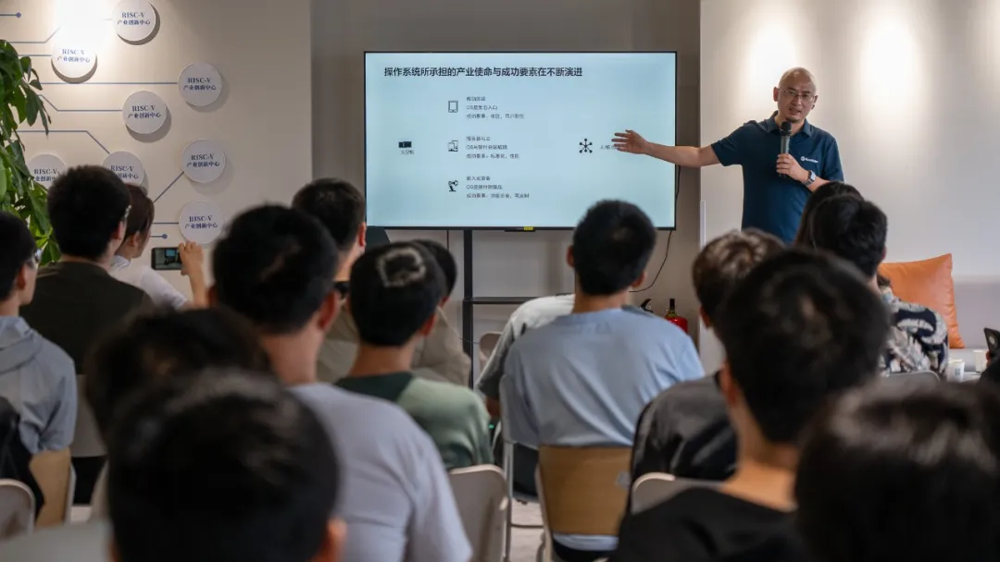
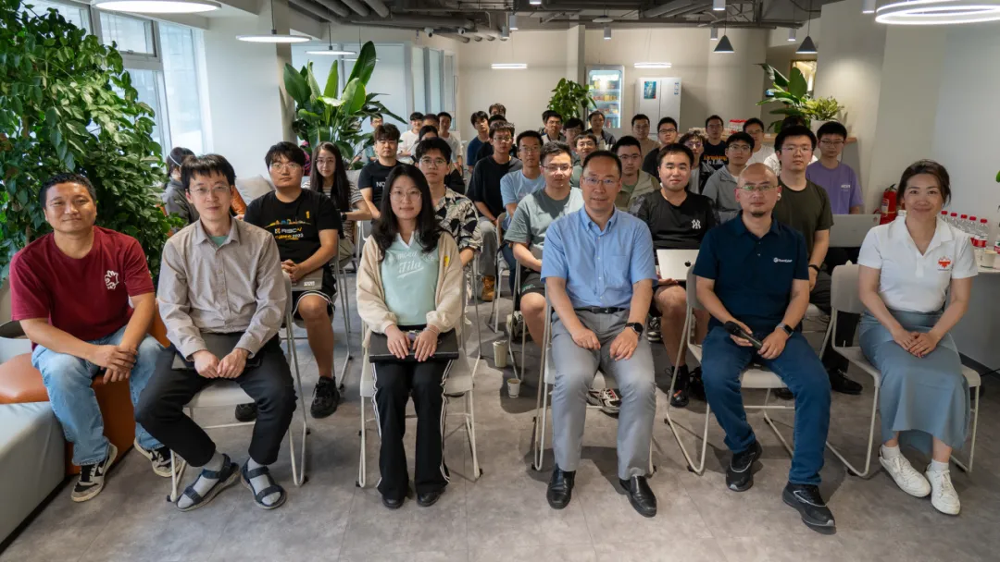

2024 年 5 月 29 日，openEuler
社区技术委员会主席**胡欣蔚**到访北京开源芯片研究院（以下简称开芯院）并带来开源主题分享。

开芯院首席科学家**包云岗**作为主持人向胡欣蔚表达了热烈的欢迎。

胡欣蔚老师带来了《通过开源社区构建操作系统发行版
openEuler》的分享，从实践角度分享了 openEuler
开源操作系统在发展中的规划与投入，识别发展中的关键"细腰"环节，强调了软件生态对于推动硬件使用场景和推动技术创新的重要性。此外，还在现场共同探讨了云技术和算力释放的重要性，以及如何通过社区合作和技术创新来促进软件生态的健康发展。

分享结束后，胡欣蔚老师与来自开芯院的硕士、博士同学进行了互动问答，详细讨论了社区发展所需关注点，例如社区发展重点关注内部提高效率和解决问题系统改进，注重合作的重要性关注社区成员们提出的想法与解决方案来使用特定的技术栈、优化数据库查询以及增强用户体验。此外，还分享了发展面临的挑战包括确保系统的稳定性和安全性以及同时保持增长的关系。

