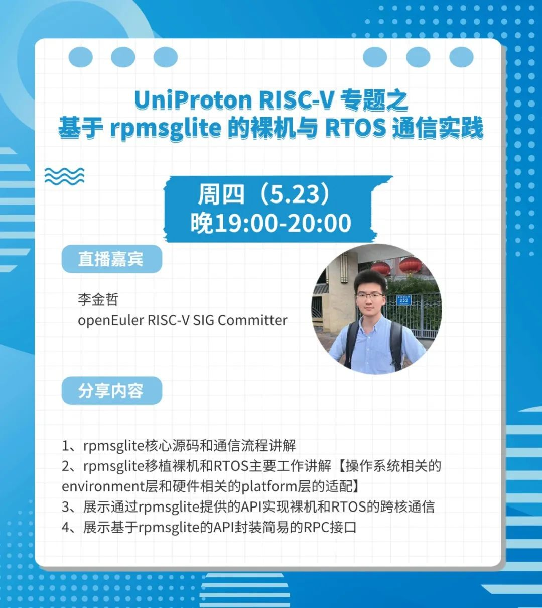

RISC-V
作为一款通用处理器指令集架构（ISA），具有开源、精简、可扩展能力强、设计协同性能优越等技术优势。OpenAtom
openEuler（简称\"openEuler\"） 已实现了对于 RISC-V 架构的支持，并于 2019
年成立 RISC-V SIG，致力于为 openEuler 构建面向 RISC-V 架构操作系统、丰富
RISC-V 软件生态。\
RISC-V，开源指令集架构，日益流行。为此，openEuler
推出了RISC-V系列线上直播栏目，本直播将解析其技术特点、优势及应用。如果你对RISC-V感兴趣，欢迎报名。

## 本期直播

**直播主题**：UniProton RISC-V 专题之基于 rpmsglite 的裸机与 RTOS
通信实践

**直播时间**：2024年5月23日 19:00-20:00

**内容简介**：

1、rpmsglite核心源码和通信流程讲解

2、rpmsglite移植裸机和RTOS主要工作讲解【操作系统相关的environment层和硬件相关的platform层的适配】

3、展示通过rpmsglite提供的API实现裸机和RTOS的跨核通信

4、展示基于rpmsglite的API封装简易的RPC接口 

**openEuler B站直播间**： http://live.bilibili.com/22290444

**彩蛋**：观看技术直播，在议题结束后提问且被老师抽中回答的用户，即可获得openEuler社区定制雨伞一把，共有5个名额，快冲！

「openEuler」安全系列线上直播预告抢先看

## 欢迎报名

「openEuler」非常欢迎更多对操作系统领域有见解且有分享欲的你们加入分享嘉宾的行列～如果你想在openEuler上进行技术分享，欢迎通过以下申请通道或点击阅读原文提交资料，openEuler小助手将在
3 个工作日内与您取得联系。

**【申请通道】：**https://shimo.im/forms/8Nk6eEY9zysEQyqL/fill 

「技术直播」是知识的传播，更是思维的碰撞。让我们携手共探，一起见证OS发展与变革。

扫码申请

联系方式：

微信号：openeuler123

邮箱：mamingxin@openeuler.sh
