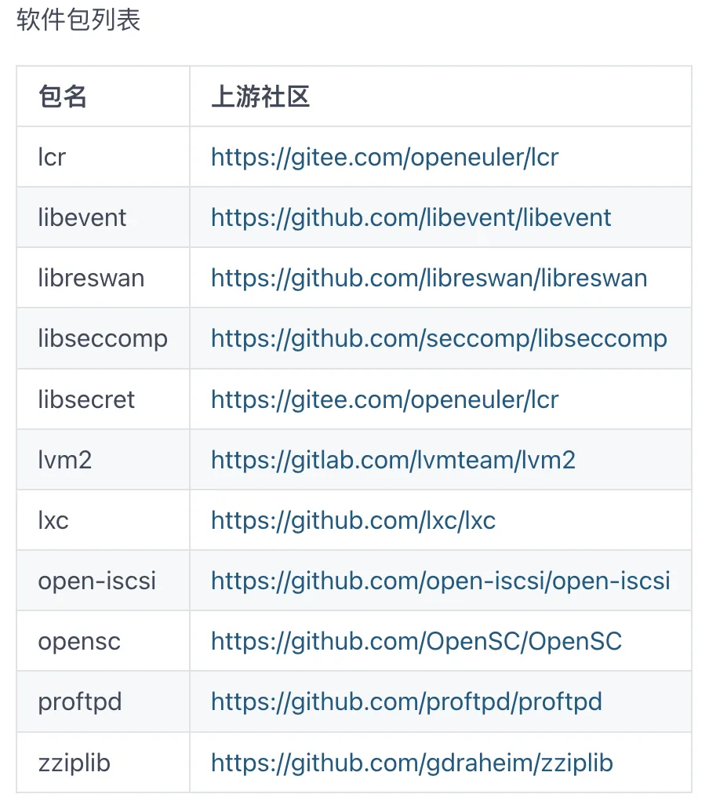

**开源之夏**
----

开源之夏是中国科学院软件研究所发起的"开源软件供应链点亮计划"系列暑期活动，旨在鼓励在校学生积极参与开源软件的开发维护，促进优秀开源软件社区的蓬勃发展。活动联合各大开源社区，针对重要开源软件的开发与维护提供项目，并向全球高校学生开放报名。

OpenAtom
openEuler（简称\"openEuler\"）社区已经连续参与三届开源之夏，为国内开源人才建设贡献力量。openEuler
Compiler SIG
致力于打造编译根技术，为用户提供高性能、高可靠的编译器工具链。本期开源之夏活动，openEuler
Compiler
SIG共发布了**8**个项目课题，欢迎同学们积极报名申请！成功结项将获得丰厚的**结项奖金**、**结项证书**、**年度优秀学生提名机会**以及未来的就业和深造机遇。

开源之夏官网：https://summer-ospp.ac.cn/

**\# 项目介绍 \#**
-------

**01**

**项目名称：**

面向LLVM开发调试场景新增实用功能选项

**项目导师：**

Meepo（wangfangcao1@huawei.com）

**项目简述：**（向上滑动浏览）

LLVM是当前主流的编译器之一。在LLVM的设计中，LLVM
IR和MIR分别是编译器中端和后端的中间表示形式。在日常LLVM开发调试工作中，我们会把编译优化过程中的IR或者MIR通过编译器选项打印出来。比如
\`clang HelloWorld.c -emit-llvm -S -o HelloWorld.ll\` 可以输出
\`HelloWorld.c\` 编译过程中的IR，使用
\`-print-after-all\` 选项可以打印每个优化pass生成的IR。请阅读相关参考资料，对LLVM工程，IR，MIR，pass等概念有一定认识。然后尝试完成以下任务：

任务一：LLVM当前可以通过 \`-print-after-all\`
选项打印每个pass之后生成的IR，但是通过该选项打印的IR并不方便用于直接调试。请仿照GCC编译器，在LLVM中新增类似GCC中
\`-fdump-tree-all/-fdump-rtl-all\`
的选项，将每个pass生成的完整IR输出到单独文件中。

任务二：在LLVM每个pass的优化过程中，并不是所有的pass都会对IR产生变化。请新增一个选项只打印优化生效的pass生成的IR。(可和任务一结合)

**项目详情：**

https://summer-ospp.ac.cn/org/prodetail/24b970218?lang=zh&list=pro

**02**

**项目名称：**

通过A-FOT工具支持LLVM编译器接入以提升反馈优化易用性

**项目导师：**

卜乐（bule1@huawei.com）

**项目简述：**（向上滑动浏览）

A-FOT（automatic feedback-directed optimization
tool）是一款用于提升编译器openEuler
GCC自动反馈优化特性易用性的工具。该工具的目标是让用户通过较少的配置即可自动完成反馈优化的相关步骤（包括采样、分析、优化等），降低自动反馈优化特性的使用难度，享受反馈优化带来的性能提升。当前A-FOT工具支持的编译器种类仅限于gcc
编译器，本项目希望将基于LLVM的编译器接入到A-FOT工具的支持范围以提升反馈优化的易用性。

**项目详情：**

https://summer-ospp.ac.cn/org/prodetail/24b970227?lang=zh&list=pro

**03**

**项目名称：**

基于LLVM实现静态调用栈分析工具

**项目导师：**

Zhang Tiger（zhangtiehu@huawei.com）

**项目简述：**（向上滑动浏览）

通常情况下，代码编写人员并不会关注栈空间使用情况，因为常用的硬件配置基本能够满足用户对栈的使用需求。但是有些特殊领域的硬件，由于资源紧缺，分配给栈的内存非常小，导致用户在编写代码过程中非常容易引起栈空间溢出，而且错误定位耗时耗力。调用栈是栈空间一个重要用途，很多时候是栈溢出的来源。对于主流编译器之一的LLVM，目前还没有提供静态调用栈分析工具。本课题希望学生能够基于LLVM实现一个静态调用栈分析工具，要求：

1）指定函数，能够打印该函数静态调用栈；

2）模拟栈溢出场景，能够快速提示用户哪条（或哪几条）路径可能引发了栈溢出。

3）调用栈分析耗时不可过长；

4）能够处理回调函数（进阶）。

为了便于实现，给出一些合理的假设：

1）变量对栈的使用暂时忽略不计；

2）每个线程栈空间大小1KB（最好能够设计成选项）。

**项目详情：**

https://summer-ospp.ac.cn/org/prodetail/24b970260?lang=zh&list=pro

**04**

**项目名称：**

llvm与gcc的兼容性分析\--unspecified behavior

**项目导师：**

yuanwei（2869658132@qq.com）

**项目简述：**（向上滑动浏览）

llvm和gcc是当下主流的C、C++编译器。应用使用不同编译器编译构建，可能遇到编译或者运行的兼容性问题。产生问题的主要原因有二种：

1\. 代码存在未定义行为，未遵循C/C++语言标准；

2\. 编译器实现的差别，又分为unspecified behavior 和 implementation
defined behavior 两种。

其中，unspecified behavior
有2种及以上的实现方式，编译器可以选择一种实现；implementation defined
behavior
没有明确规定的实现方式，由编译器自定义实现。C/C++语言标准里已明确定义和列举了undefined
behavior、unspecified behavior、implementation defined
behavior，明确llvm和gcc在此类行为方面的不同，就能提前预警编译器间的兼容性问题。

本选题目标完成llvm和gcc在unspecified
behavior的差异性梳理和总结，共有150+项。

**项目详情：**

https://summer-ospp.ac.cn/org/prodetail/24b970245?lang=zh&list=pro

**05**

**项目名称：**

llvm与gcc的兼容性分析\--implementation defined behavior

**项目导师：**

qijitao（qijitao@hisilicon.com）

**项目简述：**

llvm和gcc是当下主流的C、C++编译器。应用使用不同编译器编译构建，可能遇到编译或者运行的兼容性问题。产生问题的主要原因有二种：

1\. 代码存在未定义行为，未遵循C/C++语言标准；

2\. 编译器实现的差别，又分为unspecified behavior 和 implementation
defined behavior两种。

其中，unspecified behavior
有2种及以上的实现方式，编译器可以选择一种实现；implementation defined
behavior
没有明确规定的实现方式，由编译器自定义实现。C/C++语言标准里已明确定义和列举了undefined
behavior、unspecified behavior、implementation defined
behavior，明确llvm和gcc在此类行为方面的不同，就能提前预警编译器间的兼容性问题。

本选题目标完成llvm和gcc在implementation defined
behavior的差异性梳理和总结，共有300+项。

**项目详情：**

https://summer-ospp.ac.cn/org/prodetail/24b970339?lang=zh&list=pro

**06**

**项目名称：**

LLVM构建openEuler软件包兼容性问题分析及解决（Part I）

**项目导师：**

cf-zhao（zhaochuanfeng@huawei.com）

**项目简述：**

项目背景：

LLVM编译器凭借其良好的架构、灵活的license和繁荣的社区，逐渐成为影响力最大的开源编译器工具链之一，业界主流厂商已将自身的编译器切换到LLVM版本，OS社区也纷纷拥抱LLVM编译器技术栈。openEuler社区提交LLVM平行宇宙计划oEEP，旨在探索基于LLVM构建openEuler的工作。

项目内容：

本项目要求开发者分析并解决如下软件包构建/运行时兼容性问题。

**项目详情：**

https://summer-ospp.ac.cn/org/prodetail/24b970359?lang=zh&list=pro

**07**

**项目名称：**

LLVM构建openEuler软件包兼容性问题分析及解决（Part II）

**项目导师：**

liyunfei（lyliyunfei@foxmail.com）

**项目简述：**

项目背景

LLVM编译器凭借其良好的架构、灵活的license和繁荣的社区，逐渐成为影响力最大的开源编译器工具链之一，业界主流厂商已将自身的编译器切换到LLVM版本，OS社区也纷纷拥抱LLVM编译器技术栈。openEuler社区提交LLVM平行宇宙计划oEEP，旨在探索基于LLVM构建openEuler的工作。

项目内容

本项目要求开发者分析并解决如下软件包构建/运行时兼容性问题。

**项目详情：**

https://summer-ospp.ac.cn/org/prodetail/24b970361?lang=zh&list=pro

**08**

**项目名称：**

LLVM构建openEuler软件包兼容性问题分析及解决（Part III）

**项目导师：**

罗峰（luofeng13@huawei.com）

**项目简述：**

项目背景

LLVM编译器凭借其良好的架构、灵活的license和繁荣的社区，逐渐成为影响力最大的开源编译器工具链之一，业界主流厂商已将自身的编译器切换到LLVM版本，OS社区也纷纷拥抱LLVM编译器技术栈。openEuler社区提交LLVM平行宇宙计划oEEP，旨在探索基于LLVM构建openEuler的工作。

项目内容

本项目要求开发者分析并解决如下软件包构建/运行时兼容性问题。

**项目详情：**

https://summer-ospp.ac.cn/org/prodetail/24b970364?lang=zh&list=pro

**\# 关键时间表 \#**
--------

4月30日-6月4日

学生与导师沟通并提交项目申请

6月26日

中选结果公示

6月26日-9月30日

项目开发阶段

11月9日

结项项目公示

**\# 申请指南 \#**
------------

•  根据项目要求，参考学生指南中的【项目申请模板】准备相关材料。

•  每位学生最多可以提交三个项目的申请书，但最终只能承担一个项目。

•  对提交的所有项目申请书进行优先级排序，若同时被多个项目选中，则根据提交的项目排序，优先中选优先级高的项目。

学生指南：https://summer-ospp.ac.cn/help/student/

