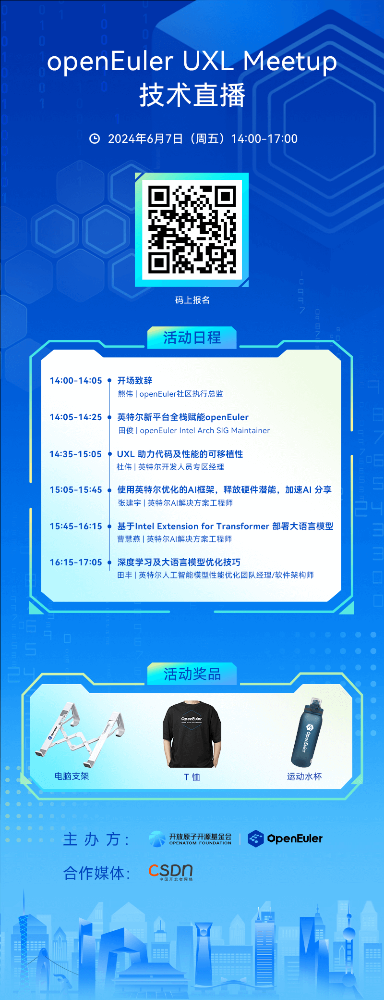

OpenAtom openEuler（简称\"openEuler\"） UXL
Meetup来啦！**本次Meetup由openEuler社区和Intel联合发起**，**旨在深入探讨基于UXL
(Unified Acceleration Foundation)
的oneAPI的实际应用与未来趋势**，为开发者们搭建一个交流和学习的平台。

在这次Meetup中，我们将聚焦于基于开放标准的加速生态系统oneAPI的最新发展，以及它在企业级应用、云计算、物联网等多个领域的实际应用场景。通过分享最佳实践和案例研究，激发参与者的创新思维，帮助用户更好地理解如何利用oneAPI加速软件开发，提高跨平台应用的开发效率。欢迎报名本次Meetup线上直播，我们荣幸邀请到了来自Intel的行业专家，给大家带来关于oneAPI及其在openEuler应用中的实践分享。机会难得，欢迎扫码报名！

**本次直播你将可收获**
-----

●掌握oneAPI在openEuler上的应用实践

● 深入了解UXL的技术架构和设计理念

●探讨oneAPI如何助力开发者提高开发效率

●分享oneAPI在不同行业的应用案例

**更多精美礼品等你来拿**
-----

为了让这次Meetup更加精彩，我们特别设置了抽奖环节，并为大家准备了多种精美礼品。快来参与我们的抽奖活动吧！参与抽奖，只需两个简单步骤：1、扫码报名并填写报名表，这将作为抽奖名单的依据2、加入交流群，中奖者的收货地址将在群内以问卷形式收集

**活动信息**
-----

**主办方**：openEuler社区

**联合主办**：Intel

**联合媒体**：CSDN

**时间**：2024年6月7日 14:00-17:00

**直播平台**：OpenAtom openEuler视频号，OpenAtom openEuler b站

**活动议程**
-----

加入我们，不仅能获得最前沿的技术知识，还能与其他开发者交流心得，更有机会赢取精美礼品。不要错过这次技术盛宴，立即扫码报名，我们在直播中等你！
