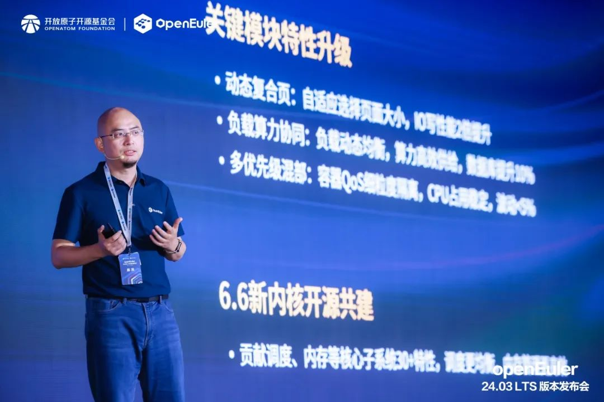
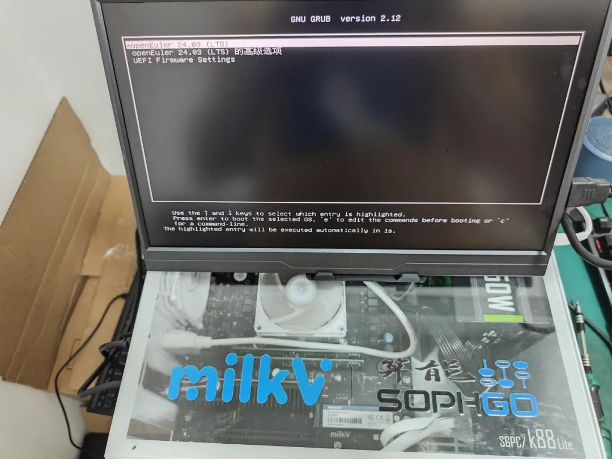
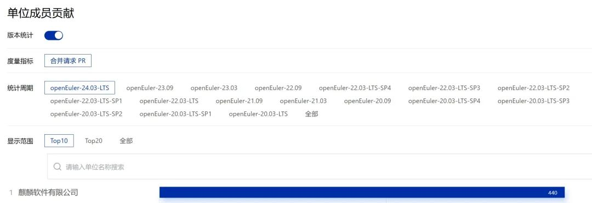
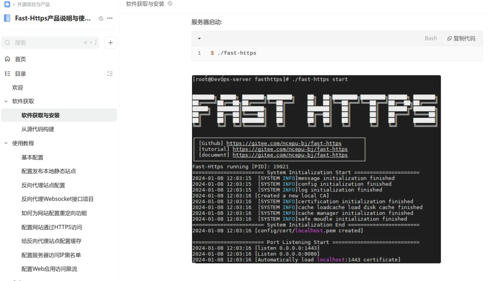
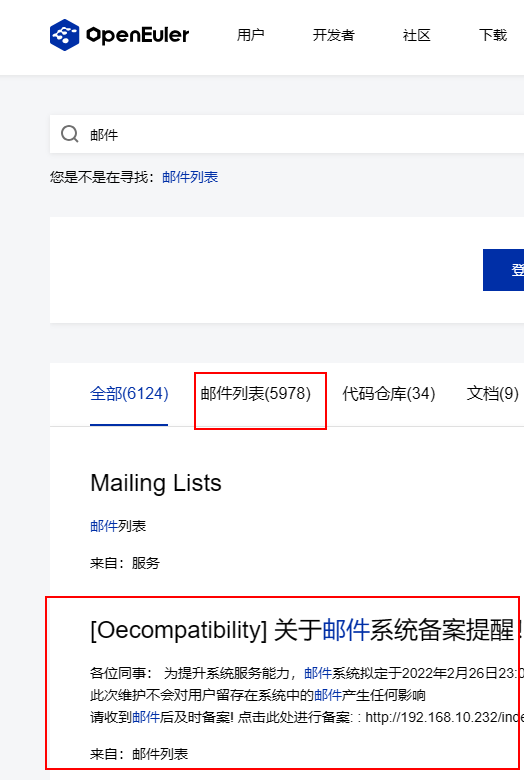
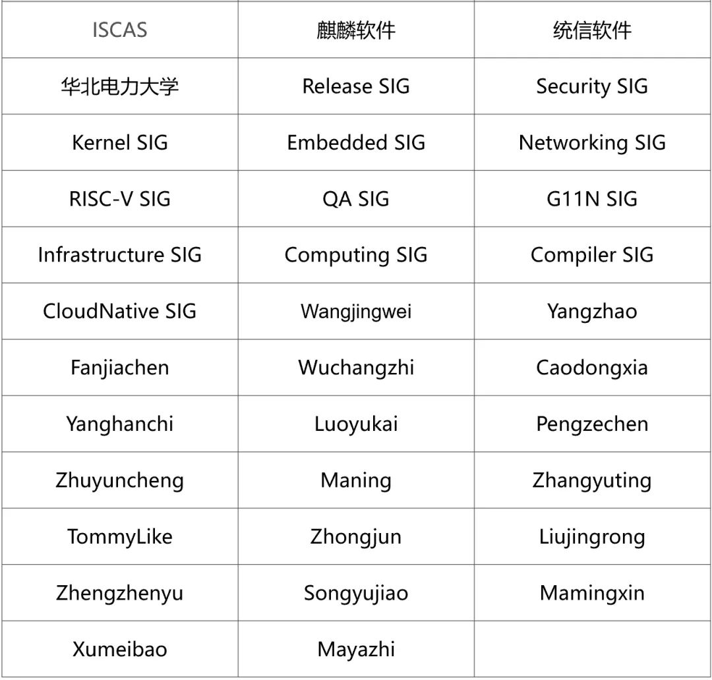

**概述**
---

2024年5月，在 OpenAtom openEuler
(简称：\"openEuler\"）技术委员会例会上，经技术委员会委员审定，同意开发者在社区成立
SBOM SIG、Intelligence SIG。SBOM SIG 主要围绕 SBOM
构建openEuler社区软件供应链安全，推动国际和国内 SBOM 标准在 openEuler
社区适配落地。Intelligence SIG
旨在结合智能化操作系统，加速人工智能技术推广及应用探索，为社区开发者提供的原生AI能力。

在版本演进方面，首个 AI 原生开源操作系统 openEuler 24.03
LTS 于6月6日版本发布会上正式发布。该版本在基础设施、Linux6.6内核、智能解决方案以及全场景体验四大方面实现了全面升级。目前，openEuler
24.03 LTS 的 4 个版本已上线社区官网，全球 37
个镜像站同步更新，全球云平台同步上线，12 个 OSV
的商业发行版和企业自用版也将陆续上线。感谢麒麟软件、华为、粤港澳大湾区（广东）国创中心、中科院软件所、龙芯中科、统信软件、麒麟信安、超聚变、润和软件、中科方德、合芯科技、中软国际、软通动力、北京中关村实验室、奥思维科技、浪潮云、苦芽科技、中移云能、奥星贝斯、长擎软件、飞腾等公司和科研院所，以及两年来参与版本开发工作的
5136 名社区开发者的贡献。

在安全方面，openEuler 注重社区安全合规和供应链信息披露的能力。经
openEuler 技术委员会、安全委员会审定的"openEuler
安全保障策略总纲"在社区发布。目前，openEuler 已通过由OpenChain发起的ISO
18974开源软件供应链安全标准（简称"ISO 18974"）的自认证，成为首个通过ISO
18974自认证的开源社区，这表明 openEuler
在开发流程、软件供应链、风险评估和管理、开发者安全能力等维度达到了国际领先水平。

其他发展方面，由统信软件发起的自动化测试框架 YouQu、由华北电力大学 IDeal
工作室发起的开源高性能 Web 服务器 Fast-Https
等新项目相继在社区运作。感兴趣的朋友可以关注。

社区活动上，openEuler 参加在马德里举办的 Linaro Connect 2024，现场展示了
openEuler 在数字智能方面的能力，推动 Arm 生态系统繁荣。

openEuler
重视开源人才的培养，5月份相继参与了在桂林电子科技大学、南京大学、中国地质大学、华东师范大学等举办的高校行活动，为高校学子如何参与开源贡献提供更多的建议和参考。

感谢朋友们对 openEuler 的支持。

本月报阅读时长预计 20 分钟。

**社区规模**
---

截至2024年5月31日，openEuler
社区用户累计超过242万。超过1.8万名开发者在社区持续贡献。社区累计产生
172K个PRs、96K条Issues。目前，加入openEuler
社区的单位成员1575家，本月新增41家。

社区贡献看板（截至2024/05/31）

**社区事件**
---

**首个 AI 原生开源操作系统，openEuler 24.03 LTS 正式发布**

经过两年的准备，三个创新版本的积累，凝聚全球创新开发力量的 openEuler
24.03 LTS
正式发布。该版本在基础设施、Linux6.6内核、智能解决方案以及全场景体验四大方面实现了全面升级，为开发者和用户带来了高性能、高可靠、高灵活的开发体验。

目前，openEuler 24.03 LTS 的 4 个版本已上线社区官网，全球 37
个镜像站同步更新，全球云平台同步上线，12 个 OSV
的商业发行版和企业自用版也将陆续上线。

图为，openEuler
社区技术委员会主席胡欣蔚在版本发布会上对新版本的四大升级进行全面解读

**openEule 参加 Linaro Connect 2024**

5月17日，openEuler 委员会执行总监熊伟博士受邀参加 Linaro Connect
2024，并在会上发表主题演讲，展示 openEuler 在数字智能方面的能力，推动
Arm 生态系统繁荣。

**openEuler 社区技术委员会主席胡欣蔚受邀参加芯技座谈**

5 月 29 日，openEuler
社区技术委员会主席胡欣蔚到访北京开源芯片研究院（以下简称"开芯院"）并带来开源主题分享《通过开源社区构建操作系统发行版
openEuler》。

他从实践角度分享了 openEuler
开源操作系统在发展中的规划与投入，识别发展中的关键"细腰"环节，强调了软件生态对于推动硬件使用场景和推动技术创新的重要性。此外，还在现场共同探讨了云技术和算力释放的重要性，以及如何通过社区合作和技术创新来促进软件生态的健康发展。

**openEuler 安全知识培训系列课程上线**

为帮助开发者更详细地了解 openEuler
社区的安全要求，更顺利地参与贡献，openEuler 安全委员会推出了" openEuler
安全知识培训"系列课程，并上线了" openEuler
基础安全意识与能力评估考试平台"，帮助开发者提高在社区贡献时的安全合规能力，共同打造更安全高效高质量的开源社区。

openEuler 安全知识培训系列：

-  https://space.bilibili.com/527064077/channel/collectiondetail?sid=2726214

-  https://www.openeuler.org/zh/blog/openeuler/20240428-security.html

**openEuler 参加 2024 鲲鹏金种子实训班全国行**

5月28日，2024 鲲鹏金种子实训班全国行·成都站在四川成功举办。openEuler
兼容性SIG组 Maintainer 杜开田参与本次活动，并分享了《开源操作系统
openEuler
技术介绍和展望》主题，现场详细介绍了"端边云全场景支持"的整体技术设计理念，openEuler
智能化 OS 的 AI 特性以及 openEuler 开发者工具链等内容。活动上，杜老师就
openEuler
运行中遇到的问题、难点同现场60余位开发者进行交流，帮助开发者解决实践中遇到的挑战、提升开发技能。

**openEuler 持续参加多所高校活动，助力开源人才的培养**

5月12日-19日，2024智能基座鲲鹏高校行相继在桂林电子科技大学、南京大学、中国地质大学、华东师范大学等举办专场活动。作为开放原子开源基金会的明星项目，openEuler
积极参加，助力开源人才的培养。

openEuler 技术委员会委员胡峰、openEuler
社区技术专家丁嘉辉、陈臻、冯涛分别以自己参与社区开发的实践经验为例，展示了社区成员如何协作解决技术难题，共同推动项目发展，为高校学子如何参与开源贡献提供更多的建议和参考。在活动上，同学们就开源文化对软件开发行业的影响与老师们深入交流，加深了对开源的理解。

图：左上为丁嘉辉，左下为胡峰，右上为陈臻，右下为冯涛

**openEuler 社区技术直播如期进行中**

openEuler
社区B站技术直播如期进行中，如果您想分享技术实践、项目成果、开源经验等，线上近距离与开发者交流，可联系社区小助手（微信号：openeuler123）预约直播内容。往期直播可在
openEuler B 站上观看。

4月29日-5月23日，openEuler 开展了4期 RISC-V
系列直播，罗君、王跃翔、李金哲等 RISC-V SIG
Committers通过自身的开发实践和禁言，详细解析 RISC-V
的技术特点、优势及应用。

**openEuler RISC-V 系列直播：**

1.  在 QEMU-RISC-V 拉取 UniProton 并开发自己的RISC-V异常解析器
1.  UniProton 在 RISC-V 的上下文切换和IPC基础
1.  自定义核间通信

1.  基于rpmsglite 的裸机与 RTOS 通信实践

**社区治理**
---

**openEuler 技术委员会5月会议摘要**

在5月的例会上，经 openEuler 技术委员会委员们审定，同意开发者在社区成立
SBOM SIG、Intelligence SIG。

SBOM SIG 致力于孵化 SBOM 相关工具和技术，围绕 SBOM 构建 openEuler
社区软件供应链安全，打造开源合规的根社区，并赋能伙伴快速构建 SBOM
披露能力。其职责主要包括维护 openEuler 社区 SBOM
生成、转换和消费的相关工具源码，以及构建基于 SBOM
的应用服务，推动国际和国内 SBOM 标准在 openEuler 社区适配落地。

Intelligence SIG
旨在结合智能化操作系统，加速人工智能技术推广及应用探索，为社区开发者提供的原生AI能力，如智能问答、智能调优、智能诊断等，同时借助AI+工具链，使能传统应用具备智能交互的能力。

感兴趣的朋友可访问 Intelligence SIG 主页了解：

https://www.openeuler.org/zh/sig/sig-detail/?name=sig-intelligence

**openEuler 安全保障策略总纲在社区发布**

为更好地提升 openEuler 社区的安全合规性，牵引其安全能力不断提升，并为
openEuler
版本提供更高质的安全保障，经openEuler技术委员会、安全委员会评审，"openEuler
安全保障策略总纲"在社区发布。

总纲描述了 openEuler 社区安全治理的框架、流程和机制，帮助 openEuler
社区开发者以及其他对 openEuler 社区感兴趣的开发人员了解 openEuler
社区的安全保证策略。

openEuler 安全保障策略总纲：

https://gitee.com/openeuler/security-committee/blob/master/security-strategy-overview.md

**技术进展**
---

**RISC-V 在 openEuler 24.03 LTS 中首次作为 Tier1 架构得到支持**

RISC-V 在 openEuler 24.03 LTS 版本中首次作为 Tier1 架构得到支持，RISC-V
镜像的构建、测试与文档等发版工作也已经接近尾声。在本次版本发布中，RISC-V
架构支持 Everything+Epol 的全量范围, 并且实现对
UEFI、热补丁、硬实时内核和可信执行环境TEE等新功能特性的架构侧支撑。其中，我们通过对
edk2 进行适配调优，首次实现了在 RISC-V 的硬件设备上进行 UEFI
启动的功能，最近发布的版本 24.03 LTS 会默认通过 UEFI 进行启动。UEFI
是目前服务器的事实标准，RISC-V SIG 首次为 RISC-V 架构实现对 UEFI
功能支持，保证了 openEuler 在 RISC-V
系统引导加载标准化和兼容性上的领先位置，为以后的扩展性和模块化预留了充足的空间。

图为在 RISC-V 服务器上通过 UEFI 启动的 openEuler

**麒麟软件在新版本 24.03 LTS
中贡献了440个PRs，大幅度助力社区技术生态发展**

openEuler 24.03 LTS 如期发布，麒麟软件以
440个PRs（数据截止到2024年5月31日） 贡献荣登版本（24.03
LTS）贡献排行榜第一！本次，麒麟软件参与 openEuler 24.03 LTS 社区版本开发
67 人，修复CVE 60+、修复软件bug 200+，升级软件包
60+，同时还包含大量软件包特性增强及架构适配等，贡献领域涉及内核、安全、AI、智能运维、云原生、虚拟化、桌面、分布式存储、数据库、大数据和高可用等。

在 openEuler 24.03 LTS
版本中，除了继承原有OS版本特性（UKUI、NestOS、NKD、PilotGo运维生态）之外，麒麟软件还带来了新的OS软件生态特性和升级：

-   PilotGo 新插件：本次 PilotGo 运维平台生态除了继承已有 prometheus
插件、grafana 插件之外，还带来了 Topo 插件、A-tune 插件两个新插件。Topo
插件可以以自定义拓扑图的方式对业务集群进行可视化，同时辅以组件信息及状态展示、指标展示等功能，方便用户对业务集群进行直观把控。A-tune
插件封装社区 A-tune
智能调优工具，提供了一键式的业务服务调优和任务管理，并对结果进行可视化展示，方便
A-tune 智能调优软件的使用和落地。

-   UKUI：本次除了集成已有的控制面板、任务栏、文件管理器等重要组件外，同时修复天气日期显示错误的问题以及部分CPU信息无法显示问题，优化麒麟影音的界面展示信息，提高
UKUI 组件的稳定性，提升用户的使用体验。

 

openEuler 贡献看板：https://datastat.openeuler.org/zh/detail

\* 下图数据截止到 2024年5月31日

**统信软件在新版本 24.03 LTS 中贡献了多个特性，**

**完成版本选型开发、软件包维护升级等多项工作**

统信软件在 openEuler 24.03 LTS 中贡献了
DDE桌面、utsudo、utshell、migration-tools等多个特性；主导完成了OpenStack
Wallaby/Antelope 两个版本的选型、开发、测试、文档编写等工作。

作为 Desktop、KDE、Gnome等SIG组软件包的主要维护者，统信软件完成了 24.03
LTS 的软件包选型、升级和维护工作；参与完成了
Base-Service、Programming-Language、Networking、Compiler、Virt
等多个SIG组基础软件包的开发工作。

此外，在6月6日的 openEuler 发布会上，统信软件同步发布基于 openEuler
24.03 LTS 的统信服务器操作系统V25（预览版）。

**自动化测试框架 YouQu 在社区建仓**

由统信软件发起创建的项目 YouQu，经 QA SIG 和TC 委员审核已成功引入
openEuler 社区，并完成建仓工作。

YouQu是一个用于 Linux
操作系统的自动化测试框架，支持多元化元素定位和断言、用例标签化管理和执行、强大的日志和报告输出等特色功能，同时完美兼容
X11、Wayland 显示协议，环境部署简单，操作易上手。

**现已支持多种自动化测试类型：**

-   Linux 桌面应用 UI 自动化测试

-   Web UI 自动化测试

-   Linux DBus 接口自动化测试

-   命令行自动化测试

-   接口自动化测试

**框架特点：**

-   提供统一的接口：编写方法时只需要导入一个包就可以使用到核心库提供的所有功能。

-   多种元素定位方案：除了常用的属性定位、图像识别、OCR识别以外，还提供基于
UI 的元素定位方案，其使用简单且高效。

-   用例标签化管理：提供用例标签化管理、批量跳过和批量条件跳过的功能。

-   远程交互式控制：用例步骤过程中控制远程机器。

-   一键部署环境：让你再也不用为环境部署而烦恼。

-   自定义断言：对断言进行了二次封装，提供更友好化的错误提示，让定位问题精准高效。

-   用例超时控制：不仅支持单条用例超时控制，而且还支持动态控制用例批量执行的总时间，确保
CI 环境下能顺畅运行。

 

项目官方文档：https://youqu.uniontech.com

项目仓库地址：https://gitee.com/src-openeuler/youqu

**高性能 Web 服务器 Fast-Https 项目在社区建仓**

由华北电力大学 IDeal 工作室发起，由 Networking SIG 组维护管理的
Fast-Https 项目已在 openEuler 社区完成建仓。Fast-Https
是一款基于Go开发的高性能、高并发、多协议支持的开源 Web 服务器，旨在为
openEuler 用户提供安全可靠、功能丰富的 Web 服务解决方案。

-   配置简单：使用 Fast-Https，进行极其简单的配置，即可发布您的 Web 应用

-   面向云原生：支持 docker 部署，一键部署多个微服务，提供注册中心功能

-   多协议支持：支持 HTTP1.1、HTTP2、HTTPS、WebSocket 等协议

-   设计模块化：将服务器的功能拆分为多个独立的模块，每个模块负责特定的任务

项目地址：

https://gitee.com/src-openeuler/fast-https

https://gitee.com/ncepu-bj/fast-https

**openEuler 官网支持对邮件列表的搜索**

本月，社区基础设施团队在官网搜索上增加了邮件列表的数据，以便开发者能更好地获取相关资料。

**软硬件兼容性认证**

2024年5月，兼容性方案 1710 个，北向 1094 个，南向 471 个，OS 145
个。5月新增 北向 36 个，南向 3 个，OS 4 个。

社区兼容性列表：

https://www.openeuler.org/zh/compatibility/

**安全公告**

2024年5月，社区共发布安全公告 178 个，修复漏洞 385 个（其中 Critical 3
个，High 46 个，其它 336 个）。

 
**重点漏洞提醒**

如下漏洞评估影响较大，请重点关注：

stb \_vorbis.c
v1.22的注释功能中存在基于堆的缓冲区溢出漏洞（CVE-2024-32659）

CVSS评分为9.8分

公告链接：

https://www.openeuler.org/zh/security/cve/detail/?cveId=CVE-2023-47212&packageName=stb

影响范围：

openEuler-22.03-LTS-SP3

Engrampa易受Path
Traversal漏洞的攻击，利用该漏洞可在目标对象上实现完全的远程命令执行（RCE）（CVE-2023-52138）

CVSS评分为9.6分

公告链接：

https://www.openeuler.org/zh/security/cve/detail/?cveId=CVE-2023-52138&packageName=engrampa

影响范围：

openEuler-22.03-LTS-SP2

openEuler-22.03-LTS-SP3

Git 安全社区发现了一个新的严重漏洞，该漏洞允许攻击者通过简单的 git clone
命令触发远程代码执行（RCE）（CVE-2024-32002）

CVSS评分为9.0分

公告链接：

https://www.openeuler.org/zh/security/cve/detail/?cveId=CVE-2024-32002&packageName=git

影响范围：

openEuler-20.03-LTS-SP1

openEuler-20.03-LTS-SP4

openEuler-22.03-LTS

openEuler-22.03-LTS-SP1

openEuler-22.03-LTS-SP2

openEuler-22.03-LTS-SP3

**漏洞防护**

openEuler社区针对在维版本例行修复漏洞，发布安全补丁。建议用户关注openEuler官网安全公告，及时安装漏洞补丁进行防护。

openEuler 安全公告：

https://www.openeuler.org/zh/security/security-bulletins/

**感谢每一位朋友、开发者的支持**

因为大家的辛勤贡献，openEuler
的每一天都发生着好的事情。小编限于视野和能力，难免有所遗漏，在此表示歉意。同时，衷心感谢社区朋友、开发者们以及openEuler
SIG组成员的贡献：

\* 以上不分先后顺序

如果您希望在月报中增加您的工作内容，或对内容有任何改进建议，请联系wengqiaozhen@openeuler.sh。
