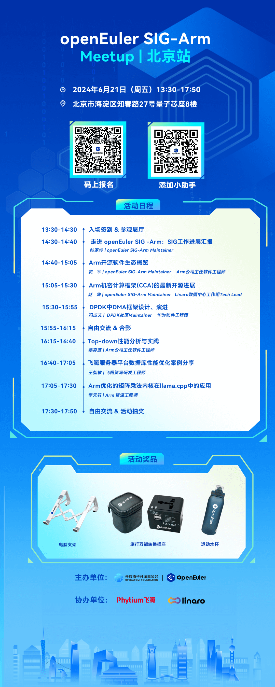

OpenAtom openEuler（简称\"openEuler\"） SIG-Arm
Meetup来到北京站啦！就在6月21日！本次Meetup由openEuler SIG-Arm发起，飞腾信息技术有限公司、Linaro协办，旨在为开发者和用户搭建一个面向Arm架构的技术交流与分享平台。在本次活动上，我们将介绍openEuler
SIG-Arm、Arm架构软件生态的最新进展。同时，我们也将展示Arm架构在典型应用场景中的最佳实践，深入探讨在Arm服务器上的部署与优化技巧，以及未来的发展方向。本次Meetup汇聚了Arm软硬件生态的技术专家和行业先锋，将为您奉上一场精彩纷呈的技术盛宴。我们诚挚邀请您参加本次活动，与社区内外的技术大咖们一同探讨Arm架构的无限可能。

**活动信息**
----

**主办单位**：openEuler 社区

**协办组织**：飞腾信息技术有限公司、Linaro

**时间**：2024年6月21日 14:30-17:50

 **地点**：北京市海淀区知春路27号量子芯座8楼

**活动议程**
----

如果您对Arm感兴趣，欢迎添加小助手微信，备注【Arm】，加入openEuler
Arm交流群。

