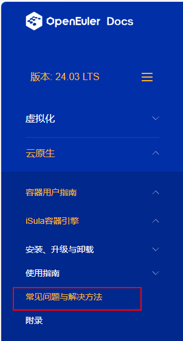

技术文档不好理解？操作失败怎么解决？遇到问题如何向社区求助？\...

不必担心！OpenAtom openEuler（简称\"openEuler\"） 文档 FAQ 正式上线啦！

FAQ（Frequently Asked Questions)
旨在为开发者提供一些常见问题及解决方法，方便开发者更好地使用 openEuler
操作系统。

**如何查看文档 FAQ ？**
-----

本次 FAQ 上线跟随 openEuler 24.03 LTS 版本发布。在 openEuler 文档官网
24.03 LTS 版本\[1\]各领域用户指南章节下可查找到对应 FAQ 文档。 

例如，开发者遇到了 iSula 容器 相关的操作问题，可以在"云原生"章节下，
容器用户指南-iSula容器引擎目录查看 FAQ 内容\[2\]。

本次共更新了虚拟化、iSula 等13个项目 48个
FAQ，后续我们会根据开发者反馈不断刷新。

**如何参与 FAQ 内容贡献？**
-----

openEuler
社区欢迎各位开发者分享自己在实践过程遇到的问题与心得。如果您有相关 FAQ
内容希望与社区开发者一起分享讨论，请通过提交 PR 的形式向社区 openEuler
docs 仓反馈\[3\]。我们收到
PR后，会邀请相关开发者一起检视合入。让我们共建繁荣、开放的社区生态\~

**遇到问题如何求助？**
-----

如果当前 FAQ 仍然无法解决您的问题，请毫不犹豫地向 docs 仓库提问吧！

1\. 登录到 gitee 平台 openEuler docs 仓 Issues 页面\[4\]。 

2\. 点击 新建 Issue ，选择对应的问题类型，填写标题名称。 

3\. 根据 Issue
模板填写您的问题，同时提供必要的版本和所在文档目录信息，方便开发者及时定位问题。 

4\. 点击创建。

我们收到 Issue 后，会及时跟踪问题进度。优秀有效的 Issue
将会进入到案例库或 FAQ。

**参考链接**
-----

1\. openEuler 文档官网 24.03 LTS
版本：https://docs.openeuler.org/zh/docs/24.03\_LTS/docs/Releasenotes/法律声明.html

2\. iSula 容器引擎
FAQ：https://docs.openeuler.org/zh/docs/24.03\_LTS/docs/Container/isula常见问题与解决方法.html

3\. gitee 平台 docs 仓 PR 页面：https://gitee.com/openeuler/docs/pulls

4\. gitee 平台 docs 仓 Issues
页面：https://gitee.com/openeuler/docs/issues
