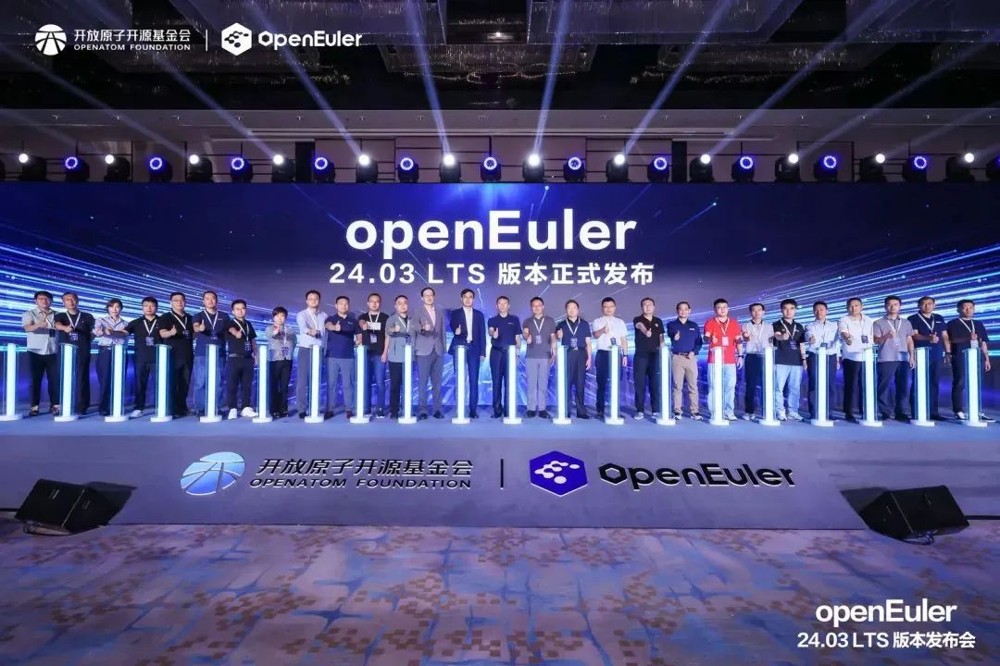

2024年6月6日，由OpenAtom
openEuler（简称\"openEuler\"）社区主办的openEuler 24.03
LTS版本发布会（以下简称"发布会"）在北京成功举办。本次发布会汇聚操作系统产业界顶尖力量，共探openEuler社区技术、生态、国际化发展，共建健康可持续发展的开源操作系统根社区。会上，openEuler首个AI原生开源操作系统，openEuler
24.03 LTS版本正式发布。

江苏润和软件股份有限公司（以下简称"润和软件"）**作为openEuler黄金捐赠人及版本共建单位受邀共同参与新版本发布及圆桌论坛环节，润和软件副总裁于萍围绕openEuler国际合作分享了润和软件的经验、能力及未来发展规划，润和软件将携手行业客户联合打造整体解决方案，助力openEuler国际化发展**。

openEuler 24.03 LTS发布仪式

openEuler社区开源四年，发展迅速，迈出了坚实的步伐，至今已吸引1577家企业成员，18800多名开发者加入贡献，下载量遍布全球153个国家的2037个城市，累计装机量超过680万套，据IDC调研报告显示，openEuler
系操作系统在 2023年新增服务器操作系统中市场份额已经达到 36.8%。

**openEuler 24.03 LTS：AI原生开源操作系统正式发布**
-----

智能时代，AI无处不在，以大模型为代表的人工智能技术是当前技术发展的重要方向。openEuler积极拥抱智能时代，和AI深度结合，引领智能化创新，让操作系统使能AI更高效，AI使能操作系统更智能。

本次发布会上，开放原子开源基金会携手润和软件等26位社区伙伴代表共同发布openEuler首个AI原生开源操作系统------openEuler
24.03 LTS。润和软件副总裁于萍受邀出席发布仪式。

该版本在基础设施、Linux6.6内核、智能解决方案以及全场景体验四大方面实现了全面升级，为开发者和用户带来了高性能、高可靠、高灵活的开发体验。同时，润和软件等12家伙伴的商业发行版将陆续发布。

**汇聚产业力量，共探openEuler繁荣之路**
-----

操作系统的成功，离不开南北向软硬件厂商的广泛支持，openEuler一直致力于打造面向全场景、多样性算力的操作系统，在驱动支持、多样性资源社区接入、构建系统等多方面不断优化。发布会现场，润和软件与社区伙伴及专家，围绕"从通用算力多样化到智能算力多样化，使能智能时代全场景应用"展开讨论，为openEuler技术发展及全球开源生态的打造提供方向及建议。

openEuler作为一个全球化的开源社区，技术走向全球的同时，商业走向全球尤为重要。在圆桌论坛"国际合作"主题环节，润和软件副总裁于萍就openEuler走向全球化参与讨论。于萍表示：润和软件起步于国际化业务，在多个国家均有分支机构及海外业务拓展能力。近一年来，**润和软件行业客户在自身行业赛道寻求国际化突破，润和软件将紧密配合行业客户需求，携手打造联合解决方案，共扩国际业务**。润和软件始终积极参于海外市场活动，今年4月，润和软件参与在越南举办的"FOSSASIA
Summit
2024"并发表主题演讲，今年5月，润和软件应邀参与由江苏省政府组织的阿联酋迪拜市场推介活动并取得丰硕成果。润和软件期待协同海外客户及合作伙伴，将润和软件openEuler业务深入延伸到国际市场。同时，润和软件将积极参与国际化市场活动及加强与海外商机的紧密联系，为openEuler国际化发展贡献更多力量。

润和软件副总裁于萍（右二）参与openEuler国际合作圆桌讨论

润和软件长期深耕服务器操作系统关键技术领域，并在自身技术优势基础上提出"All
in AI"战略。润和软件**基于openEuler基线版本发布的商用发行版HopeOS V22针对行业客户不同应用场景，分别推出了AI版、大数据版版及云原生版等多个专用场景优化版本**。HopeOS
V22已经从单一产品进化为适应不同业务场景的产品家族，使能千行百业操作系统替换需求，**实现了操作系统在新能源、智慧电力、智慧金融、智能制造等行业的商业化落地**。作为openEuler大数据业务领域的领军企业，润和软件企业级操作系统大数据解决方案已获得市场充分认可，在多个重要战略客户核心应用中实现商用落地。

智启新程，奔赴山海。未来，润和软件将持续致力为行业客户提供操作系统、人工智能等领域的创新产品与解决方案，并携手openEuler社区，共同将openEuler打造成国际化的开源协作平台，共创操作系统生态繁荣，为世界开源贡献中国智慧。
