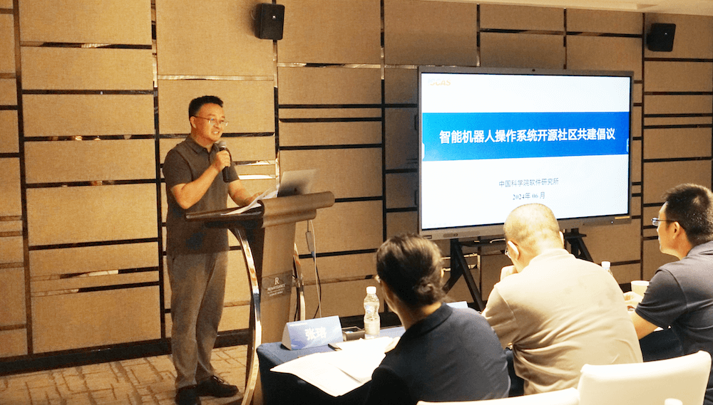
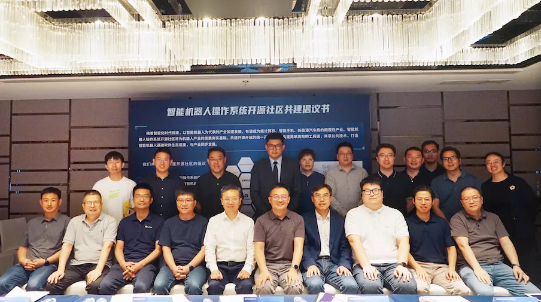

6月6日，智能机器人操作系统开源社区共建启动会在北京召开。工业和信息化部科技司、中国科学院软件研究所、openEuler开源社区、中国科学院自动化研究所、北京人形机器创新中心、工业和信息化部电子第五研究所、北京航空航天大学、上海智元新创技术有限公司、小米科技有限责任公司等二十余家单位参会，共同开启智能机器人操作系统开源社区共建工作。

openEuler 社区从建立之初就成了 ROS SIG，专注于 openEuler
在机器人操作系统领域的基础软件创新，在最新发布 openEuler 24.03 LTS
中，社区完成了对 ROS Noetic （ROS1）的基础支持和 ROS
Humble（ROS2） 全面支持，并在 ROS Humble
基础上，开发一些原创技术特性，与 ROS 社区共同完善和维护 ROS2
的软件生态，与产业界一起推动机器人操作系统从 ROS1 向 ROS2 过渡。

智能机器人操作系统开源社区由软件所倡议发起，旨在通过凝聚智能机器人操作系统产学研用各方力量，共同推动智能机器人操作系统技术及生态的发展，全面推进智能机器人领域的开源开放协同创新，为智能机器人产业夯实基础。

软件所副所长武延军向大会致辞。软件所副研究员张珩介绍了社区的建设背景、建设方案、治理架构及远景目标。共建单位代表围绕智能机器人操作系统技术进行了研讨并签署了共建倡议书。

武延军致辞

智能机器人操作系统开源社区共建倡议书签字仪式

智能机器人操作系统开源社区共建单位代表合影

智能机器人操作系统开源社区将立足新发展阶段，致力于完善开源体系顶层设计及体系化布局；打造智能机器人操作系统应用示范标杆，助力提升基础软件源头创新和供给能力；汇聚产学研用各方力量，发挥开放合作优势，繁荣智能机器人操作系统产业生态。
